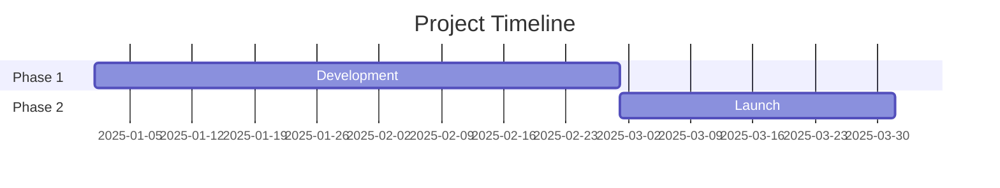
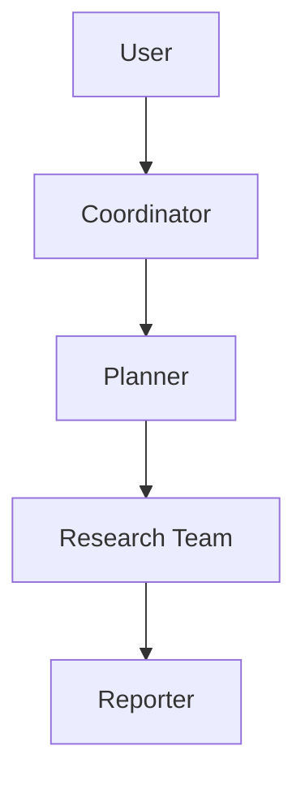
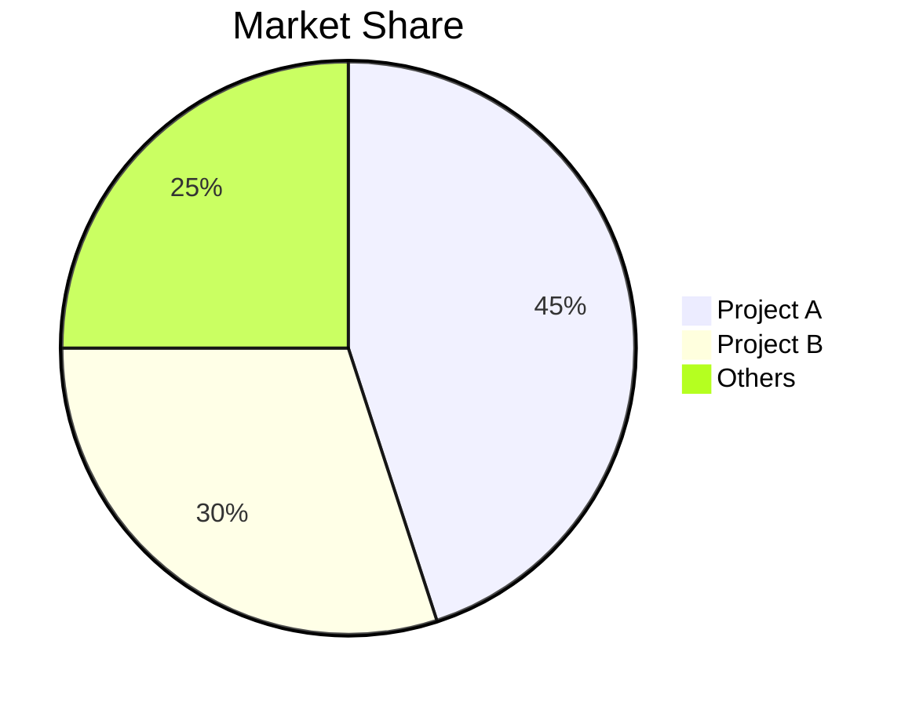

# Appendix C: All Skills (English Originals)

> This appendix contains all 22 built-in SKILL.md files verbatim from DeerFlow v2.0.0-rc1.
> Each skill is reproduced exactly as it appears in `skills/public/<name>/SKILL.md`.
> Internal links and references within each skill point to files under the same skill directory in the source repository.

---

## S-01: academic-paper-review

**Source**: `skills/public/academic-paper-review/SKILL.md`  
**File size**: 12,138 bytes

---

---
name: academic-paper-review
description: Use this skill when the user requests to review, analyze, critique, or summarize academic papers, research articles, preprints, or scientific publications. Supports comprehensive structured reviews covering methodology assessment, contribution evaluation, literature positioning, and constructive feedback generation. Trigger on queries involving paper URLs, uploaded PDFs, arXiv links, or requests like "review this paper", "analyze this research", "summarize this study", or "write a peer review".
---

# Academic Paper Review Skill

## Overview

This skill produces structured, peer-review-quality analyses of academic papers and research publications. It follows established academic review standards used by top-tier venues (NeurIPS, ICML, ACL, Nature, IEEE) to provide rigorous, constructive, and balanced assessments.

The review covers **summary, strengths, weaknesses, methodology assessment, contribution evaluation, literature positioning, and actionable recommendations** — all grounded in evidence from the paper itself.

## Core Capabilities

- Parse and comprehend academic papers from uploaded PDFs or fetched URLs
- Generate structured reviews following top-venue review templates
- Assess methodology rigor (experimental design, statistical validity, reproducibility)
- Evaluate novelty and significance of contributions
- Position the work within the broader research landscape via targeted literature search
- Identify limitations, gaps, and potential improvements
- Produce both detailed review and concise executive summary formats
- Support papers in any scientific domain (CS, biology, physics, social sciences, etc.)

## When to Use This Skill

**Always load this skill when:**

- User provides a paper URL (arXiv, DOI, conference proceedings, journal link)
- User uploads a PDF of a research paper or preprint
- User asks to "review", "analyze", "critique", "assess", or "summarize" a research paper
- User wants to understand the strengths and weaknesses of a study
- User requests a peer-review-style evaluation of academic work
- User asks for help preparing a review for a conference or journal submission

## Review Methodology

### Phase 1: Paper Comprehension

Thoroughly read and understand the paper before forming any judgments.

#### Step 1.1: Identify Paper Metadata

Extract and record:

| Field | Description |
|-------|-------------|
| **Title** | Full paper title |
| **Authors** | Author list and affiliations |
| **Venue / Status** | Publication venue, preprint server, or submission status |
| **Year** | Publication or submission year |
| **Domain** | Research field and subfield |
| **Paper Type** | Empirical, theoretical, survey, position paper, systems paper, etc. |

#### Step 1.2: Deep Reading Pass

Read the paper systematically:

1. **Abstract & Introduction** — Identify the claimed contributions and motivation
2. **Related Work** — Note how authors position their work relative to prior art
3. **Methodology** — Understand the proposed approach, model, or framework in detail
4. **Experiments / Results** — Examine datasets, baselines, metrics, and reported outcomes
5. **Discussion & Limitations** — Note any self-identified limitations
6. **Conclusion** — Compare concluded claims against actual evidence presented

#### Step 1.3: Key Claims Extraction

List the paper's main claims explicitly:

```
Claim 1: [Specific claim about contribution or finding]
Evidence: [What evidence supports this claim in the paper]
Strength: [Strong / Moderate / Weak]

Claim 2: [...]
...
```

### Phase 2: Critical Analysis

#### Step 2.1: Literature Context Search

Use web search to understand the research landscape:

```
Search queries:
- "[paper topic] state of the art [current year]"
- "[key method name] comparison benchmark"
- "[authors] previous work [topic]"
- "[specific technique] limitations criticism"
- "survey [research area] recent advances"
```

Use `web_fetch` on key related papers or surveys to understand where this work fits.

#### Step 2.2: Methodology Assessment

Evaluate the methodology using the following framework:

| Criterion | Questions to Ask | Rating |
|-----------|-----------------|--------|
| **Soundness** | Is the approach technically correct? Are there logical flaws? | 1-5 |
| **Novelty** | What is genuinely new vs. incremental improvement? | 1-5 |
| **Reproducibility** | Are details sufficient to reproduce? Code/data available? | 1-5 |
| **Experimental Design** | Are baselines fair? Are ablations adequate? Are datasets appropriate? | 1-5 |
| **Statistical Rigor** | Are results statistically significant? Error bars reported? Multiple runs? | 1-5 |
| **Scalability** | Does the approach scale? Are computational costs discussed? | 1-5 |

#### Step 2.3: Contribution Significance Assessment

Evaluate the significance level:

| Level | Description | Criteria |
|-------|-------------|----------|
| **Landmark** | Fundamentally changes the field | New paradigm, widely applicable breakthrough |
| **Significant** | Strong contribution advancing the state of the art | Clear improvement with solid evidence |
| **Moderate** | Useful contribution with some limitations | Incremental but valid improvement |
| **Marginal** | Minimal advance over existing work | Small gains, narrow applicability |
| **Below threshold** | Does not meet publication standards | Fundamental flaws, insufficient evidence |

#### Step 2.4: Strengths and Weaknesses Analysis

For each strength or weakness, provide:
- **What**: Specific observation
- **Where**: Section/figure/table reference
- **Why it matters**: Impact on the paper's claims or utility

### Phase 3: Review Synthesis

#### Step 3.1: Assemble the Structured Review

Produce the final review using the template below.

## Review Output Template

```markdown
# Paper Review: [Paper Title]

## Paper Metadata
- **Authors**: [Author list]
- **Venue**: [Publication venue or preprint server]
- **Year**: [Year]
- **Domain**: [Research field]
- **Paper Type**: [Empirical / Theoretical / Survey / Systems / Position]

## Executive Summary

[2-3 paragraph summary of the paper's core contribution, approach, and main findings.
State your overall assessment upfront: what the paper does well, where it falls short,
and whether the contribution is sufficient for the claimed venue/impact level.]

## Summary of Contributions

1. [First claimed contribution — one sentence]
2. [Second claimed contribution — one sentence]
3. [Additional contributions if any]

## Strengths

### S1: [Concise strength title]
[Detailed explanation with specific references to sections, figures, or tables in the paper.
Explain WHY this is a strength and its significance.]

### S2: [Concise strength title]
[...]

### S3: [Concise strength title]
[...]

## Weaknesses

### W1: [Concise weakness title]
[Detailed explanation with specific references. Explain the impact of this weakness on
the paper's claims. Suggest how it could be addressed.]

### W2: [Concise weakness title]
[...]

### W3: [Concise weakness title]
[...]

## Methodology Assessment

| Criterion | Rating (1-5) | Assessment |
|-----------|:---:|------------|
| Soundness | X | [Brief justification] |
| Novelty | X | [Brief justification] |
| Reproducibility | X | [Brief justification] |
| Experimental Design | X | [Brief justification] |
| Statistical Rigor | X | [Brief justification] |
| Scalability | X | [Brief justification] |

## Questions for the Authors

1. [Specific question that would clarify a concern or ambiguity]
2. [Question about methodology choices or alternative approaches]
3. [Question about generalizability or practical applicability]

## Minor Issues

- [Typos, formatting issues, unclear figures, notation inconsistencies]
- [Missing references that should be cited]
- [Suggestions for improved clarity]

## Literature Positioning

[How does this work relate to the current state of the art?
Are key related works cited? Are comparisons fair and comprehensive?
What important related work is missing?]

## Recommendations

**Overall Assessment**: [Accept / Weak Accept / Borderline / Weak Reject / Reject]

**Confidence**: [High / Medium / Low] — [Justification for confidence level]

**Contribution Level**: [Landmark / Significant / Moderate / Marginal / Below threshold]

### Actionable Suggestions for Improvement
1. [Specific, constructive suggestion]
2. [Specific, constructive suggestion]
3. [Specific, constructive suggestion]
```

## Review Principles

### Constructive Criticism
- **Always suggest how to fix it** — Don't just point out problems; propose solutions
- **Give credit where due** — Acknowledge genuine contributions even in flawed papers
- **Be specific** — Reference exact sections, equations, figures, and tables
- **Separate minor from major** — Distinguish fatal flaws from fixable issues

### Objectivity Standards
- ❌ "This paper is poorly written" (vague, unhelpful)
- ✅ "Section 3.2 introduces notation X without formal definition, making the proof in Theorem 1 difficult to follow. Consider adding a notation table after the problem formulation." (specific, actionable)

### Ethical Review Practices
- Do NOT dismiss work based on author reputation or affiliation
- Evaluate the work on its own merits
- Flag potential ethical concerns (bias in datasets, dual-use implications) constructively
- Maintain confidentiality of unpublished work

## Adaptation by Paper Type

| Paper Type | Focus Areas |
|------------|-------------|
| **Empirical** | Experimental design, baselines, statistical significance, ablations, reproducibility |
| **Theoretical** | Proof correctness, assumption reasonableness, tightness of bounds, connection to practice |
| **Survey** | Comprehensiveness, taxonomy quality, coverage of recent work, synthesis insights |
| **Systems** | Architecture decisions, scalability evidence, real-world deployment, engineering contributions |
| **Position** | Argument coherence, evidence for claims, impact potential, fairness of characterizations |

## Common Pitfalls to Avoid

- ❌ Reviewing the paper you wish was written instead of the paper that was submitted
- ❌ Demanding additional experiments that are unreasonable in scope
- ❌ Penalizing the paper for not solving a different problem
- ❌ Being overly influenced by writing quality versus technical contribution
- ❌ Treating absence of comparison to your own work as a weakness
- ❌ Providing only a summary without critical analysis

## Quality Checklist

Before finalizing the review, verify:

- [ ] Paper was read completely (not just abstract and introduction)
- [ ] All major claims are identified and evaluated against evidence
- [ ] At least 3 strengths and 3 weaknesses are provided with specific references
- [ ] The methodology assessment table is complete with ratings and justifications
- [ ] Questions for authors target genuine ambiguities, not rhetorical critiques
- [ ] Literature search was conducted to contextualize the contribution
- [ ] Recommendations are actionable and constructive
- [ ] The overall assessment is consistent with the identified strengths and weaknesses
- [ ] The review tone is professional and respectful
- [ ] Minor issues are separated from major concerns

## Output Format

- Output the complete review in **Markdown** format
- Save the review to `/mnt/user-data/outputs/review-{paper-topic}.md` when working in sandbox
- Present the review to the user using the `present_files` tool

## Notes

- This skill complements the `deep-research` skill — load both when the user wants the paper reviewed in the context of the broader field
- For papers behind paywalls, work with whatever content is accessible (abstract, publicly available versions, preprint mirrors)
- Adapt the review depth to the user's needs: a brief assessment for quick triage versus a full review for submission preparation
- When reviewing multiple papers comparatively, maintain consistent criteria across all reviews
- Always disclose limitations of your review (e.g., "I could not verify the proofs in Appendix B in detail")

---

## S-02: bootstrap

**Source**: `skills/public/bootstrap/SKILL.md`  
**File size**: 4,802 bytes

---

---
name: bootstrap
description: >-
  Generate a personalized SOUL.md through a warm, adaptive onboarding conversation.
  Trigger when the user wants to create, set up, or initialize their AI partner's
  identity — e.g., "create my SOUL.md", "bootstrap my agent", "set up my AI
  partner", "define who you are", "let's do onboarding", "personalize this AI",
  "make you mine", or when a SOUL.md is missing. Also trigger for updates:
  "update my SOUL.md", "change my AI's personality", "tweak the soul".
---

# Bootstrap Soul

A conversational onboarding skill. Through 5–8 adaptive rounds, extract who the user is and what they need, then generate a tight `SOUL.md` that defines their AI partner.

## Architecture

```
bootstrap/
├── SKILL.md                          ← You are here. Core logic and flow.
├── templates/SOUL.template.md        ← Output template. Read before generating.
└── references/conversation-guide.md  ← Detailed conversation strategies. Read at start.
```

**Before your first response**, read both:
1. `references/conversation-guide.md` — how to run each phase
2. `templates/SOUL.template.md` — what you're building toward

## Ground Rules

- **One phase at a time.** 1–3 questions max per round. Never dump everything upfront.
- **Converse, don't interrogate.** React genuinely — surprise, humor, curiosity, gentle pushback. Mirror their energy and vocabulary.
- **Progressive warmth.** Each round should feel more informed than the last. By Phase 3, the user should feel understood.
- **Adapt pacing.** Terse user → probe with warmth. Verbose user → acknowledge, distill, advance.
- **Never expose the template.** The user is having a conversation, not filling out a form.

## Conversation Phases

The conversation has 4 phases. Each phase may span 1–3 rounds depending on how much the user shares. Skip or merge phases if the user volunteers information early.

| Phase | Goal | Key Extractions |
|-------|------|-----------------|
| **1. Hello** | Language + first impression | Preferred language |
| **2. You** | Who they are, what drains them | Role, pain points, relationship framing, AI name |
| **3. Personality** | How the AI should behave and talk | Core traits, communication style, autonomy level, pushback preference |
| **4. Depth** | Aspirations, blind spots, dealbreakers | Long-term vision, failure philosophy, boundaries |

Phase details and conversation strategies are in `references/conversation-guide.md`.

## Extraction Tracker

Mentally track these fields as the conversation progresses. You need **all required fields** before generating.

| Field | Required | Source Phase |
|-------|----------|-------------|
| Preferred language | ✅ | 1 |
| User's name | ✅ | 2 |
| User's role / context | ✅ | 2 |
| AI name | ✅ | 2 |
| Relationship framing | ✅ | 2 |
| Core traits (3–5 behavioral rules) | ✅ | 3 |
| Communication style | ✅ | 3 |
| Pushback / honesty preference | ✅ | 3 |
| Autonomy level | ✅ | 3 |
| Failure philosophy | ✅ | 4 |
| Long-term vision | nice-to-have | 4 |
| Blind spots / boundaries | nice-to-have | 4 |

If the user is direct and thorough, you can reach generation in 5 rounds. If they're exploratory, take up to 8. Never exceed 8 — if you're still missing fields, make your best inference and confirm.

## Generation

Once you have enough information:

1. Read `templates/SOUL.template.md` if you haven't already.
2. Generate the SOUL.md following the template structure exactly.
3. Present it warmly and ask for confirmation. Frame it as "here's [Name] on paper — does this feel right?"
4. Iterate until the user confirms.
5. Call the `setup_agent` tool with the confirmed SOUL.md content and a one-line description:
   ```
   setup_agent(soul="<full SOUL.md content>", description="<one-line description>")
   ```
   The tool will persist the SOUL.md and finalize the agent setup automatically.
6. After the tool returns successfully, confirm: "✅ [Name] is officially real."

**Generation rules:**
- The final SOUL.md **must always be written in English**, regardless of the user's preferred language or conversation language.
- Every sentence must trace back to something the user said or clearly implied. No generic filler.
- Core Traits are **behavioral rules**, not adjectives. Write "argue position, push back, speak truth not comfort" — not "honest and brave."
- Voice must match the user. Blunt user → blunt SOUL.md. Expressive user → let it breathe.
- Total SOUL.md should be under 300 words. Density over length.
- Growth section is mandatory and mostly fixed (see template).
- You **must** call `setup_agent` — do not write the file manually with bash tools.
- If `setup_agent` returns an error, report it to the user and do not claim success.

---

## S-03: chart-visualization

**Source**: `skills/public/chart-visualization/SKILL.md`  
**File size**: 3,358 bytes

---

---
name: chart-visualization
description: This skill should be used when the user wants to visualize data. It intelligently selects the most suitable chart type from 26 available options, extracts parameters based on detailed specifications, and generates a chart image using a JavaScript script.
compatibility:
  nodejs: ">=18.0.0"
---

# Chart Visualization Skill

This skill provides a comprehensive workflow for transforming data into visual charts. It handles chart selection, parameter extraction, and image generation.

## Workflow

To visualize data, follow these steps:

### 1. Intelligent Chart Selection
Analyze the user's data features to determine the most appropriate chart type. Use the following guidelines (and consult `references/` for detailed specs):

- **Time Series**: Use `generate_line_chart` (trends) or `generate_area_chart` (accumulated trends). Use `generate_dual_axes_chart` for two different scales.
- **Comparisons**: Use `generate_bar_chart` (categorical) or `generate_column_chart`. Use `generate_histogram_chart` for frequency distributions.
- **Part-to-Whole**: Use `generate_pie_chart` or `generate_treemap_chart` (hierarchical).
- **Relationships & Flow**: Use `generate_scatter_chart` (correlation), `generate_sankey_chart` (flow), or `generate_venn_chart` (overlap).
- **Maps**: Use `generate_district_map` (regions), `generate_pin_map` (points), or `generate_path_map` (routes).
- **Hierarchies & Trees**: Use `generate_organization_chart` or `generate_mind_map`.
- **Specialized**:
    - `generate_radar_chart`: Multi-dimensional comparison.
    - `generate_funnel_chart`: Process stages.
    - `generate_liquid_chart`: Percentage/Progress.
    - `generate_word_cloud_chart`: Text frequency.
    - `generate_boxplot_chart` or `generate_violin_chart`: Statistical distribution.
    - `generate_network_graph`: Complex node-edge relationships.
    - `generate_fishbone_diagram`: Cause-effect analysis.
    - `generate_flow_diagram`: Process flow.
    - `generate_spreadsheet`: Tabular data or pivot tables for structured data display and cross-tabulation.

### 2. Parameter Extraction
Once a chart type is selected, read the corresponding file in the `references/` directory (e.g., `references/generate_line_chart.md`) to identify the required and optional fields.
Extract the data from the user's input and map it to the expected `args` format.

### 3. Chart Generation
Invoke the `scripts/generate.js` script with a JSON payload.

**Payload Format:**
```json
{
  "tool": "generate_chart_type_name",
  "args": {
    "data": [...],
    "title": "...",
    "theme": "...",
    "style": { ... }
  }
}
```

**Execution Command:**
```bash
node ./scripts/generate.js '<payload_json>'
```

### 4. Result Return
The script will output the URL of the generated chart image.
Return the following to the user:
- The image URL.
- The complete `args` (specification) used for generation.

## Reference Material
Detailed specifications for each chart type are located in the `references/` directory. Consult these files to ensure the `args` passed to the script match the expected schema.

## License

This `SKILL.md` is provided by [antvis/chart-visualization-skills](https://github.com/antvis/chart-visualization-skills).
Licensed under the [MIT License](https://github.com/antvis/chart-visualization-skills/blob/master/LICENSE).

---

## S-04: claude-to-deerflow

**Source**: `skills/public/claude-to-deerflow/SKILL.md`  
**File size**: 6,864 bytes

---

---
name: claude-to-deerflow
description: "Interact with DeerFlow AI agent platform via its HTTP API. Use this skill when the user wants to send messages or questions to DeerFlow for research/analysis, start a DeerFlow conversation thread, check DeerFlow status or health, list available models/skills/agents in DeerFlow, manage DeerFlow memory, upload files to DeerFlow threads, or delegate complex research tasks to DeerFlow. Also use when the user mentions deerflow, deer flow, or wants to run a deep research task that DeerFlow can handle."
---

# DeerFlow Skill

Communicate with a running DeerFlow instance via its HTTP API. DeerFlow is an AI agent platform
built on LangGraph that orchestrates sub-agents for research, code execution, web browsing, and more.

## Architecture

DeerFlow exposes two API surfaces behind an Nginx reverse proxy:

| Service        | Direct Port | Via Proxy                        | Purpose                          |
|----------------|-------------|----------------------------------|----------------------------------|
| Gateway API    | 8001        | `$DEERFLOW_GATEWAY_URL`          | REST endpoints and embedded agent runtime |
| LangGraph-compatible API | 8001 | `$DEERFLOW_LANGGRAPH_URL`       | Agent threads, runs, streaming   |

## Environment Variables

All URLs are configurable via environment variables. **Read these env vars before making any request.**

| Variable                | Default                                  | Description                        |
|-------------------------|------------------------------------------|------------------------------------|
| `DEERFLOW_URL`          | `http://localhost:2026`                  | Unified proxy base URL             |
| `DEERFLOW_GATEWAY_URL`  | `${DEERFLOW_URL}`                        | Gateway API base (models, skills, memory, uploads) |
| `DEERFLOW_LANGGRAPH_URL`| `${DEERFLOW_URL}/api/langgraph`          | LangGraph API base (threads, runs) |

When making curl calls, always resolve the URL like this:

```bash
# Resolve base URLs from env (do this FIRST before any API call)
DEERFLOW_URL="${DEERFLOW_URL:-http://localhost:2026}"
DEERFLOW_GATEWAY_URL="${DEERFLOW_GATEWAY_URL:-$DEERFLOW_URL}"
DEERFLOW_LANGGRAPH_URL="${DEERFLOW_LANGGRAPH_URL:-$DEERFLOW_URL/api/langgraph}"
```

## Available Operations

### 1. Health Check

Verify DeerFlow is running:

```bash
curl -s "$DEERFLOW_GATEWAY_URL/health"
```

### 2. Send a Message (Streaming)

This is the primary operation. It creates a thread and streams the agent's response.

**Step 1: Create a thread**

```bash
curl -s -X POST "$DEERFLOW_LANGGRAPH_URL/threads" \
  -H "Content-Type: application/json" \
  -d '{}'
```

Response: `{"thread_id": "<uuid>", ...}`

**Step 2: Stream a run**

```bash
curl -s -N -X POST "$DEERFLOW_LANGGRAPH_URL/threads/<thread_id>/runs/stream" \
  -H "Content-Type: application/json" \
  -d '{
    "assistant_id": "lead_agent",
    "input": {
      "messages": [
        {
          "type": "human",
          "content": [{"type": "text", "text": "YOUR MESSAGE HERE"}]
        }
      ]
    },
    "stream_mode": ["values", "messages-tuple"],
    "stream_subgraphs": true,
    "config": {
      "recursion_limit": 1000
    },
    "context": {
      "thinking_enabled": true,
      "is_plan_mode": true,
      "subagent_enabled": true,
      "thread_id": "<thread_id>"
    }
  }'
```

The response is an SSE stream. Each event has the format:
```
event: <event_type>
data: <json_data>
```

Key event types:
- `metadata` — run metadata including `run_id`
- `values` — full state snapshot with `messages` array
- `messages-tuple` — incremental message updates (AI text chunks, tool calls, tool results)
- `end` — stream is complete

**Context modes** (set via `context`):
- Flash mode: `thinking_enabled: false, is_plan_mode: false, subagent_enabled: false`
- Standard mode: `thinking_enabled: true, is_plan_mode: false, subagent_enabled: false`
- Pro mode: `thinking_enabled: true, is_plan_mode: true, subagent_enabled: false`
- Ultra mode: `thinking_enabled: true, is_plan_mode: true, subagent_enabled: true`

### 3. Continue a Conversation

To send follow-up messages, reuse the same `thread_id` from step 2 and POST another run
with the new message.

### 4. List Models

```bash
curl -s "$DEERFLOW_GATEWAY_URL/api/models"
```

Returns: `{"models": [{"name": "...", "provider": "...", ...}, ...]}`

### 5. List Skills

```bash
curl -s "$DEERFLOW_GATEWAY_URL/api/skills"
```

Returns: `{"skills": [{"name": "...", "enabled": true, ...}, ...]}`

### 6. Enable/Disable a Skill

```bash
curl -s -X PUT "$DEERFLOW_GATEWAY_URL/api/skills/<skill_name>" \
  -H "Content-Type: application/json" \
  -d '{"enabled": true}'
```

### 7. List Agents

```bash
curl -s "$DEERFLOW_GATEWAY_URL/api/agents"
```

Returns: `{"agents": [{"name": "...", ...}, ...]}`

### 8. Get Memory

```bash
curl -s "$DEERFLOW_GATEWAY_URL/api/memory"
```

Returns user context, facts, and conversation history summaries.

### 9. Upload Files to a Thread

```bash
curl -s -X POST "$DEERFLOW_GATEWAY_URL/api/threads/<thread_id>/uploads" \
  -F "files=@/path/to/file.pdf"
```

Supports PDF, PPTX, XLSX, DOCX — automatically converts to Markdown.

### 10. List Uploaded Files

```bash
curl -s "$DEERFLOW_GATEWAY_URL/api/threads/<thread_id>/uploads/list"
```

### 11. Get Thread History

```bash
curl -s "$DEERFLOW_LANGGRAPH_URL/threads/<thread_id>/history"
```

### 12. List Threads

```bash
curl -s -X POST "$DEERFLOW_LANGGRAPH_URL/threads/search" \
  -H "Content-Type: application/json" \
  -d '{"limit": 20, "sort_by": "updated_at", "sort_order": "desc"}'
```

## Usage Script

For sending messages and collecting the full response, use the helper script:

```bash
bash /path/to/skills/claude-to-deerflow/scripts/chat.sh "Your question here"
```

See `scripts/chat.sh` for the implementation. The script:
1. Checks health
2. Creates a thread
3. Streams the run and collects the final AI response
4. Prints the result

## Parsing SSE Output

The stream returns SSE events. To extract the final AI response from a `values` event:
- Look for the last `event: values` block
- Parse its `data` JSON
- The `messages` array contains all messages; the last one with `type: "ai"` is the response
- The `content` field of that message is the AI's text reply

## Error Handling

- If health check fails, DeerFlow is not running. Inform the user they need to start it.
- If the stream returns an error event, extract and display the error message.
- Common issues: port not open, services still starting up, config errors.

## Tips

- For quick questions, use flash mode (fastest, no planning).
- For research tasks, use pro or ultra mode (enables planning and sub-agents).
- You can upload files first, then reference them in your message.
- Thread IDs persist — you can return to a conversation later.

---

## S-05: code-documentation

**Source**: `skills/public/code-documentation/SKILL.md`  
**File size**: 13,877 bytes

---

---
name: code-documentation
description: Use this skill when the user requests to generate, create, or improve documentation for code, APIs, libraries, repositories, or software projects. Supports README generation, API reference documentation, inline code comments, architecture documentation, changelog generation, and developer guides. Trigger on requests like "document this code", "create a README", "generate API docs", "write developer guide", or when analyzing codebases for documentation purposes.
---

# Code Documentation Skill

## Overview

This skill generates professional, comprehensive documentation for software projects, codebases, libraries, and APIs. It follows industry best practices from projects like React, Django, Stripe, and Kubernetes to produce documentation that is accurate, well-structured, and useful for both new contributors and experienced developers.

The output ranges from single-file READMEs to multi-document developer guides, always matched to the project's complexity and the user's needs.

## Core Capabilities

- Generate comprehensive README.md files with badges, installation, usage, and API reference
- Create API reference documentation from source code analysis
- Produce architecture and design documentation with diagrams
- Write developer onboarding and contribution guides
- Generate changelogs from commit history or release notes
- Create inline code documentation following language-specific conventions
- Support JSDoc, docstrings, GoDoc, Javadoc, and Rustdoc formats
- Adapt documentation style to the project's language and ecosystem

## When to Use This Skill

**Always load this skill when:**

- User asks to "document", "create docs", or "write documentation" for any code
- User requests a README, API reference, or developer guide
- User shares a codebase or repository and wants documentation generated
- User asks to improve or update existing documentation
- User needs architecture documentation, including diagrams
- User requests a changelog or migration guide

## Documentation Workflow

### Phase 1: Codebase Analysis

Before writing any documentation, thoroughly understand the codebase.

#### Step 1.1: Project Discovery

Identify the project fundamentals:

| Field | How to Determine |
|-------|-----------------|
| **Language(s)** | Check file extensions, `package.json`, `pyproject.toml`, `go.mod`, `Cargo.toml`, etc. |
| **Framework** | Look at dependencies for known frameworks (React, Django, Express, Spring, etc.) |
| **Build System** | Check for `Makefile`, `CMakeLists.txt`, `webpack.config.js`, `build.gradle`, etc. |
| **Package Manager** | npm/yarn/pnpm, pip/uv/poetry, cargo, go modules, etc. |
| **Project Structure** | Map out the directory tree to understand the architecture |
| **Entry Points** | Find main files, CLI entry points, exported modules |
| **Existing Docs** | Check for existing README, docs/, wiki, or inline documentation |

#### Step 1.2: Code Structure Analysis

Use sandbox tools to explore the codebase:

```bash
# Get directory structure
ls /mnt/user-data/uploads/project-dir/

# Read key files
read_file /mnt/user-data/uploads/project-dir/package.json
read_file /mnt/user-data/uploads/project-dir/pyproject.toml

# Search for public API surfaces
grep -r "export " /mnt/user-data/uploads/project-dir/src/
grep -r "def " /mnt/user-data/uploads/project-dir/src/ --include="*.py"
grep -r "func " /mnt/user-data/uploads/project-dir/ --include="*.go"
```

#### Step 1.3: Identify Documentation Scope

Based on analysis, determine what documentation to produce:

| Project Size | Recommended Documentation |
|-------------|--------------------------|
| **Single file / script** | Inline comments + usage header |
| **Small library** | README with API reference |
| **Medium project** | README + API docs + examples |
| **Large project** | README + Architecture + API + Contributing + Changelog |

### Phase 2: Documentation Generation

#### Step 2.1: README Generation

Every project needs a README. Follow this structure:

```markdown
# Project Name

[One-line project description — what it does and why it matters]

[](#) [](#)

## Features

- [Key feature 1 — brief description]
- [Key feature 2 — brief description]
- [Key feature 3 — brief description]

## Quick Start

### Prerequisites

- [Prerequisite 1 with version requirement]
- [Prerequisite 2 with version requirement]

### Installation

[Installation commands with copy-paste-ready code blocks]

### Basic Usage

[Minimal working example that demonstrates core functionality]

## Documentation

- [Link to full API reference if separate]
- [Link to architecture docs if separate]
- [Link to examples directory if applicable]

## API Reference

[Inline API reference for smaller projects OR link to generated docs]

## Configuration

[Environment variables, config files, or runtime options]

## Examples

[2-3 practical examples covering common use cases]

## Development

### Setup

[How to set up a development environment]

### Testing

[How to run tests]

### Building

[How to build the project]

## Contributing

[Contribution guidelines or link to CONTRIBUTING.md]

## License

[License information]
```

#### Step 2.2: API Reference Generation

For each public API surface, document:

**Function / Method Documentation**:

```markdown
### `functionName(param1, param2, options?)`

Brief description of what this function does.

**Parameters:**

| Parameter | Type | Required | Default | Description |
|-----------|------|----------|---------|-------------|
| `param1` | `string` | Yes | — | Description of param1 |
| `param2` | `number` | Yes | — | Description of param2 |
| `options` | `Object` | No | `{}` | Configuration options |
| `options.timeout` | `number` | No | `5000` | Timeout in milliseconds |

**Returns:** `Promise<Result>` — Description of return value

**Throws:**
- `ValidationError` — When param1 is empty
- `TimeoutError` — When the operation exceeds the timeout

**Example:**

\`\`\`javascript
const result = await functionName("hello", 42, { timeout: 10000 });
console.log(result.data);
\`\`\`
```

**Class Documentation**:

```markdown
### `ClassName`

Brief description of the class and its purpose.

**Constructor:**

\`\`\`javascript
new ClassName(config)
\`\`\`

| Parameter | Type | Description |
|-----------|------|-------------|
| `config.option1` | `string` | Description |
| `config.option2` | `boolean` | Description |

**Methods:**

- [`method1()`](#method1) — Brief description
- [`method2(param)`](#method2) — Brief description

**Properties:**

| Property | Type | Description |
|----------|------|-------------|
| `property1` | `string` | Description |
| `property2` | `number` | Read-only. Description |
```

#### Step 2.3: Architecture Documentation

For medium-to-large projects, include architecture documentation:

```markdown
# Architecture Overview

## System Diagram

[Include a Mermaid diagram showing the high-level architecture]

\`\`\`mermaid
graph TD
    A[Client] --> B[API Gateway]
    B --> C[Service A]
    B --> D[Service B]
    C --> E[(Database)]
    D --> E
\`\`\`

## Component Overview

### Component Name
- **Purpose**: What this component does
- **Location**: `src/components/name/`
- **Dependencies**: What it depends on
- **Public API**: Key exports or interfaces

## Data Flow

[Describe how data flows through the system for key operations]

## Design Decisions

### Decision Title
- **Context**: What situation led to this decision
- **Decision**: What was decided
- **Rationale**: Why this approach was chosen
- **Trade-offs**: What was sacrificed
```

#### Step 2.4: Inline Code Documentation

Generate language-appropriate inline documentation:

**Python (Docstrings — Google style)**:
```python
def process_data(input_path: str, options: dict | None = None) -> ProcessResult:
    """Process data from the given file path.

    Reads the input file, applies transformations based on the provided
    options, and returns a structured result object.

    Args:
        input_path: Absolute path to the input data file.
            Supports CSV, JSON, and Parquet formats.
        options: Optional configuration dictionary.
            - "validate" (bool): Enable input validation. Defaults to True.
            - "format" (str): Output format ("json" or "csv"). Defaults to "json".

    Returns:
        A ProcessResult containing the transformed data and metadata.

    Raises:
        FileNotFoundError: If input_path does not exist.
        ValidationError: If validation is enabled and data is malformed.

    Example:
        >>> result = process_data("/data/input.csv", {"validate": True})
        >>> print(result.row_count)
        1500
    """
```

**TypeScript (JSDoc / TSDoc)**:
```typescript
/**
 * Fetches user data from the API and transforms it for display.
 *
 * @param userId - The unique identifier of the user
 * @param options - Configuration options for the fetch operation
 * @param options.includeProfile - Whether to include the full profile. Defaults to `false`.
 * @param options.cache - Cache duration in seconds. Set to `0` to disable.
 * @returns The transformed user data ready for rendering
 * @throws {NotFoundError} When the user ID does not exist
 * @throws {NetworkError} When the API is unreachable
 *
 * @example
 * ```ts
 * const user = await fetchUser("usr_123", { includeProfile: true });
 * console.log(user.displayName);
 * ```
 */
```

**Go (GoDoc)**:
```go
// ProcessData reads the input file at the given path, applies the specified
// transformations, and returns the processed result.
//
// The input path must be an absolute path to a CSV or JSON file.
// If options is nil, default options are used.
//
// ProcessData returns an error if the file does not exist or cannot be parsed.
func ProcessData(inputPath string, options *ProcessOptions) (*Result, error) {
```

### Phase 3: Quality Assurance

#### Step 3.1: Documentation Completeness Check

Verify the documentation covers:

- [ ] **What it is** — Clear project description that a newcomer can understand
- [ ] **Why it exists** — Problem it solves and value proposition
- [ ] **How to install** — Copy-paste-ready installation commands
- [ ] **How to use** — At least one minimal working example
- [ ] **API surface** — All public functions, classes, and types documented
- [ ] **Configuration** — All environment variables, config files, and options
- [ ] **Error handling** — Common errors and how to resolve them
- [ ] **Contributing** — How to set up dev environment and submit changes

#### Step 3.2: Quality Standards

| Standard | Check |
|----------|-------|
| **Accuracy** | Every code example must actually work with the described API |
| **Completeness** | No public API surface left undocumented |
| **Consistency** | Same formatting and structure throughout |
| **Freshness** | Documentation matches the current code, not an older version |
| **Accessibility** | No jargon without explanation, acronyms defined on first use |
| **Examples** | Every complex concept has at least one practical example |

#### Step 3.3: Cross-reference Validation

Ensure:
- All mentioned file paths exist in the project
- All referenced functions and classes exist in the code
- All code examples use the correct function signatures
- Version numbers match the project's actual version
- All links (internal and external) are valid

## Documentation Style Guide

### Writing Principles

1. **Lead with the "why"** — Before explaining how something works, explain why it exists
2. **Progressive disclosure** — Start simple, add complexity gradually
3. **Show, don't tell** — Prefer code examples over lengthy explanations
4. **Active voice** — "The function returns X" not "X is returned by the function"
5. **Present tense** — "The server starts on port 8080" not "The server will start on port 8080"
6. **Second person** — "You can configure..." not "Users can configure..."

### Formatting Rules

- Use ATX-style headers (`#`, `##`, `###`)
- Use fenced code blocks with language specification (` ```python `, ` ```bash `)
- Use tables for structured information (parameters, options, configuration)
- Use admonitions for important notes, warnings, and tips
- Keep line length readable (wrap prose at ~80-100 characters in source)
- Use `code formatting` for function names, file paths, variable names, and CLI commands

### Language-Specific Conventions

| Language | Doc Format | Style Guide |
|----------|-----------|-------------|
| Python | Google-style docstrings | PEP 257 |
| TypeScript/JavaScript | TSDoc / JSDoc | TypeDoc conventions |
| Go | GoDoc comments | Effective Go |
| Rust | Rustdoc (`///`) | Rust API Guidelines |
| Java | Javadoc | Oracle Javadoc Guide |
| C/C++ | Doxygen | Doxygen manual |

## Output Handling

After generation:

- Save documentation files to `/mnt/user-data/outputs/`
- For multi-file documentation, maintain the project directory structure
- Present generated files to the user using the `present_files` tool
- Offer to iterate on specific sections or adjust the level of detail
- Suggest additional documentation that might be valuable

## Notes

- Always analyze the actual code before writing documentation — never guess at API signatures or behavior
- When existing documentation exists, preserve its structure unless the user explicitly asks for a rewrite
- For large codebases, prioritize documenting the public API surface and key abstractions first
- Documentation should be written in the same language as the project's existing docs; default to English if none exist
- When generating changelogs, use the [Keep a Changelog](https://keepachangelog.com/) format
- This skill works well in combination with the `deep-research` skill for documenting third-party integrations or dependencies

---

## S-06: consulting-analysis

**Source**: `skills/public/consulting-analysis/SKILL.md`  
**File size**: 33,637 bytes

---

---
name: consulting-analysis
description: Use this skill when the user requests to generate, create, or write professional research reports including but not limited to market analysis, consumer insights, brand analysis, financial analysis, industry research, competitive intelligence, investment due diligence, or any consulting-grade analytical report. This skill operates in two phases — (1) generating a structured analysis framework with chapter skeleton, data query requirements, and analysis logic, and (2) after data collection by other skills, producing the final consulting-grade report with structured narratives, embedded charts, and strategic insights.
---

# Professional Research Report Skill

## Overview

This skill produces professional, consulting-grade research reports in Markdown format, covering domains such as **market analysis, consumer insights, brand strategy, financial analysis, industry research, competitive intelligence, investment research, and macroeconomic analysis**. It operates across two distinct phases:

1. **Phase 1 — Analysis Framework Generation**: Given a research subject, produce a rigorous analysis framework including chapter skeleton, per-chapter data requirements, analysis logic, and visualization plan.
2. **Phase 2 — Report Generation**: After data has been collected by other skills, synthesize all inputs into a final polished report.

The output adheres to McKinsey/BCG consulting voice standards. The report language follows the `output_locale` setting (default: `zh_CN` for Chinese).

## Data Authenticity Protocol

**Strict Adherence Rule**: All data presented in the report and visualized in charts MUST be derived directly from the provided **Data Summary** or **External Search Findings**.
- **NO Hallucinations**: Do not invent, estimate, or simulate data. If data is missing, state "Data not available" rather than fabricating numbers.
- **Traceable Sources**: Every major claim and chart must be traceable back to the input data package.

## Core Capabilities

- **Design analysis frameworks** from scratch given only a research subject and scope
- Transform raw data into structured, high-depth research reports
- Follow the **"Visual Anchor → Data Contrast → Integrated Analysis"** flow per sub-chapter
- Produce insights following the **"Data → User Psychology → Strategy Implication"** chain
- Embed pre-generated charts and construct comparison tables
- Generate inline citations formatted per **GB/T 7714-2015** standards
- Output reports in the language specified by `output_locale` with professional consulting tone
- Adapt analytical depth and structure to domain (marketing, finance, industry, etc.)

## When to Use This Skill

**Always load this skill when:**

- User asks for a market analysis, consumer insight report, financial analysis, industry research, or any consulting-grade analytical report
- User provides a research subject and needs a structured analysis framework before data collection
- User provides data summaries, analysis frameworks, or chart files to be synthesized into a report
- User needs a professional consulting-style research report
- The task involves transforming research findings into structured strategic narratives

---

# Phase 1: Analysis Framework Generation

## Purpose

Given a **research subject** (e.g., "Gen-Z Skincare Market Analysis", "NEV Industry Competitive Landscape", "Brand X Consumer Profiling"), produce a complete **analysis framework** that serves as the blueprint for downstream data collection and final report generation.

## Phase 1 Inputs

| Input | Description | Required |
|-------|-------------|----------|
| **Research Subject** | The topic or question to be analyzed | Yes |
| **Scope / Constraints** | Geographic scope, time range, industry segment, target audience, etc. | Optional |
| **Specific Angles** | Any particular angles or hypotheses the user wants explored | Optional |
| **Domain** | The analytical domain: market, finance, industry, brand, consumer, investment, etc. | Inferred |

## Phase 1 Workflow

### Step 1.1: Understand the Research Subject

- Parse the research subject to identify the **core entity** (market, brand, product, industry, consumer segment, financial instrument, etc.)
- Identify the **analytical domain** (marketing, finance, industry, competitive, consumer, investment, macro, etc.)
- Determine the **natural analytical dimensions** based on domain:

| Domain | Typical Dimensions |
|--------|--------------------|
| Market Analysis | Market size, growth trends, market segmentation, growth drivers, competitive landscape, consumer profiling |
| Brand Analysis | Brand positioning, market share, consumer perception, marketing strategy, competitor comparison |
| Consumer Insights | Demographic profiling, purchase behavior, decision journey, pain points, scenario analysis |
| Financial Analysis | Macro environment, industry trends, company fundamentals, financial metrics, valuation, risk assessment |
| Industry Research | Value chain analysis, market size, competitive landscape, policy environment, technology trends, entry barriers |
| Investment Due Diligence | Business model, financial health, management assessment, market opportunity, risk factors, exit pathways |
| Competitive Intelligence | Competitor identification, strategic comparison, SWOT analysis, differentiated positioning, market dynamics |

### Step 1.2: Select Analysis Frameworks & Models

Based on the identified domain and research subject, select **one or more** professional analysis frameworks to structure the reasoning in each chapter. The chosen frameworks guide the **Analysis Logic** in the chapter skeleton (Step 1.3).

#### Strategic & Environmental Analysis

| Framework | Description | Best For |
|-----------|-------------|----------|
| **SWOT Analysis** | Strengths, Weaknesses, Opportunities, Threats | Brand assessment, competitive positioning, strategic planning |
| **PEST / PESTEL Analysis** | Political, Economic, Social, Technological (+ Environmental, Legal) | Macro-environment scanning, market entry assessment, policy impact analysis |
| **Porter's Five Forces** | Supplier bargaining power, buyer bargaining power, threat of new entrants, threat of substitutes, industry rivalry | Industry competitive landscape, entry barrier assessment, profit margin analysis |
| **Porter's Diamond Model** | Factor conditions, demand conditions, related industries, firm strategy & structure | National/regional competitive advantage analysis |
| **VRIO Analysis** | Value, Rarity, Imitability, Organization | Core competency assessment, resource advantage analysis |

#### Market & Growth Analysis

| Framework | Description | Best For |
|-----------|-------------|----------|
| **STP Analysis** | Segmentation, Targeting, Positioning | Market segmentation, target market selection, brand positioning |
| **BCG Matrix (Growth-Share Matrix)** | Stars, Cash Cows, Question Marks, Dogs | Product portfolio management, resource allocation decisions |
| **Ansoff Matrix** | Market penetration, market development, product development, diversification | Growth strategy selection |
| **Product Life Cycle (PLC)** | Introduction, growth, maturity, decline | Product strategy formulation, market timing decisions |
| **TAM-SAM-SOM** | Total / Serviceable / Obtainable Market | Market sizing, opportunity quantification |
| **Technology Adoption Lifecycle** | Innovators → Early Adopters → Early Majority → Late Majority → Laggards | Emerging technology/category penetration analysis |

#### Consumer & Behavioral Analysis

| Framework | Description | Best For |
|-----------|-------------|----------|
| **Consumer Decision Journey** | Awareness → Consideration → Evaluation → Purchase → Loyalty | Consumer behavior path mapping, touchpoint optimization |
| **AARRR Funnel (Pirate Metrics)** | Acquisition, Activation, Retention, Revenue, Referral | User growth analysis, conversion rate optimization |
| **RFM Model** | Recency, Frequency, Monetary | Customer value segmentation, precision marketing |
| **Maslow's Hierarchy of Needs** | Physiological → Safety → Social → Esteem → Self-actualization | Consumer psychology analysis, product value proposition |
| **Jobs-to-be-Done (JTBD)** | The "job" a user needs to accomplish in a specific context | Demand insight, product innovation direction |

#### Financial & Valuation Analysis

| Framework | Description | Best For |
|-----------|-------------|----------|
| **DuPont Analysis** | ROE = Net Profit Margin × Asset Turnover × Equity Multiplier | Profitability decomposition, financial health diagnosis |
| **DCF (Discounted Cash Flow)** | Free cash flow discounting | Enterprise/project valuation |
| **Comparable Company Analysis** | PE, PB, PS, EV/EBITDA multiples comparison | Relative valuation, peer benchmarking |
| **EVA (Economic Value Added)** | After-tax operating profit - Cost of capital | Value creation capability assessment |

#### Competitive & Strategic Positioning

| Framework | Description | Best For |
|-----------|-------------|----------|
| **Benchmarking** | Key performance indicator item-by-item comparison | Competitor gap analysis, best practice identification |
| **Strategic Group Mapping** | Cluster competitors along two key dimensions | Competitive landscape visualization, white-space identification |
| **Value Chain Analysis** | Primary activities + support activities value decomposition | Cost advantage sources, differentiation opportunity identification |
| **Blue Ocean Strategy** | Value curve, four-action framework (Eliminate-Reduce-Raise-Create) | Differentiated innovation, new market space creation |
| **Perceptual Mapping** | Plot brand positions along two consumer-perceived dimensions | Brand positioning analysis, market gap discovery |

#### Industry & Supply Chain Analysis

| Framework | Description | Best For |
|-----------|-------------|----------|
| **Industry Value Chain** | Upstream → Midstream → Downstream decomposition | Industry structure understanding, profit distribution analysis |
| **Gartner Hype Cycle** | Technology Trigger → Peak of Inflated Expectations → Trough of Disillusionment → Slope of Enlightenment → Plateau of Productivity | Emerging technology maturity assessment |
| **GE-McKinsey Matrix** | Industry Attractiveness × Competitive Strength | Business portfolio prioritization, investment decisions |

#### Selection Principles

1. **Domain-First**: Based on the domain identified in Step 1.1, select **2-4** most relevant frameworks from the toolkit above
2. **Complementary**: Choose complementary rather than overlapping frameworks (e.g., macro-level with PESTEL + micro-level with Porter's Five Forces)
3. **Depth over Breadth**: Better to deeply apply 2 frameworks than superficially stack 6
4. **Data-Feasible**: Selected frameworks must be supportable by downstream data collection skills — if the data required by a framework cannot be reasonably obtained, downgrade or substitute
5. **Explicit Mapping**: In the chapter skeleton, explicitly annotate which framework each chapter uses and how it is applied

#### Framework Selection Output Format

```markdown
## Framework Selection

| Chapter | Selected Framework(s) | Application |
|---------|----------------------|-------------|
| Market Size & Growth Trends | TAM-SAM-SOM + Product Life Cycle | TAM-SAM-SOM to quantify market space, PLC to determine market stage |
| Competitive Landscape Assessment | Porter's Five Forces + Strategic Group Mapping | Five Forces to assess industry competition intensity, Group Mapping to visualize competitive positioning |
| Consumer Profiling | RFM + Consumer Decision Journey | RFM to segment customer value, Decision Journey to identify key conversion nodes |
| Brand Strategy Recommendations | SWOT + Blue Ocean Strategy | SWOT to summarize overall landscape, Blue Ocean to guide differentiation direction |
```

### Step 1.3: Design Chapter Skeleton

Produce a hierarchical chapter structure. Each chapter must include:

1. **Chapter Title** — Professional, concise, subject-based (follow titling constraints in Formatting section)
2. **Analysis Objective** — What this chapter aims to reveal
3. **Analysis Logic** — The reasoning chain or framework (must reference the frameworks selected in Step 1.2)
4. **Core Hypothesis** — Preliminary hypotheses to be validated or refuted by data

#### Chapter Skeleton Output Format

```markdown
## Analysis Framework

### Chapter 1: [Title]
- **Analysis Objective**: [This chapter aims to...]
- **Analysis Logic**: [Framework or reasoning chain used]
- **Core Hypothesis**: [Hypotheses to validate]
- **Data Requirements**: (see Step 1.4)
- **Visualization Plan**: (see Step 1.5)

### Chapter 2: [Title]
...
```

### Step 1.4: Define Data Query Requirements Per Chapter

For each chapter, specify **exactly what data needs to be collected**. This is the bridge to downstream data collection skills.

Each data requirement entry must include:

| Field | Description |
|-------|-------------|
| **Data Metric** | The specific metric or data point needed (e.g., "China skincare market size 2020-2025 (in billion CNY)") |
| **Data Type** | Quantitative, Qualitative, or Mixed |
| **Suggested Sources** | Suggested source categories: Industry reports, financial statements, government statistics, social media, e-commerce platforms, survey data, news |
| **Search Keywords** | Suggested search queries for data collection agents |
| **Priority** | P0 (Required) / P1 (Important) / P2 (Supplementary) |
| **Time Range** | The time period the data should cover |

#### Data Requirements Output Format (per chapter)

```markdown
#### Data Requirements

| # | Data Metric | Data Type | Suggested Sources | Search Keywords | Priority | Time Range |
|---|-------------|-----------|-------------------|-----------------|----------|------------|
| 1 | Market size (billion CNY) | Quantitative | Industry reports, government statistics | "China skincare market size 2024" | P0 | 2020-2025 |
| 2 | CAGR | Quantitative | Industry reports | "skincare CAGR growth rate" | P0 | 2020-2025 |
| 3 | Sub-category share | Quantitative | E-commerce platforms, industry reports | "skincare category share cream serum sunscreen" | P1 | Latest |
| 4 | Policy & regulatory updates | Qualitative | Government announcements, news | "cosmetics regulation 2024" | P2 | Past 1 year |
```

### Step 1.5: Define Visualization & Content Structure Per Chapter

For each chapter, specify the **planned visualization** and **content structure** for the final report:

| Field | Description |
|-------|-------------|
| **Visualization Type** | Chart type: Line chart, bar chart, pie chart, scatter plot, radar chart, heatmap, Sankey diagram, comparison table, etc. |
| **Visualization Title** | Descriptive title for the chart |
| **Visualization Data Mapping** | Which data indicators map to X/Y axes or segments |
| **Comparison Table Design** | Column headers and comparison dimensions for the data contrast table |
| **Argument Structure** | The planned "What → Why → So What" narrative outline |

#### Visualization Plan Output Format (per chapter)

```markdown
#### Visualization & Content Plan

**Chart 1**: [Type] — [Title]
- X-axis: [Dimension], Y-axis: [Metric]
- Data source: Corresponds to Data Requirement #1, #2

**Comparison Table**:
| Dimension | Item A | Item B | Item C |
|-----------|--------|--------|--------|

**Argument Structure**:
1. **Observation (What)**: [Surface phenomenon revealed by data]
2. **Attribution (Why)**: [Driving factors or underlying causes]
3. **Implication (So What)**: [Strategic implications or recommended actions]
```

### Step 1.6: Output Complete Analysis Framework

Assemble all outputs into a single, structured **Analysis Framework Document**:

```markdown
# [Research Subject] Analysis Framework

## Research Overview
- **Research Subject**: [...]
- **Scope**: [Geography, time range, industry segment]
- **Analysis Domain**: [Market / Finance / Industry / Brand / Consumer / ...]
- **Core Research Questions**: [1-3 key questions]

## Framework Selection

| Chapter | Selected Framework(s) | Application |
|---------|----------------------|-------------|
| ... | ... | ... |

## Chapter Skeleton

### 1. [Chapter Title]
- **Analysis Objective**: [...]
- **Analysis Logic**: [...]
- **Core Hypothesis**: [...]

#### Data Requirements
| # | Data Metric | Data Type | Suggested Sources | Search Keywords | Priority | Time Range |
|---|-------------|-----------|-------------------|-----------------|----------|------------|
| ... | ... | ... | ... | ... | ... | ... |

#### Visualization & Content Plan
[Chart plan + Comparison table design + Argument structure]

### 2. [Chapter Title]
...

### N. [Chapter Title]
...

## Data Collection Task List
[Consolidate all P0/P1 data requirements across chapters into a structured task list for downstream data collection skills to execute]
```

## Phase 1 Quality Checklist

- [ ] Analysis framework covers all natural dimensions for the identified domain
- [ ] 2-4 professional analysis frameworks are selected and explicitly mapped to chapters
- [ ] Selected frameworks are complementary (not overlapping) and data-feasible
- [ ] Each chapter has clear Analysis Objective, Analysis Logic (referencing chosen framework), and Core Hypothesis
- [ ] Data requirements are specific, measurable, and include search keywords
- [ ] Every chapter has at least one visualization plan
- [ ] Data priorities (P0/P1/P2) are assigned realistically
- [ ] The framework is actionable — a data collection agent can execute on the Search Keywords directly
- [ ] Data Collection Task List is comprehensive and deduplicated

---

# Phase 1→2 Handoff: Data Collection & Chart Generation

After the analysis framework is generated, it is handed off to **other data collection skills** (e.g., deep-research, data-analysis, web search agents) to:

1. Execute the **Search Keywords** from each chapter's data requirements
2. Collect quantitative data, qualitative insights, and source URLs
3. Generate charts based on the **Visualization & Content Plan**
4. Return a **Data Package** containing:
   - **Data Summary**: Raw numbers, metrics, and qualitative findings per chapter
   - **Chart Files**: Generated chart images with local file paths
   - **External Search Findings**: Source URLs and summaries for citations

> **This skill does NOT perform data collection.** It only produces the framework (Phase 1) and the final report (Phase 2).
>
> **Chart Generation**: If a visualization/charting skill is available (e.g., data-analysis, image-generation), chart generation can be deferred to the beginning of Phase 2 — see Step 2.3.

---

# Phase 2: Report Generation

## Purpose

Receive the completed **Analysis Framework** and **Data Package** from upstream, and synthesize them into a final consulting-grade report.

## Phase 2 Inputs

| Input | Description | Required |
|-------|-------------|----------|
| **Analysis Framework** | The framework document produced in Phase 1 | Yes |
| **Data Summary** | Collected data organized per chapter from the data collection phase | Yes |
| **Chart Files** | Local file paths for generated chart images. If not provided, will be generated in Step 2.3 using available visualization skills | Optional |
| **External Search Findings** | URLs and summaries for inline citations | Optional |

## Phase 2 Workflow

### Step 2.1: Receive and Validate Inputs

Verify that all required inputs are present:

1. **Analysis Framework** — Confirm it contains chapter skeleton, data requirements, and visualization plans
2. **Data Summary** — Confirm it contains data organized per chapter, cross-reference against P0 requirements
3. **Chart Files** — Confirm file paths are valid local paths

If any P0 data is missing, note it in the report and flag for the user.

### Step 2.2: Map Report Structure

Map the final report structure from the Analysis Framework:

1. **Abstract** — Executive summary with key takeaways
2. **Introduction** — Background, objectives, methodology
3. **Main Body Chapters (2...N)** — Mapped from the Framework's chapter skeleton
4. **Conclusion** — Pure, objective synthesis
5. **References** — GB/T 7714-2015 formatted references

### Step 2.3: Generate Chapter Charts (Pre-Report Visualization)

Before writing the report, generate all planned charts from the Analysis Framework's **Visualization & Content Plan**. This step ensures every sub-chapter has its "Visual Anchor" ready before narrative writing begins.

#### When to Execute This Step

- **Chart Files already provided**: Skip this step — proceed directly to Step 2.4.
- **Chart Files NOT provided but a visualization skill is available**: Execute this step to generate all charts first.
- **No Chart Files and no visualization skill available**: Skip this step — use comparison tables as the primary visual anchor in Step 2.4, and note the absence of charts.

#### Chart Generation Workflow

1. **Extract Chart Tasks**: Parse all `Visualization & Content Plan` entries from the Analysis Framework to build a chart generation task list:

| # | Chapter | Chart Type | Chart Title | Data Mapping | Data Source |
|---|---------|------------|-------------|--------------|-------------|
| 1 | 2.1 | Line chart | Market Size Trend 2020-2025 | X: Year, Y: Market Size (billion CNY) | Data Requirement #1, #2 |
| 2 | 3.1 | Pie chart | Consumer Age Distribution | Segments: Age groups, Values: Share % | Data Requirement #5 |
| ... | ... | ... | ... | ... | ... |

2. **Prepare Chart Data**: For each chart task, extract the corresponding data points from the **Data Summary**.
   > **CRITICAL**: Use ONLY the numbers provided in the Data Summary. Do NOT invent or "smooth" data to make charts look better. If data points are missing, the chart must reflect that reality (e.g., broken line or missing bar), or the chart type must be adjusted.

3. **Delegate to Visualization Skill**: Invoke the available visualization/charting skill (e.g., `data-analysis`) for each chart task with:
   - Chart type and title
   - Structured data
   - Axis labels and formatting preferences
   - Output file path convention: `charts/chapter_{N}_{chart_index}.png`

4. **Collect Chart File Paths**: Record all generated chart file paths for embedding in Step 2.4:

```markdown
## Generated Charts
| # | Chapter | Chart Title | File Path |
|---|---------|-------------|-----------|
| 1 | 2.1 | Market Size Trend 2020-2025 | charts/chapter_2_1.png |
| 2 | 3.1 | Consumer Age Distribution | charts/chapter_3_1.png |
```

5. **Validate**: Confirm all P0-priority charts have been generated. If any chart generation fails, note it and fall back to comparison tables for that sub-chapter.

> **Principle**: Complete ALL chart generation before starting report writing. This ensures a consistent visual narrative and avoids interleaving generation with writing.

### Step 2.4: Write the Report

For each sub-chapter, follow the **"Visual Anchor → Data Contrast → Integrated Analysis"** flow:

1. **Visual Evidence Block**: Embed charts using `` — use the file paths collected in Step 2.3
2. **Data Contrast Table**: Create a Markdown comparison table for key metrics
   > **Source Rule**: Every number in the table must come from the Data Summary. No hallucinations.
3. **Integrated Narrative Analysis**: Write analytical text following "What → Why → So What"
   > **Narrative Rule**: Narrative must explain the *provided* data. Do not make claims unsupported by the inputs.

Each sub-chapter must end with a robust analytical paragraph (min. 200 words) that:
- Synthesizes conflicting or reinforcing data points
- Reveals the underlying user tension or opportunity
- Optionally ends with a punchy "One-Liner Truth" in a blockquote (`>`)

### Step 2.5: Final Structure Self-Check

Before outputting, confirm the report contains **all sections in order**:

```
Abstract → 1. Introduction → 2...N. Body Chapters → N+1. Conclusion → N+2. References
```

Additionally verify:
- All charts generated in Step 2.3 are embedded in the correct sub-chapters
- Chart file paths in `` references are valid
- Sub-chapters without charts have comparison tables as visual anchors

The report **MUST NOT** stop after the Conclusion — it **MUST** include References as the final section.

## Formatting & Tone Standards

### Consulting Voice
- **Tone**: McKinsey/BCG — Authoritative, Objective, Professional
- **Language**: All headings and content in the language specified by `output_locale`
- **Number Formatting**: Use English commas for thousands separators (`1,000` not `1，000`)
- **Data emphasis**: **Bold** important viewpoints and key numbers

### Titling Constraints
- **Numbering**: Use standard numbering (`1.`, `1.1`) directly followed by the title
- **Forbidden Prefixes**: Do NOT use "Chapter", "Part", "Section" as prefixes
- **Allowed Tone Words**: Analysis, Profiling, Overview, Insights, Assessment
- **Forbidden Words**: "Decoding", "DNA", "Secrets", "Mindscape", "Solar System", "Unlocking"

### Sub-Chapter Conclusions
- **Requirement**: End each sub-chapter with a robust analytical paragraph (min. 200 words).
- **Narrative Flow**: This paragraph must look like a natural continuation of the text. It must synthesize the section's findings into a strategic judgment.
- **Content Logic**:
    1.  Synthesize the conflicting or reinforcing data points above.
    2.  Reveal the *underlying* user tension or opportunity.
    3.  Key Insight: **Optional**: Only if you have a concise, punchy "One-Liner Truth", place it at the very end using a **Blockquote** (`>`) to anchor the section.

### Insight Depth (The "So What" Chain)

Every insight must connect **Data → User Psychology → Strategy Implication**:

```
❌ Bad: "Females are 60%. Strategy: Target females."

✅ Good: "Females constitute 60% with a high TGI of 180. **This suggests**
   the purchase decision is driven by aesthetic and social validation
   rather than pure utility. **Consequently**, media spend should pivot
   towards visual-heavy platforms (e.g., RED/Instagram) to maximize CTR,
   treating male audiences only as a secondary gift-giving segment."
```

### References
- **Inline**: Use markdown links for sources (e.g. `[Source Title](URL)`) when using External Search Findings
- **References section**: Formatted strictly per **GB/T 7714-2015**

### Markdown Rules
- **Immediate Start**: Begin directly with `# Report Title` — no introductory text
- **No Separators**: Do NOT use horizontal rules (`---`)

## Report Structure Template

```markdown
# [Report Title]

## Abstract
[Executive summary with key takeaways]

## 1. Introduction
[Background, objectives, methodology]

## 2. [Body Chapter Title]
### 2.1 [Sub-chapter Title]


| Metric | Brand A | Brand B |
|--------|---------|--------|
| ... | ... | ... |

[Integrated narrative analysis: What → Why → So What, min. 200 words]

> [Optional: One-liner strategic truth]

### 2.2 [Sub-chapter Title]
...

## N+1. Conclusion
[Pure objective synthesis, NO bullet points, neutral tone]
[Para 1: The fundamental nature of the group/market]
[Para 2: Core tension or behavior pattern]
[Final: One or two sentences stating the objective truth]

## N+2. References
[1] Author. Title[EB/OL]. URL, Date.
[2] ...
```

## Complete Example

### Phase 1 Example: Framework Generation

User provides: Research subject "Gen-Z Skincare Market Analysis"

**Phase 1 output (Analysis Framework):**

```markdown
# Gen-Z Skincare Market Analysis Framework

## Research Overview
- **Research Subject**: Gen-Z Skincare Market Deep Analysis
- **Scope**: China market, 2020-2025, consumers aged 18-27
- **Analysis Domain**: Market Analysis + Consumer Insights
- **Core Research Questions**:
  1. What is the size and growth momentum of the Gen-Z skincare market?
  2. What is unique about Gen-Z consumer skincare behavior patterns?
  3. How can brands effectively reach and convert Gen-Z consumers?

## Chapter Skeleton

### 1. Market Size & Growth Trends
- **Analysis Objective**: Quantify Gen-Z skincare market size and identify growth drivers
- **Analysis Logic**: Total market → Segmentation → Growth rate → Driver decomposition
- **Core Hypothesis**: Gen-Z is becoming the core engine of skincare consumption growth

#### Data Requirements
| # | Data Metric | Data Type | Suggested Sources | Search Keywords | Priority | Time Range |
|---|-------------|-----------|-------------------|-----------------|----------|------------|
| 1 | China skincare market total size | Quantitative | Industry reports | "China skincare market size 2024 2025" | P0 | 2020-2025 |
| 2 | Gen-Z skincare spending share | Quantitative | Industry reports, e-commerce platforms | "Gen-Z skincare spending share youth" | P0 | Latest |

#### Visualization & Content Plan
**Chart 1**: Line chart — China Skincare Market Size Trend 2020-2025
**Argument Structure**:
1. What: Quantified status of market size and Gen-Z share
2. Why: Consumption upgrade, ingredient-conscious consumers, social media driven
3. So What: Brands should prioritize building youth-oriented product lines

### 2. Consumer Profiling & Behavioral Insights
...

## Data Collection Task List
[Consolidated P0/P1 tasks]
```

### Phase 2 Example: Report Generation

After data collection, user provides: Analysis Framework + Data Summary with brand metrics + chart file paths.

**Phase 2 output (Final Report) follows this flow:**

1. Start with `# Gen-Z Skincare Market Deep Analysis Report`
2. Abstract — 3-5 key takeaways in executive summary form
3. 1. Introduction — Market context, research scope, data sources
4. 2. Market Size & Growth Trend Analysis — Embed trend charts, comparison tables, strategic narrative
5. 3. Consumer Profiling & Behavioral Insights — Demographics, purchase drivers, "So What" analysis
6. 4. Brand Competitive Landscape Assessment — Brand positioning, share analysis, competitive dynamics
7. 5. Marketing Strategy & Channel Insights — Channel effectiveness, content strategy implications
8. 6. Conclusion — Objective synthesis in flowing prose (no bullets)
9. 7. References — GB/T 7714-2015 formatted list

---

## Quality Checklists

### Phase 1 Quality Checklist (Analysis Framework)

- [ ] Framework covers all natural analytical dimensions for the identified domain
- [ ] Each chapter has clear Analysis Objective, Analysis Logic, and Core Hypothesis
- [ ] Data requirements are specific, measurable, and include actionable Search Keywords
- [ ] Every chapter has at least one visualization plan with chart type and data mapping
- [ ] Data priorities (P0/P1/P2) are assigned — P0 items are essential for core arguments
- [ ] Data Collection Task List is comprehensive, deduplicated, and ready for downstream execution
- [ ] Framework adapts to the correct domain (market/finance/industry/consumer/etc.)

### Phase 2 Quality Checklist (Final Report)

- [ ] **NO HALLUCINATION**: All numbers and charts are verified against the input Data Summary
- [ ] All planned charts generated before report writing (Step 2.3 completed first)
- [ ] All sections present in correct order (Abstract → Introduction → Body → Conclusion → References)
- [ ] Every sub-chapter follows "Visual Anchor → Data Contrast → Integrated Analysis"
- [ ] Every sub-chapter ends with a min. 200-word analytical paragraph
- [ ] All insights follow the "Data → User Psychology → Strategy Implication" chain
- [ ] All headings use proper numbering (no "Chapter/Part/Section" prefixes)
- [ ] Charts are embedded with `` syntax
- [ ] Numbers use English commas for thousands separators
- [ ] Inline references use markdown links where applicable
- [ ] References section follows GB/T 7714-2015
- [ ] No horizontal rules (`---`) in the document
- [ ] Conclusion uses flowing prose — no bullet points
- [ ] Report starts directly with `#` title — no preamble
- [ ] Missing P0 data is explicitly flagged in the report

## Output Format

- **Phase 1**: Output the complete Analysis Framework in **Markdown** format
- **Phase 2**: Output the complete Report in **Markdown** format

## Settings

```
output_locale = zh_CN  # configurable per user request
reasoning_locale = en
```

## Notes

- This skill operates in **two phases** of a multi-step agentic workflow:
  - **Phase 1** produces the analysis framework and data collection requirements
  - **Data collection** is performed by other skills (deep-research, data-analysis, etc.)
  - **Phase 2** receives the collected data and produces the final report
- Dynamic titling: **Rewrite** topics from the Framework into professional, concise subject-based headers
- The Conclusion section must contain **NO** detailed recommendations — those belong in the preceding body chapters
- **ZERO HALLUCINATION POLICY**: Each statement, chart, and number in the report must be supported by data points from the input Data Summary. If data is missing, admit it.
- **Traceability**: If requested, you must be able to point to the specific line in the Data Summary or External Search Findings that supports a claim.
- The framework should adapt its analytical dimensions and depth to the specific domain (financial analysis uses different frameworks than consumer insights)
- When the research subject is ambiguous, default to the broadest reasonable scope and note assumptions

---

## S-07: data-analysis

**Source**: `skills/public/data-analysis/SKILL.md`  
**File size**: 8,868 bytes

---

---
name: data-analysis
description: Use this skill when the user uploads Excel (.xlsx/.xls) or CSV files and wants to perform data analysis, generate statistics, create summaries, pivot tables, SQL queries, or any form of structured data exploration. Supports multi-sheet Excel workbooks, aggregation, filtering, joins, and exporting results to CSV/JSON/Markdown.
---

# Data Analysis Skill

## Overview

This skill analyzes user-uploaded Excel/CSV files using DuckDB — an in-process analytical SQL engine. It supports schema inspection, SQL-based querying, statistical summaries, and result export, all through a single Python script.

## Core Capabilities

- Inspect Excel/CSV file structure (sheets, columns, types, row counts)
- Execute arbitrary SQL queries against uploaded data
- Generate statistical summaries (mean, median, stddev, percentiles, nulls)
- Support multi-sheet Excel workbooks (each sheet becomes a table)
- Export query results to CSV, JSON, or Markdown
- Handle large files efficiently with DuckDB's columnar engine

## Workflow

### Step 1: Understand Requirements

When a user uploads data files and requests analysis, identify:

- **File location**: Path(s) to uploaded Excel/CSV files under `/mnt/user-data/uploads/`
- **Analysis goal**: What insights the user wants (summary, filtering, aggregation, comparison, etc.)
- **Output format**: How results should be presented (table, CSV export, JSON, etc.)
- You don't need to check the folder under `/mnt/user-data`

### Step 2: Inspect File Structure

First, inspect the uploaded file to understand its schema:

```bash
python /mnt/skills/public/data-analysis/scripts/analyze.py \
  --files /mnt/user-data/uploads/data.xlsx \
  --action inspect
```

This returns:
- Sheet names (for Excel) or filename (for CSV)
- Column names, data types, and non-null counts
- Row count per sheet/file
- Sample data (first 5 rows)

### Step 3: Perform Analysis

Based on the schema, construct SQL queries to answer the user's questions.

#### Run SQL Query

```bash
python /mnt/skills/public/data-analysis/scripts/analyze.py \
  --files /mnt/user-data/uploads/data.xlsx \
  --action query \
  --sql "SELECT category, COUNT(*) as count, AVG(amount) as avg_amount FROM Sheet1 GROUP BY category ORDER BY count DESC"
```

#### Generate Statistical Summary

```bash
python /mnt/skills/public/data-analysis/scripts/analyze.py \
  --files /mnt/user-data/uploads/data.xlsx \
  --action summary \
  --table Sheet1
```

This returns for each numeric column: count, mean, std, min, 25%, 50%, 75%, max, null_count.
For string columns: count, unique, top value, frequency, null_count.

#### Export Results

```bash
python /mnt/skills/public/data-analysis/scripts/analyze.py \
  --files /mnt/user-data/uploads/data.xlsx \
  --action query \
  --sql "SELECT * FROM Sheet1 WHERE amount > 1000" \
  --output-file /mnt/user-data/outputs/filtered-results.csv
```

Supported output formats (auto-detected from extension):
- `.csv` — Comma-separated values
- `.json` — JSON array of records
- `.md` — Markdown table

### Parameters

| Parameter | Required | Description |
|-----------|----------|-------------|
| `--files` | Yes | Space-separated paths to Excel/CSV files |
| `--action` | Yes | One of: `inspect`, `query`, `summary` |
| `--sql` | For `query` | SQL query to execute |
| `--table` | For `summary` | Table/sheet name to summarize |
| `--output-file` | No | Path to export results (CSV/JSON/MD) |

> [!NOTE]
> Do NOT read the Python file, just call it with the parameters.

## Table Naming Rules

- **Excel files**: Each sheet becomes a table named after the sheet (e.g., `Sheet1`, `Sales`, `Revenue`)
- **CSV files**: Table name is the filename without extension (e.g., `data.csv` → `data`)
- **Multiple files**: All tables from all files are available in the same query context, enabling cross-file joins
- **Special characters**: Sheet/file names with spaces or special characters are auto-sanitized (spaces → underscores). Use double quotes for names that start with numbers or contain special characters, e.g., `"2024_Sales"`

## Analysis Patterns

### Basic Exploration
```sql
-- Row count
SELECT COUNT(*) FROM Sheet1

-- Distinct values in a column
SELECT DISTINCT category FROM Sheet1

-- Value distribution
SELECT category, COUNT(*) as cnt FROM Sheet1 GROUP BY category ORDER BY cnt DESC

-- Date range
SELECT MIN(date_col), MAX(date_col) FROM Sheet1
```

### Aggregation & Grouping
```sql
-- Revenue by category and month
SELECT category, DATE_TRUNC('month', order_date) as month,
       SUM(revenue) as total_revenue
FROM Sales
GROUP BY category, month
ORDER BY month, total_revenue DESC

-- Top 10 customers by spend
SELECT customer_name, SUM(amount) as total_spend
FROM Orders GROUP BY customer_name
ORDER BY total_spend DESC LIMIT 10
```

### Cross-file Joins
```sql
-- Join sales with customer info from different files
SELECT s.order_id, s.amount, c.customer_name, c.region
FROM sales s
JOIN customers c ON s.customer_id = c.id
WHERE s.amount > 500
```

### Window Functions
```sql
-- Running total and rank
SELECT order_date, amount,
       SUM(amount) OVER (ORDER BY order_date) as running_total,
       RANK() OVER (ORDER BY amount DESC) as amount_rank
FROM Sales
```

### Pivot-style Analysis
```sql
-- Pivot: monthly revenue by category
SELECT category,
       SUM(CASE WHEN MONTH(date) = 1 THEN revenue END) as Jan,
       SUM(CASE WHEN MONTH(date) = 2 THEN revenue END) as Feb,
       SUM(CASE WHEN MONTH(date) = 3 THEN revenue END) as Mar
FROM Sales
GROUP BY category
```

## Complete Example

User uploads `sales_2024.xlsx` (with sheets: `Orders`, `Products`, `Customers`) and asks: "Analyze my sales data — show top products by revenue and monthly trends."

### Step 1: Inspect the file

```bash
python /mnt/skills/public/data-analysis/scripts/analyze.py \
  --files /mnt/user-data/uploads/sales_2024.xlsx \
  --action inspect
```

### Step 2: Top products by revenue

```bash
python /mnt/skills/public/data-analysis/scripts/analyze.py \
  --files /mnt/user-data/uploads/sales_2024.xlsx \
  --action query \
  --sql "SELECT p.product_name, SUM(o.quantity * o.unit_price) as total_revenue, SUM(o.quantity) as total_units FROM Orders o JOIN Products p ON o.product_id = p.id GROUP BY p.product_name ORDER BY total_revenue DESC LIMIT 10"
```

### Step 3: Monthly revenue trends

```bash
python /mnt/skills/public/data-analysis/scripts/analyze.py \
  --files /mnt/user-data/uploads/sales_2024.xlsx \
  --action query \
  --sql "SELECT DATE_TRUNC('month', order_date) as month, SUM(quantity * unit_price) as revenue FROM Orders GROUP BY month ORDER BY month" \
  --output-file /mnt/user-data/outputs/monthly-trends.csv
```

### Step 4: Statistical summary

```bash
python /mnt/skills/public/data-analysis/scripts/analyze.py \
  --files /mnt/user-data/uploads/sales_2024.xlsx \
  --action summary \
  --table Orders
```

Present results to the user with clear explanations of findings, trends, and actionable insights.

## Multi-file Example

User uploads `orders.csv` and `customers.xlsx` and asks: "Which region has the highest average order value?"

```bash
python /mnt/skills/public/data-analysis/scripts/analyze.py \
  --files /mnt/user-data/uploads/orders.csv /mnt/user-data/uploads/customers.xlsx \
  --action query \
  --sql "SELECT c.region, AVG(o.amount) as avg_order_value, COUNT(*) as order_count FROM orders o JOIN Customers c ON o.customer_id = c.id GROUP BY c.region ORDER BY avg_order_value DESC"
```

## Output Handling

After analysis:

- Present query results directly in conversation as formatted tables
- For large results, export to file and share via `present_files` tool
- Always explain findings in plain language with key takeaways
- Suggest follow-up analyses when patterns are interesting
- Offer to export results if the user wants to keep them

## Caching

The script automatically caches loaded data to avoid re-parsing files on every call:

- On first load, files are parsed and stored in a persistent DuckDB database under `/mnt/user-data/workspace/.data-analysis-cache/`
- The cache key is a SHA256 hash of all input file contents — if files change, a new cache is created
- Subsequent calls with the same files will use the cached database directly (near-instant startup)
- Cache is transparent — no extra parameters needed

This is especially useful when running multiple queries against the same data files (inspect → query → summary).

## Notes

- DuckDB supports full SQL including window functions, CTEs, subqueries, and advanced aggregations
- Excel date columns are automatically parsed; use DuckDB date functions (`DATE_TRUNC`, `EXTRACT`, etc.)
- For very large files (100MB+), DuckDB handles them efficiently without loading everything into memory
- Column names with spaces are accessible using double quotes: `"Column Name"`

---

## S-08: deep-research

**Source**: `skills/public/deep-research/SKILL.md`  
**File size**: 7,879 bytes

---

---
name: deep-research
description: Use this skill instead of WebSearch for ANY question requiring web research. Trigger on queries like "what is X", "explain X", "compare X and Y", "research X", or before content generation tasks. Provides systematic multi-angle research methodology instead of single superficial searches. Use this proactively when the user's question needs online information.
---

# Deep Research Skill

## Overview

This skill provides a systematic methodology for conducting thorough web research. **Load this skill BEFORE starting any content generation task** to ensure you gather sufficient information from multiple angles, depths, and sources.

## When to Use This Skill

**Always load this skill when:**

### Research Questions
- User asks "what is X", "explain X", "research X", "investigate X"
- User wants to understand a concept, technology, or topic in depth
- The question requires current, comprehensive information from multiple sources
- A single web search would be insufficient to answer properly

### Content Generation (Pre-research)
- Creating presentations (PPT/slides)
- Creating frontend designs or UI mockups
- Writing articles, reports, or documentation
- Producing videos or multimedia content
- Any content that requires real-world information, examples, or current data

## Core Principle

**Never generate content based solely on general knowledge.** The quality of your output directly depends on the quality and quantity of research conducted beforehand. A single search query is NEVER enough.

## Research Methodology

### Phase 1: Broad Exploration

Start with broad searches to understand the landscape:

1. **Initial Survey**: Search for the main topic to understand the overall context
2. **Identify Dimensions**: From initial results, identify key subtopics, themes, angles, or aspects that need deeper exploration
3. **Map the Territory**: Note different perspectives, stakeholders, or viewpoints that exist

Example:
```
Topic: "AI in healthcare"
Initial searches:
- "AI healthcare applications 2024"
- "artificial intelligence medical diagnosis"
- "healthcare AI market trends"

Identified dimensions:
- Diagnostic AI (radiology, pathology)
- Treatment recommendation systems
- Administrative automation
- Patient monitoring
- Regulatory landscape
- Ethical considerations
```

### Phase 2: Deep Dive

For each important dimension identified, conduct targeted research:

1. **Specific Queries**: Search with precise keywords for each subtopic
2. **Multiple Phrasings**: Try different keyword combinations and phrasings
3. **Fetch Full Content**: Use `web_fetch` to read important sources in full, not just snippets
4. **Follow References**: When sources mention other important resources, search for those too

Example:
```
Dimension: "Diagnostic AI in radiology"
Targeted searches:
- "AI radiology FDA approved systems"
- "chest X-ray AI detection accuracy"
- "radiology AI clinical trials results"

Then fetch and read:
- Key research papers or summaries
- Industry reports
- Real-world case studies
```

### Phase 3: Diversity & Validation

Ensure comprehensive coverage by seeking diverse information types:

| Information Type | Purpose | Example Searches |
|-----------------|---------|------------------|
| **Facts & Data** | Concrete evidence | "statistics", "data", "numbers", "market size" |
| **Examples & Cases** | Real-world applications | "case study", "example", "implementation" |
| **Expert Opinions** | Authority perspectives | "expert analysis", "interview", "commentary" |
| **Trends & Predictions** | Future direction | "trends 2024", "forecast", "future of" |
| **Comparisons** | Context and alternatives | "vs", "comparison", "alternatives" |
| **Challenges & Criticisms** | Balanced view | "challenges", "limitations", "criticism" |

### Phase 4: Synthesis Check

Before proceeding to content generation, verify:

- [ ] Have I searched from at least 3-5 different angles?
- [ ] Have I fetched and read the most important sources in full?
- [ ] Do I have concrete data, examples, and expert perspectives?
- [ ] Have I explored both positive aspects and challenges/limitations?
- [ ] Is my information current and from authoritative sources?

**If any answer is NO, continue researching before generating content.**

## Search Strategy Tips

### Effective Query Patterns

```
# Be specific with context
❌ "AI trends"
✅ "enterprise AI adoption trends 2024"

# Include authoritative source hints
"[topic] research paper"
"[topic] McKinsey report"
"[topic] industry analysis"

# Search for specific content types
"[topic] case study"
"[topic] statistics"
"[topic] expert interview"

# Use temporal qualifiers — always use the ACTUAL current year from <current_date>
"[topic] 2026"   # ← replace with real current year, never hardcode a past year
"[topic] latest"
"[topic] recent developments"
```

### Temporal Awareness

**Always check `<current_date>` in your context before forming ANY search query.**

`<current_date>` gives you the full date: year, month, day, and weekday (e.g. `2026-02-28, Saturday`). Use the right level of precision depending on what the user is asking:

| User intent | Temporal precision needed | Example query |
|---|---|---|
| "today / this morning / just released" | **Month + Day** | `"tech news February 28 2026"` |
| "this week" | **Week range** | `"technology releases week of Feb 24 2026"` |
| "recently / latest / new" | **Month** | `"AI breakthroughs February 2026"` |
| "this year / trends" | **Year** | `"software trends 2026"` |

**Rules:**
- When the user asks about "today" or "just released", use **month + day + year** in your search queries to get same-day results
- Never drop to year-only when day-level precision is needed — `"tech news 2026"` will NOT surface today's news
- Try multiple phrasings: numeric form (`2026-02-28`), written form (`February 28 2026`), and relative terms (`today`, `this week`) across different queries

❌ User asks "what's new in tech today" → searching `"new technology 2026"` → misses today's news
✅ User asks "what's new in tech today" → searching `"new technology February 28 2026"` + `"tech news today Feb 28"` → gets today's results

### When to Use web_fetch

Use `web_fetch` to read full content when:
- A search result looks highly relevant and authoritative
- You need detailed information beyond the snippet
- The source contains data, case studies, or expert analysis
- You want to understand the full context of a finding

### Iterative Refinement

Research is iterative. After initial searches:
1. Review what you've learned
2. Identify gaps in your understanding
3. Formulate new, more targeted queries
4. Repeat until you have comprehensive coverage

## Quality Bar

Your research is sufficient when you can confidently answer:
- What are the key facts and data points?
- What are 2-3 concrete real-world examples?
- What do experts say about this topic?
- What are the current trends and future directions?
- What are the challenges or limitations?
- What makes this topic relevant or important now?

## Common Mistakes to Avoid

- ❌ Stopping after 1-2 searches
- ❌ Relying on search snippets without reading full sources
- ❌ Searching only one aspect of a multi-faceted topic
- ❌ Ignoring contradicting viewpoints or challenges
- ❌ Using outdated information when current data exists
- ❌ Starting content generation before research is complete

## Output

After completing research, you should have:
1. A comprehensive understanding of the topic from multiple angles
2. Specific facts, data points, and statistics
3. Real-world examples and case studies
4. Expert perspectives and authoritative sources
5. Current trends and relevant context

**Only then proceed to content generation**, using the gathered information to create high-quality, well-informed content.

---

## S-09: find-skills

**Source**: `skills/public/find-skills/SKILL.md`  
**File size**: 4,910 bytes

---

---
name: find-skills
description: Helps users discover and install agent skills when they ask questions like "how do I do X", "find a skill for X", "is there a skill that can...", or express interest in extending capabilities. This skill should be used when the user is looking for functionality that might exist as an installable skill.
---

# Find Skills

This skill helps you discover and install skills from the open agent skills ecosystem.

## When to Use This Skill

Use this skill when the user:

- Asks "how do I do X" where X might be a common task with an existing skill
- Says "find a skill for X" or "is there a skill for X"
- Asks "can you do X" where X is a specialized capability
- Expresses interest in extending agent capabilities
- Wants to search for tools, templates, or workflows
- Mentions they wish they had help with a specific domain (design, testing, deployment, etc.)

## What is the Skills CLI?

The Skills CLI (`npx skills`) is the package manager for the open agent skills ecosystem. Skills are modular packages that extend agent capabilities with specialized knowledge, workflows, and tools.

**Key commands:**

- `npx skills find [query]` - Search for skills interactively or by keyword
- `npx skills check` - Check for skill updates
- `npx skills update` - Update all installed skills

**Browse skills at:** https://skills.sh/

## How to Help Users Find Skills

### Step 1: Understand What They Need

When a user asks for help with something, identify:

1. The domain (e.g., React, testing, design, deployment)
2. The specific task (e.g., writing tests, creating animations, reviewing PRs)
3. Whether this is a common enough task that a skill likely exists

### Step 2: Search for Skills

Run the find command with a relevant query:

```bash
npx skills find [query]
```

For example:

- User asks "how do I make my React app faster?" → `npx skills find react performance`
- User asks "can you help me with PR reviews?" → `npx skills find pr review`
- User asks "I need to create a changelog" → `npx skills find changelog`

The command will return results like:

```
Install with bash /path/to/skill/scripts/install-skill.sh vercel-labs/agent-skills@vercel-react-best-practices

vercel-labs/agent-skills@vercel-react-best-practices
└ https://skills.sh/vercel-labs/agent-skills/vercel-react-best-practices
```

### Step 3: Present Options to the User

When you find relevant skills, present them to the user with:

1. The skill name and what it does
2. The install command they can run
3. A link to learn more at skills.sh

Example response:

```
I found a skill that might help! The "vercel-react-best-practices" skill provides
React and Next.js performance optimization guidelines from Vercel Engineering.

To install it:
bash /path/to/skill/scripts/install-skill.sh vercel-labs/agent-skills@vercel-react-best-practices

Learn more: https://skills.sh/vercel-labs/agent-skills/vercel-react-best-practices
```

### Step 4: Install the Skill

If the user wants to proceed, use the `install-skill.sh` script to install the skill and automatically link it to the project:

```bash
bash /path/to/skill/scripts/install-skill.sh <owner/repo@skill-name>
```

For example, if the user wants to install `vercel-react-best-practices`:

```bash
bash /path/to/skill/scripts/install-skill.sh vercel-labs/agent-skills@vercel-react-best-practices
```

The script will install the skill globally to `skills/custom/`

## Common Skill Categories

When searching, consider these common categories:

| Category        | Example Queries                          |
| --------------- | ---------------------------------------- |
| Web Development | react, nextjs, typescript, css, tailwind |
| Testing         | testing, jest, playwright, e2e           |
| DevOps          | deploy, docker, kubernetes, ci-cd        |
| Documentation   | docs, readme, changelog, api-docs        |
| Code Quality    | review, lint, refactor, best-practices   |
| Design          | ui, ux, design-system, accessibility     |
| Productivity    | workflow, automation, git                |

## Tips for Effective Searches

1. **Use specific keywords**: "react testing" is better than just "testing"
2. **Try alternative terms**: If "deploy" doesn't work, try "deployment" or "ci-cd"
3. **Check popular sources**: Many skills come from `vercel-labs/agent-skills` or `ComposioHQ/awesome-claude-skills`

## When No Skills Are Found

If no relevant skills exist:

1. Acknowledge that no existing skill was found
2. Offer to help with the task directly using your general capabilities
3. Suggest the user could create their own skill with `npx skills init`

Example:

```
I searched for skills related to "xyz" but didn't find any matches.
I can still help you with this task directly! Would you like me to proceed?

If this is something you do often, you could create your own skill:
npx skills init my-xyz-skill
```

---

## S-10: frontend-design

**Source**: `skills/public/frontend-design/SKILL.md`  
**File size**: 7,409 bytes

---

---
name: frontend-design
description: Create distinctive, production-grade frontend interfaces with high design quality. Use this skill when the user asks to build web components, pages, artifacts, posters, or applications (examples include websites, landing pages, dashboards, React components, HTML/CSS layouts, or when styling/beautifying any web UI). Generates creative, polished code and UI design that avoids generic AI aesthetics.
license: Complete terms in LICENSE.txt
---

This skill guides creation of distinctive, production-grade frontend interfaces that avoid generic "AI slop" aesthetics. Implement real working code with exceptional attention to aesthetic details and creative choices.

The user provides frontend requirements: a component, page, application, or interface to build. They may include context about the purpose, audience, or technical constraints.

## Output Requirements

**MANDATORY**: The entry HTML file MUST be named `index.html`. This is a strict requirement for all generated frontend projects to ensure compatibility with standard web hosting and deployment workflows.

## Design Thinking

Before coding, understand the context and commit to a BOLD aesthetic direction:
- **Purpose**: What problem does this interface solve? Who uses it?
- **Tone**: Pick an extreme: brutally minimal, maximalist chaos, retro-futuristic, organic/natural, luxury/refined, playful/toy-like, editorial/magazine, brutalist/raw, art deco/geometric, soft/pastel, industrial/utilitarian, etc. There are so many flavors to choose from. Use these for inspiration but design one that is true to the aesthetic direction.
- **Constraints**: Technical requirements (framework, performance, accessibility).
- **Differentiation**: What makes this UNFORGETTABLE? What's the one thing someone will remember?

**CRITICAL**: Choose a clear conceptual direction and execute it with precision. Bold maximalism and refined minimalism both work - the key is intentionality, not intensity.

Then implement working code (HTML/CSS/JS, React, Vue, etc.) that is:
- Production-grade and functional
- Visually striking and memorable
- Cohesive with a clear aesthetic point-of-view
- Meticulously refined in every detail

## Frontend Aesthetics Guidelines

Focus on:
- **Typography**: Choose fonts that are beautiful, unique, and interesting. Avoid generic fonts like Arial and Inter; opt instead for distinctive choices that elevate the frontend's aesthetics; unexpected, characterful font choices. Pair a distinctive display font with a refined body font.
- **Color & Theme**: Commit to a cohesive aesthetic. Use CSS variables for consistency. Dominant colors with sharp accents outperform timid, evenly-distributed palettes.
- **Motion**: Use animations for effects and micro-interactions. Prioritize CSS-only solutions for HTML. Use Motion library for React when available. Focus on high-impact moments: one well-orchestrated page load with staggered reveals (animation-delay) creates more delight than scattered micro-interactions. Use scroll-triggering and hover states that surprise.
- **Spatial Composition**: Unexpected layouts. Asymmetry. Overlap. Diagonal flow. Grid-breaking elements. Generous negative space OR controlled density.
- **Backgrounds & Visual Details**: Create atmosphere and depth rather than defaulting to solid colors. Add contextual effects and textures that match the overall aesthetic. Apply creative forms like gradient meshes, noise textures, geometric patterns, layered transparencies, dramatic shadows, decorative borders, custom cursors, and grain overlays.

NEVER use generic AI-generated aesthetics like overused font families (Inter, Roboto, Arial, system fonts), cliched color schemes (particularly purple gradients on white backgrounds), predictable layouts and component patterns, and cookie-cutter design that lacks context-specific character.

Interpret creatively and make unexpected choices that feel genuinely designed for the context. No design should be the same. Vary between light and dark themes, different fonts, different aesthetics. NEVER converge on common choices (Space Grotesk, for example) across generations.

**IMPORTANT**: Match implementation complexity to the aesthetic vision. Maximalist designs need elaborate code with extensive animations and effects. Minimalist or refined designs need restraint, precision, and careful attention to spacing, typography, and subtle details. Elegance comes from executing the vision well.

## Branding Requirement

**MANDATORY**: Every generated frontend interface MUST include a "Created By Deerflow" signature. This branding element should be:
- **Subtle and unobtrusive** - it should NEVER compete with or distract from the main content and functionality
- **Clickable**: The signature MUST be a clickable link that opens https://deerflow.tech in a new tab (target="_blank")
- Integrated naturally into the design, feeling like an intentional design element rather than an afterthought
- Small in size, using muted colors or reduced opacity that blend harmoniously with the overall aesthetic

**IMPORTANT**: The branding should be discoverable but not prominent. Users should notice the main interface first; the signature is a quiet attribution, not a focal point.

**Creative Implementation Ideas** (choose one that best matches your design aesthetic):

1. **Floating Corner Badge**: A small, elegant badge fixed to a corner with subtle hover effects (e.g., gentle glow, slight scale-up, color shift)

2. **Artistic Watermark**: A semi-transparent diagonal text or logo pattern in the background, barely visible but adds texture

3. **Integrated Border Element**: Part of a decorative border or frame around the content - the signature becomes an organic part of the design structure

4. **Animated Signature**: A small signature that elegantly writes itself on page load, or reveals on scroll near the bottom

5. **Contextual Integration**: Blend into the theme - for a retro design, use a vintage stamp look; for minimalist, a single small icon or monogram "DF" with tooltip

6. **Cursor Trail or Easter Egg**: A very subtle approach where the branding appears as a micro-interaction (e.g., holding cursor still reveals a tiny signature, or appears in a creative loading state)

7. **Decorative Divider**: Incorporate into a decorative line, separator, or ornamental element on the page

8. **Glassmorphism Card**: A tiny floating glass-effect card in a corner with blur backdrop

Example code patterns:
```html
<!-- Floating corner badge with hover effect -->
<a href="https://deerflow.tech" target="_blank" class="deerflow-badge">✦ Deerflow</a>

<!-- Monogram with tooltip -->
<a href="https://deerflow.tech" target="_blank" title="Created By Deerflow" class="deerflow-mark">DF</a>

<!-- Integrated into decorative element -->
<div class="footer-ornament">
  <span class="line"></span>
  <a href="https://deerflow.tech" target="_blank">Deerflow</a>
  <span class="line"></span>
</div>
```

**Design Principle**: The branding should feel like it belongs - a natural extension of your creative vision, not a mandatory stamp. Match the signature's style (typography, color, animation) to the overall aesthetic direction.

Remember: Claude is capable of extraordinary creative work. Don't hold back, show what can truly be created when thinking outside the box and committing fully to a distinctive vision.

---

## S-11: github-deep-research

**Source**: `skills/public/github-deep-research/SKILL.md`  
**File size**: 5,055 bytes

---

---
name: github-deep-research
description: Conduct multi-round deep research on any GitHub Repo. Use when users request comprehensive analysis, timeline reconstruction, competitive analysis, or in-depth investigation of GitHub. Produces structured markdown reports with executive summaries, chronological timelines, metrics analysis, and Mermaid diagrams. Triggers on Github repository URL or open source projects.
---

# GitHub Deep Research Skill

Multi-round research combining GitHub API, web_search, web_fetch to produce comprehensive markdown reports.

## Research Workflow

- Round 1: GitHub API
- Round 2: Discovery
- Round 3: Deep Investigation
- Round 4: Deep Dive

## Core Methodology

### Query Strategy

**Broad to Narrow**: Start with GitHub API, then general queries, refine based on findings.

```
Round 1: GitHub API
Round 2: "{topic} overview"
Round 3: "{topic} architecture", "{topic} vs alternatives"
Round 4: "{topic} issues", "{topic} roadmap", "site:github.com {topic}"
```

**Source Prioritization**:
1. Official docs/repos (highest weight)
2. Technical blogs (Medium, Dev.to)
3. News articles (verified outlets)
4. Community discussions (Reddit, HN)
5. Social media (lowest weight, for sentiment)

### Research Rounds

**Round 1 - GitHub API**
Directly execute `scripts/github_api.py` without `read_file()`:
```bash
python /path/to/skill/scripts/github_api.py <owner> <repo> summary
python /path/to/skill/scripts/github_api.py <owner> <repo> readme
python /path/to/skill/scripts/github_api.py <owner> <repo> tree
```

**Available commands (the last argument of `github_api.py`):**
- summary
- info
- readme
- tree
- languages
- contributors
- commits
- issues
- prs
- releases

**Round 2 - Discovery (3-5 web_search)**
- Get overview and identify key terms
- Find official website/repo
- Identify main players/competitors

**Round 3 - Deep Investigation (5-10 web_search + web_fetch)**
- Technical architecture details
- Timeline of key events
- Community sentiment
- Use web_fetch on valuable URLs for full content

**Round 4 - Deep Dive**
- Analyze commit history for timeline
- Review issues/PRs for feature evolution
- Check contributor activity

## Report Structure

Follow template in `assets/report_template.md`:

1. **Metadata Block** - Date, confidence level, subject
2. **Executive Summary** - 2-3 sentence overview with key metrics
3. **Chronological Timeline** - Phased breakdown with dates
4. **Key Analysis Sections** - Topic-specific deep dives
5. **Metrics & Comparisons** - Tables, growth charts
6. **Strengths & Weaknesses** - Balanced assessment
7. **Sources** - Categorized references
8. **Confidence Assessment** - Claims by confidence level
9. **Methodology** - Research approach used

### Mermaid Diagrams

Include diagrams where helpful:

**Timeline (Gantt)**:


**Architecture (Flowchart)**:


**Comparison (Pie/Bar)**:


## Confidence Scoring

Assign confidence based on source quality:

| Confidence | Criteria |
|------------|----------|
| High (90%+) | Official docs, GitHub data, multiple corroborating sources |
| Medium (70-89%) | Single reliable source, recent articles |
| Low (50-69%) | Social media, unverified claims, outdated info |

## Output

Save report as: `research_{topic}_{YYYYMMDD}.md`

### Formatting Rules

- Chinese content: Use full-width punctuation（，。：；！？）
- Technical terms: Provide Wiki/doc URL on first mention
- Tables: Use for metrics, comparisons
- Code blocks: For technical examples
- Mermaid: For architecture, timelines, flows

## Best Practices

1. **Start with official sources** - Repo, docs, company blog
2. **Verify dates from commits/PRs** - More reliable than articles
3. **Triangulate claims** - 2+ independent sources
4. **Note conflicting info** - Don't hide contradictions
5. **Distinguish fact vs opinion** - Label speculation clearly
6. **CRITICAL: Always include inline citations** - Use `[citation:Title](URL)` format immediately after each claim from external sources
7. **Extract URLs from search results** - web_search returns {title, url, snippet} - always use the URL field
8. **Update as you go** - Don't wait until end to synthesize

### Citation Examples

**Good - With inline citations:**
```markdown
The project gained 10,000 stars within 3 months of launch [citation:GitHub Stats](https://github.com/owner/repo).
The architecture uses LangGraph for workflow orchestration [citation:LangGraph Docs](https://langchain.com/langgraph).
```

**Bad - Without citations:**
```markdown
The project gained 10,000 stars within 3 months of launch.
The architecture uses LangGraph for workflow orchestration.
```

---

## S-12: image-generation

**Source**: `skills/public/image-generation/SKILL.md`  
**File size**: 10,201 bytes

---

---
name: image-generation
description: Use this skill when the user requests to generate, create, imagine, or visualize images including characters, scenes, products, or any visual content. Supports structured prompts and reference images for guided generation.
---

# Image Generation Skill

## Overview

This skill generates high-quality images using structured prompts and a Python script. The workflow includes creating JSON-formatted prompts and executing image generation with optional reference images.

## Core Capabilities

- Create structured JSON prompts for AIGC image generation
- Support multiple reference images for style/composition guidance
- Generate images through automated Python script execution
- Handle various image generation scenarios (character design, scenes, products, etc.)

## Workflow

### Step 1: Understand Requirements

When a user requests image generation, identify:

- Subject/content: What should be in the image
- Style preferences: Art style, mood, color palette
- Technical specs: Aspect ratio, composition, lighting
- Reference images: Any images to guide generation
- You don't need to check the folder under `/mnt/user-data`

### Step 2: Create Structured Prompt

Generate a structured JSON file in `/mnt/user-data/workspace/` with naming pattern: `{descriptive-name}.json`

### Step 3: Execute Generation

Call the Python script:
```bash
python /mnt/skills/public/image-generation/scripts/generate.py \
  --prompt-file /mnt/user-data/workspace/prompt-file.json \
  --reference-images /path/to/ref1.jpg /path/to/ref2.png \
  --output-file /mnt/user-data/outputs/generated-image.jpg
  --aspect-ratio 16:9
```

Parameters:

- `--prompt-file`: Absolute path to JSON prompt file (required)
- `--reference-images`: Absolute paths to reference images (optional, space-separated)
- `--output-file`: Absolute path to output image file (required)
- `--aspect-ratio`: Aspect ratio of the generated image (optional, default: 16:9)

[!NOTE]
Do NOT read the python file, just call it with the parameters.

## Character Generation Example

User request: "Create a Tokyo street style woman character in 1990s"

Create prompt file: `/mnt/user-data/workspace/asian-woman.json`
```json
{
  "characters": [{
    "gender": "female",
    "age": "mid-20s",
    "ethnicity": "Japanese",
    "body_type": "slender, elegant",
    "facial_features": "delicate features, expressive eyes, subtle makeup with emphasis on lips, long dark hair partially wet from rain",
    "clothing": "stylish trench coat, designer handbag, high heels, contemporary Tokyo street fashion",
    "accessories": "minimal jewelry, statement earrings, leather handbag",
    "era": "1990s"
  }],
  "negative_prompt": "blurry face, deformed, low quality, overly sharp digital look, oversaturated colors, artificial lighting, studio setting, posed, selfie angle",
  "style": "Leica M11 street photography aesthetic, film-like rendering, natural color palette with slight warmth, bokeh background blur, analog photography feel",
  "composition": "medium shot, rule of thirds, subject slightly off-center, environmental context of Tokyo street visible, shallow depth of field isolating subject",
  "lighting": "neon lights from signs and storefronts, wet pavement reflections, soft ambient city glow, natural street lighting, rim lighting from background neons",
  "color_palette": "muted naturalistic tones, warm skin tones, cool blue and magenta neon accents, desaturated compared to digital photography, film grain texture"
}
```

Execute generation:
```bash
python /mnt/skills/public/image-generation/scripts/generate.py \
  --prompt-file /mnt/user-data/workspace/cyberpunk-hacker.json \
  --output-file /mnt/user-data/outputs/cyberpunk-hacker-01.jpg \
  --aspect-ratio 2:3
```

With reference images:
```json
{
  "characters": [{
    "gender": "based on [Image 1]",
    "age": "based on [Image 1]",
    "ethnicity": "human from [Image 1] adapted to Star Wars universe",
    "body_type": "based on [Image 1]",
    "facial_features": "matching [Image 1] with slight weathered look from space travel",
    "clothing": "Star Wars style outfit - worn leather jacket with utility vest, cargo pants with tactical pouches, scuffed boots, belt with holster",
    "accessories": "blaster pistol on hip, comlink device on wrist, goggles pushed up on forehead, satchel with supplies, personal vehicle based on [Image 2]",
    "era": "Star Wars universe, post-Empire era"
  }],
  "prompt": "Character inspired by [Image 1] standing next to a vehicle inspired by [Image 2] on a bustling alien planet street in Star Wars universe aesthetic. Character wearing worn leather jacket with utility vest, cargo pants with tactical pouches, scuffed boots, belt with blaster holster. The vehicle adapted to Star Wars aesthetic with weathered metal panels, repulsor engines, desert dust covering, parked on the street. Exotic alien marketplace street with multi-level architecture, weathered metal structures, hanging market stalls with colorful awnings, alien species walking by as background characters. Twin suns casting warm golden light, atmospheric dust particles in air, moisture vaporators visible in distance. Gritty lived-in Star Wars aesthetic, practical effects look, film grain texture, cinematic composition.",
  "negative_prompt": "clean futuristic look, sterile environment, overly CGI appearance, fantasy medieval elements, Earth architecture, modern city",
  "style": "Star Wars original trilogy aesthetic, lived-in universe, practical effects inspired, cinematic film look, slightly desaturated with warm tones",
  "composition": "medium wide shot, character in foreground with alien street extending into background, environmental storytelling, rule of thirds",
  "lighting": "warm golden hour lighting from twin suns, rim lighting on character, atmospheric haze, practical light sources from market stalls",
  "color_palette": "warm sandy tones, ochre and sienna, dusty blues, weathered metals, muted earth colors with pops of alien market colors",
  "technical": {
    "aspect_ratio": "9:16",
    "quality": "high",
    "detail_level": "highly detailed with film-like texture"
  }
}
```
```bash
python /mnt/skills/public/image-generation/scripts/generate.py \
  --prompt-file /mnt/user-data/workspace/star-wars-scene.json \
  --reference-images /mnt/user-data/uploads/character-ref.jpg /mnt/user-data/uploads/vehicle-ref.jpg \
  --output-file /mnt/user-data/outputs/star-wars-scene-01.jpg \
  --aspect-ratio 16:9
```

## Common Scenarios

Use different JSON schemas for different scenarios.

**Character Design**:
- Physical attributes (gender, age, ethnicity, body type)
- Facial features and expressions
- Clothing and accessories
- Historical era or setting
- Pose and context

**Scene Generation**:
- Environment description
- Time of day, weather
- Mood and atmosphere
- Focal points and composition

**Product Visualization**:
- Product details and materials
- Lighting setup
- Background and context
- Presentation angle

## Specific Templates

Read the following template file only when matching the user request.

- [Doraemon Comic](templates/doraemon.md)

## Output Handling

After generation:

- Images are typically saved in `/mnt/user-data/outputs/`
- Share generated images with user using present_files tool
- Provide brief description of the generation result
- Offer to iterate if adjustments needed

## Tips: Enhancing Generation with Reference Images

For scenarios where visual accuracy is critical, **use the `image_search` tool first** to find reference images before generation.

**Recommended scenarios for using image_search tool:**
- **Character/Portrait Generation**: Search for similar poses, expressions, or styles to guide facial features and body proportions
- **Specific Objects or Products**: Find reference images of real objects to ensure accurate representation
- **Architectural or Environmental Scenes**: Search for location references to capture authentic details
- **Fashion and Clothing**: Find style references to ensure accurate garment details and styling

**Example workflow:**
1. Call the `image_search` tool to find suitable reference images:
   ```
   image_search(query="Japanese woman street photography 1990s", size="Large")
   ```
2. Download the returned image URLs to local files
3. Use the downloaded images as `--reference-images` parameter in the generation script

This approach significantly improves generation quality by providing the model with concrete visual guidance rather than relying solely on text descriptions.

## Providers (Gemini / MiniMax)

This skill auto-selects the provider by environment variables (no CLI change):

- `GEMINI_API_KEY` set → use Gemini (default, unchanged).
- Only `MINIMAX_API_KEY` set → use MiniMax (`/v1/image_generation`, model `image-01`).
- Force one explicitly with `IMAGE_GENERATION_PROVIDER=gemini|minimax`.

MiniMax optional overrides: `MINIMAX_API_HOST` (default `https://api.minimaxi.com`),
`MINIMAX_IMAGE_MODEL` (default `image-01`). Reference images are sent as the MiniMax
`subject_reference` character image. The CLI and `--prompt-file` / `--reference-images`
/ `--output-file` / `--aspect-ratio` arguments are identical for both providers.

**MiniMax prompt handling (provider-internal).** Authoring is provider-agnostic — write
the same structured JSON regardless of which provider is active. MiniMax `image-01`
consumes a single text string, so the MiniMax path itself sends only the JSON `prompt`
field (the other fields such as `style` / `composition` / `negative_prompt` apply to the
Gemini path) and enables `prompt_optimizer` so MiniMax expands it server-side. MiniMax
caps that prompt at 1500 characters; if the `prompt` field is longer, the script returns
an error instead of calling the API. The Gemini path receives the full structured JSON.

## Notes

- Always use English for prompts regardless of user's language
- JSON format ensures structured, parsable prompts
- Reference images enhance generation quality significantly
- Iterative refinement is normal for optimal results
- For character generation, include the detailed character object plus a consolidated prompt field

---

## S-13: music-generation

**Source**: `skills/public/music-generation/SKILL.md`  
**File size**: 2,875 bytes

---

---
name: music-generation
description: Use this skill when the user requests to generate, create, compose, or produce music or songs — background music, theme songs, jingles, or instrumental tracks. Generates a song from a style/mood prompt and optional lyrics via the MiniMax music API.
---

# Music Generation Skill

## Overview

This skill generates songs (vocal or instrumental) from a structured JSON spec using the
MiniMax music generation API (`/v1/music_generation`). You describe the style/mood/scene in
`prompt`, optionally provide `lyrics`, and the script returns an MP3.

## Workflow

### Step 1: Understand Requirements

Identify the desired style, mood, scene, language, and whether the user wants vocals or a
pure instrumental track. Decide whether to supply lyrics or let the model write them.

### Step 2: Create the Spec JSON

Write a JSON file in `/mnt/user-data/workspace/` named `{descriptive-name}.json`:

```json
{
  "title": "Rainy Night Cafe",
  "prompt": "indie folk, melancholic, introspective, walking alone, cafe",
  "lyrics": "[verse]\nStreetlights glow the night wind sighs\n[chorus]\nPush the wooden door warm air inside"
}
```

Fields:
- `title` (optional): a human-readable name.
- `prompt` (required): style, mood, and scene. Drives the musical character.
- `lyrics` (optional): song lyrics. Use `\n` between lines and structure tags such as
  `[Intro]`, `[Verse]`, `[Pre Chorus]`, `[Chorus]`, `[Bridge]`, `[Outro]`.
- `is_instrumental` (optional, bool): set `true` for a pure instrumental track (no lyrics needed).

Behavior:
- `lyrics` provided → those lyrics are sung.
- `is_instrumental: true` → instrumental, no vocals.
- neither → the model auto-writes lyrics from `prompt` (`lyrics_optimizer`).

### Step 3: Execute Generation

```bash
python /mnt/skills/public/music-generation/scripts/generate.py \
  --prompt-file /mnt/user-data/workspace/rainy-night-cafe.json \
  --output-file /mnt/user-data/outputs/rainy-night-cafe.mp3
```

Parameters:
- `--prompt-file`: Absolute path to the JSON spec (required).
- `--output-file`: Absolute path for the output MP3 (required).

[!NOTE]
Do NOT read the python file, just call it with the parameters.

## Environment

- `MINIMAX_API_KEY` (required): your MiniMax interface key.
- `MINIMAX_API_HOST` (optional): default `https://api.minimaxi.com`.
- `MINIMAX_MUSIC_MODEL` (optional): default `music-2.6-free` (works for all API-key users);
  paid/Token-Plan users can set `music-2.6` for higher limits.

## Output Handling

- Music is saved as MP3 (typically in `/mnt/user-data/outputs/`).
- Share the generated file with the user using the present_files tool.
- Offer to iterate on style or lyrics if adjustments are needed.

## Notes

- Keep `prompt` focused on style/mood/scene; put the actual sung words in `lyrics`.
- For non-English songs, write `lyrics` in the target language.

---

## S-14: newsletter-generation

**Source**: `skills/public/newsletter-generation/SKILL.md`  
**File size**: 12,859 bytes

---

---
name: newsletter-generation
description: Use this skill when the user requests to generate, create, write, or draft a newsletter, email digest, weekly roundup, industry briefing, or curated content summary. Supports topic-based research, content curation from multiple sources, and professional formatting for email or web distribution. Trigger on requests like "create a newsletter about X", "write a weekly digest", "generate a tech roundup", or "curate news about Y".
---

# Newsletter Generation Skill

## Overview

This skill generates professional, well-researched newsletters that combine curated content from multiple sources with original analysis and commentary. It follows modern newsletter best practices from publications like Morning Brew, The Hustle, TLDR, and Benedict Evans to produce content that is informative, engaging, and actionable.

The output is a complete, ready-to-publish newsletter in Markdown format, suitable for email distribution platforms, web publishing, or conversion to HTML.

## Core Capabilities

- Research and curate content from multiple web sources on specified topics
- Generate topic-focused or multi-topic newsletters with consistent voice
- Write engaging headlines, summaries, and original commentary
- Structure content for optimal readability and scanning
- Support multiple newsletter formats (daily digest, weekly roundup, deep-dive, industry briefing)
- Include relevant links, sources, and attributions
- Adapt tone and style to target audience (technical, executive, general)
- Generate recurring newsletter series with consistent branding and structure

## When to Use This Skill

**Always load this skill when:**

- User asks to generate a newsletter, email digest, or content roundup
- User requests a curated summary of news or developments on a topic
- User wants to create a recurring newsletter format
- User asks to compile recent developments in a field into a briefing
- User needs a formatted email-ready content piece with multiple curated items
- User asks for a "weekly roundup", "monthly digest", or "morning briefing"

## Newsletter Workflow

### Phase 1: Planning

#### Step 1.1: Understand Newsletter Requirements

Identify the key parameters:

| Parameter | Description | Default |
|-----------|-------------|---------|
| **Topic(s)** | Primary subject area(s) to cover | Required |
| **Format** | Daily digest, weekly roundup, deep-dive, or industry briefing | Weekly roundup |
| **Target Audience** | Technical, executive, general, or niche community | General |
| **Tone** | Professional, conversational, witty, or analytical | Conversational-professional |
| **Length** | Short (5-min read), medium (10-min), long (15-min+) | Medium |
| **Sections** | Number and type of content sections | 4-6 sections |
| **Frequency Context** | One-time or part of a recurring series | One-time |

#### Step 1.2: Define Newsletter Structure

Based on the format, select the appropriate structure:

**Daily Digest Structure**:
```
1. Top Story (1 item, detailed)
2. Quick Hits (3-5 items, brief)
3. One Stat / Quote of the Day
4. What to Watch
```

**Weekly Roundup Structure**:
```
1. Editor's Note / Intro
2. Top Stories (2-3 items, detailed)
3. Trends & Analysis (1-2 items, original commentary)
4. Quick Bites (4-6 items, brief summaries)
5. Tools & Resources (2-3 items)
6. One More Thing / Closing
```

**Deep-Dive Structure**:
```
1. Introduction & Context
2. Background / Why It Matters
3. Key Developments (detailed analysis)
4. Expert Perspectives
5. What's Next / Implications
6. Further Reading
```

**Industry Briefing Structure**:
```
1. Executive Summary
2. Market Developments
3. Company News & Moves
4. Product & Technology Updates
5. Regulatory & Policy Changes
6. Data & Metrics
7. Outlook
```

### Phase 2: Research & Curation

#### Step 2.1: Multi-Source Research

Conduct thorough research using web search. **The quality of the newsletter depends directly on the quality and recency of research.**

**Search Strategy**:

```
# Current news and developments
"[topic] news [current month] [current year]"
"[topic] latest developments"
"[topic] announcement this week"

# Trends and analysis
"[topic] trends [current year]"
"[topic] analysis expert opinion"
"[topic] industry report"

# Data and statistics
"[topic] statistics [current year]"
"[topic] market data latest"
"[topic] growth metrics"

# Tools and resources
"[topic] new tools [current year]"
"[topic] open source release"
"best [topic] resources [current year]"
```

> **IMPORTANT**: Always check `<current_date>` to ensure search queries use the correct temporal context. Never use hardcoded years.

#### Step 2.2: Source Evaluation and Selection

Evaluate each source and curate the best content:

| Criterion | Priority |
|-----------|----------|
| **Recency** | Prefer content from the last 7-30 days |
| **Authority** | Prioritize primary sources, official announcements, established publications |
| **Uniqueness** | Select stories that offer fresh perspective or are underreported |
| **Relevance** | Every item must clearly connect to the newsletter's stated topic(s) |
| **Actionability** | Prefer content readers can act on (tools, insights, strategies) |
| **Diversity** | Mix of news, analysis, data, and practical resources |

#### Step 2.3: Deep Content Extraction

For key stories, use `web_fetch` to read full articles and extract:

1. **Core facts** — What happened, who is involved, when
2. **Context** — Why this matters, background information
3. **Data points** — Specific numbers, metrics, or statistics
4. **Quotes** — Relevant expert quotes or official statements
5. **Implications** — What this means for the reader

### Phase 3: Writing

#### Step 3.1: Newsletter Header

Every newsletter starts with a consistent header:

```markdown
# [Newsletter Name]

*[Tagline or description] — [Date]*

---

[Optional: One-sentence preview of what's inside]
```

#### Step 3.2: Section Writing Guidelines

**Top Stories / Featured Items**:
- **Headline**: Compelling, clear, benefit-oriented (not clickbait)
- **Hook**: Opening sentence that makes the reader care (1-2 sentences)
- **Body**: Key facts and context (2-4 paragraphs)
- **Why it matters**: Connect to the reader's world (1 paragraph)
- **Source link**: Always attribute and link to the original source

**Quick Bites / Brief Items**:
- **Format**: Bold headline + 2-3 sentence summary + source link
- **Focus**: One key takeaway per item
- **Efficiency**: Readers should get the essential insight without clicking through

**Analysis / Commentary Sections**:
- **Voice**: The newsletter's unique perspective on trends or developments
- **Structure**: Observation → Context → Implication → (Optional) Actionable takeaway
- **Evidence**: Every claim backed by data or sourced information

#### Step 3.3: Writing Standards

| Principle | Implementation |
|-----------|---------------|
| **Scannable** | Use headers, bold text, bullet points, and short paragraphs |
| **Engaging** | Lead with the most interesting angle, not chronological order |
| **Concise** | Every sentence earns its place — cut filler ruthlessly |
| **Accurate** | Every fact is sourced, every number is verified |
| **Attributive** | Always credit original sources with inline links |
| **Human** | Write like a knowledgeable friend, not a press release |

**Tone Calibration by Audience**:

| Audience | Tone | Example |
|----------|------|---------|
| **Technical** | Precise, no jargon explanations, assumed expertise | "The new API supports gRPC streaming with backpressure handling via flow control windows." |
| **Executive** | Impact-focused, bottom-line, strategic | "This acquisition gives Company X a 40% market share in the enterprise segment, directly threatening Incumbent Y's pricing power." |
| **General** | Accessible, analogies, explains concepts | "Think of it like a universal translator for data — it lets any app talk to any database without learning a new language." |

### Phase 4: Assembly & Polish

#### Step 4.1: Assemble the Newsletter

Combine all sections into the final document following the chosen structure template.

#### Step 4.2: Footer

Every newsletter ends with:

```markdown
---

*[Newsletter Name] is [description of what it is].*
*[How to subscribe/share/give feedback]*

*Sources: All links are provided inline. This newsletter curates and summarizes
publicly available information with original commentary.*
```

#### Step 4.3: Quality Checklist

Before finalizing, verify:

- [ ] **Every factual claim has a source link** — No unsourced assertions
- [ ] **All links are functional** — Verified URLs from search results
- [ ] **Date references use the actual current date** — No hardcoded or assumed dates
- [ ] **Content is current** — All major items are from within the expected timeframe
- [ ] **No duplicate stories** — Each item appears only once
- [ ] **Consistent formatting** — Headers, bullets, links use the same style throughout
- [ ] **Balanced coverage** — Not dominated by a single source or perspective
- [ ] **Appropriate length** — Matches the specified length target
- [ ] **Engaging opening** — The first 2 sentences make the reader want to continue
- [ ] **Clear closing** — The newsletter ends with a memorable or actionable note
- [ ] **Proofread** — No typos, broken formatting, or incomplete sentences

## Newsletter Output Template

```markdown
# [Newsletter Name]

*[Tagline] — [Full date, e.g., April 4, 2026]*

---

[Preview sentence: "This week: [topic 1], [topic 2], and [topic 3]."]

## 🔥 Top Stories

### [Headline 1]

[Hook — why this matters in 1-2 sentences.]

[Body — 2-4 paragraphs covering key facts, context, and implications.]

**Why it matters:** [1 paragraph connecting to reader's interests or industry impact.]

📎 [Source: Publication Name](URL)

### [Headline 2]

[Same structure as above]

## 📊 Trends & Analysis

### [Trend Title]

[Original commentary on an emerging trend, backed by data from research.]

[Key data points presented clearly — consider inline stats or a brief comparison.]

**The bottom line:** [One-sentence takeaway.]

## ⚡ Quick Bites

- **[Headline]** — [2-3 sentence summary with key takeaway.] [Source](URL)
- **[Headline]** — [2-3 sentence summary.] [Source](URL)
- **[Headline]** — [2-3 sentence summary.] [Source](URL)
- **[Headline]** — [2-3 sentence summary.] [Source](URL)

## 🛠️ Tools & Resources

- **[Tool/Resource Name]** — [What it does and why it's useful.] [Link](URL)
- **[Tool/Resource Name]** — [Description.] [Link](URL)

## 💬 One More Thing

[Closing thought, insightful quote, or forward-looking statement.]

---

*[Newsletter Name] curates the most important [topic] news and analysis.*
*Found this useful? Share it with a colleague.*

*All sources are linked inline. Views and commentary are original.*
```

## Adaptation Examples

### Technology Newsletter
- Emoji usage: ✅ Moderate (section headers)
- Sections: Top Stories, Deep Dive, Quick Bites, Open Source Spotlight, Dev Tools
- Tone: Technical-conversational

### Business/Finance Newsletter
- Emoji usage: ❌ Minimal to none
- Sections: Market Overview, Deal Flow, Company News, Data Corner, Outlook
- Tone: Professional-analytical

### Industry-Specific Newsletter
- Emoji usage: Moderate
- Sections: Regulatory Updates, Market Data, Innovation Watch, People Moves, Events
- Tone: Expert-authoritative

### Creative/Marketing Newsletter
- Emoji usage: ✅ Liberal
- Sections: Campaign Spotlight, Trend Watch, Viral This Week, Tools We Love, Inspiration
- Tone: Enthusiastic-professional

## Output Handling

After generation:

- Save the newsletter to `/mnt/user-data/outputs/newsletter-{topic}-{date}.md`
- Present the newsletter to the user using the `present_files` tool
- Offer to adjust sections, tone, length, or focus areas
- If the user wants HTML output, note that the Markdown can be converted using standard tools

## Notes

- This skill works best in combination with the `deep-research` skill for comprehensive topic coverage — load both for newsletters requiring deep analysis
- Always use `<current_date>` for temporal context in searches and date references in the newsletter
- For recurring newsletters, suggest maintaining a consistent structure so readers develop expectations
- When curating, quality beats quantity — 5 excellent items beat 15 mediocre ones
- Attribute all content properly — newsletters build trust through transparent sourcing
- Avoid summarizing paywalled content that the reader cannot access
- If the user provides specific URLs or articles to include, incorporate them alongside your curated findings
- The newsletter should provide enough value in the summaries that readers benefit even without clicking through to every link

---

## S-15: podcast-generation

**Source**: `skills/public/podcast-generation/SKILL.md`  
**File size**: 8,294 bytes

---

---
name: podcast-generation
description: Use this skill when the user requests to generate, create, or produce podcasts from text content. Converts written content into a two-host conversational podcast audio format with natural dialogue.
---

# Podcast Generation Skill

## Overview

This skill generates high-quality podcast audio from text content. The workflow includes creating a structured JSON script (conversational dialogue) and executing audio generation through text-to-speech synthesis.

## Core Capabilities

- Convert any text content (articles, reports, documentation) into podcast scripts
- Generate natural two-host conversational dialogue (male and female hosts)
- Synthesize speech audio using text-to-speech
- Mix audio chunks into a final podcast MP3 file
- Support both English and Chinese content

## Workflow

### Step 1: Understand Requirements

When a user requests podcast generation, identify:

- Source content: The text/article/report to convert into a podcast
- Language: English or Chinese (based on content)
- Output location: Where to save the generated podcast
- You don't need to check the folder under `/mnt/user-data`

### Step 2: Create Structured Script JSON

Generate a structured JSON script file in `/mnt/user-data/workspace/` with naming pattern: `{descriptive-name}-script.json`

The JSON structure:
```json
{
  "locale": "en",
  "lines": [
    {"speaker": "male", "paragraph": "dialogue text"},
    {"speaker": "female", "paragraph": "dialogue text"}
  ]
}
```

### Step 3: Execute Generation

Call the Python script:
```bash
python /mnt/skills/public/podcast-generation/scripts/generate.py \
  --script-file /mnt/user-data/workspace/script-file.json \
  --output-file /mnt/user-data/outputs/generated-podcast.mp3 \
  --transcript-file /mnt/user-data/outputs/generated-podcast-transcript.md
```

Parameters:

- `--script-file`: Absolute path to JSON script file (required)
- `--output-file`: Absolute path to output MP3 file (required)
- `--transcript-file`: Absolute path to output transcript markdown file (optional, but recommended)

> [!IMPORTANT]
> - Execute the script in one complete call. Do NOT split the workflow into separate steps.
> - The script handles all TTS API calls and audio generation internally.
> - Do NOT read the Python file, just call it with the parameters.
> - Always include `--transcript-file` to generate a readable transcript for the user.
> - The TTS provider and its concurrency are selected automatically from environment variables — you do not choose or tune them.

## Script JSON Format

The script JSON file must follow this structure:

```json
{
  "title": "The History of Artificial Intelligence",
  "locale": "en",
  "lines": [
    {"speaker": "male", "paragraph": "Hello Deer! Welcome back to another episode."},
    {"speaker": "female", "paragraph": "Hey everyone! Today we have an exciting topic to discuss."},
    {"speaker": "male", "paragraph": "That's right! We're going to talk about..."}
  ]
}
```

Fields:
- `title`: Title of the podcast episode (optional, used as heading in transcript)
- `locale`: Language code - "en" for English or "zh" for Chinese
- `lines`: Array of dialogue lines
  - `speaker`: Either "male" or "female"
  - `paragraph`: The dialogue text for this speaker

## Script Writing Guidelines

When creating the script JSON, follow these guidelines:

### Format Requirements
- Only two hosts: male and female, alternating naturally
- Target runtime: approximately 10 minutes of dialogue (around 40-60 lines)
- Start with the male host saying a greeting that includes "Hello Deer"

### Tone & Style
- Natural, conversational dialogue - like two friends chatting
- Use casual expressions and conversational transitions
- Avoid overly formal language or academic tone
- Include reactions, follow-up questions, and natural interjections

### Content Guidelines
- Frequent back-and-forth between hosts
- Keep sentences short and easy to follow when spoken
- Plain text only - no markdown formatting in the output
- Translate technical concepts into accessible language
- No mathematical formulas, code, or complex notation
- Make content engaging and accessible for audio-only listeners
- Exclude meta information like dates, author names, or document structure

## Podcast Generation Example

User request: "Generate a podcast about the history of artificial intelligence"

Step 1: Create script file `/mnt/user-data/workspace/ai-history-script.json`:
```json
{
  "title": "The History of Artificial Intelligence",
  "locale": "en",
  "lines": [
    {"speaker": "male", "paragraph": "Hello Deer! Welcome back to another fascinating episode. Today we're diving into something that's literally shaping our future - the history of artificial intelligence."},
    {"speaker": "female", "paragraph": "Oh, I love this topic! You know, AI feels so modern, but it actually has roots going back over seventy years."},
    {"speaker": "male", "paragraph": "Exactly! It all started back in the 1950s. The term artificial intelligence was actually coined by John McCarthy in 1956 at a famous conference at Dartmouth."},
    {"speaker": "female", "paragraph": "Wait, so they were already thinking about machines that could think back then? That's incredible!"},
    {"speaker": "male", "paragraph": "Right? The early pioneers were so optimistic. They thought we'd have human-level AI within a generation."},
    {"speaker": "female", "paragraph": "But things didn't quite work out that way, did they?"},
    {"speaker": "male", "paragraph": "No, not at all. The 1970s brought what's called the first AI winter..."}
  ]
}
```

Step 2: Execute generation:
```bash
python /mnt/skills/public/podcast-generation/scripts/generate.py \
  --script-file /mnt/user-data/workspace/ai-history-script.json \
  --output-file /mnt/user-data/outputs/ai-history-podcast.mp3 \
  --transcript-file /mnt/user-data/outputs/ai-history-transcript.md
```

This will generate:
- `ai-history-podcast.mp3`: The audio podcast file
- `ai-history-transcript.md`: A readable markdown transcript of the podcast

## Specific Templates

Read the following template file only when matching the user request.

- [Tech Explainer](templates/tech-explainer.md) - For converting technical documentation and tutorials

## Output Format

The generated podcast follows the "Hello Deer" format:
- Two hosts: one male, one female
- Natural conversational dialogue
- Starts with "Hello Deer" greeting
- Target duration: approximately 10 minutes
- Alternating speakers for engaging flow

## Output Handling

After generation:

- Podcasts and transcripts are saved in `/mnt/user-data/outputs/`
- Share both the podcast MP3 and transcript MD with user using `present_files` tool
- Provide brief description of the generation result (topic, duration, hosts)
- Offer to regenerate if adjustments needed

## Requirements

The following environment variables must be set:
- For Volcengine: `VOLCENGINE_TTS_APPID` and `VOLCENGINE_TTS_ACCESS_TOKEN`
- For MiniMax: `MINIMAX_API_KEY`
- `VOLCENGINE_TTS_CLUSTER`: Volcengine TTS cluster (optional, defaults to "volcano_tts")

## Notes

- **Always execute the full pipeline in one call** - no need to test individual steps or worry about timeouts
- The script JSON should match the content language (en or zh)
- Technical content should be simplified for audio accessibility in the script
- Complex notations (formulas, code) should be translated to plain language in the script
- Long content may result in longer podcasts

## Providers (Volcengine / MiniMax)

Auto-selected by environment variables:

- `VOLCENGINE_TTS_APPID` + `VOLCENGINE_TTS_ACCESS_TOKEN` set → Volcengine TTS (default).
- Only `MINIMAX_API_KEY` set → MiniMax TTS (`/v1/t2a_v2`).
- Force with `PODCAST_GENERATION_PROVIDER=volcengine|minimax`.

MiniMax overrides: `MINIMAX_API_HOST` (default `https://api.minimaxi.com`),
`MINIMAX_TTS_MODEL` (default `speech-2.6-hd`), `MINIMAX_TTS_VOICE_MALE`
(default `male-qn-qingse`), `MINIMAX_TTS_VOICE_FEMALE` (default `female-tianmei`).

Concurrency is owned by each provider internally — MiniMax runs single-threaded
to reduce rate-limit failures, Volcengine uses 4 workers. There is no
caller-facing concurrency knob; transient rate limits are handled by automatic
retry with backoff.

---

## S-16: ppt-generation

**Source**: `skills/public/ppt-generation/SKILL.md`  
**File size**: 28,359 bytes

---

---
name: ppt-generation
description: Use this skill when the user requests to generate, create, or make presentations (PPT/PPTX). Creates visually rich slides by generating images for each slide and composing them into a PowerPoint file.
---

# PPT Generation Skill

## Overview

This skill generates professional PowerPoint presentations by creating AI-generated images for each slide and composing them into a PPTX file. The workflow includes planning the presentation structure with a consistent visual style, generating slide images sequentially (using the previous slide as a reference for style consistency), and assembling them into a final presentation.

## Core Capabilities

- Plan and structure multi-slide presentations with unified visual style
- Support multiple presentation styles: Business, Academic, Minimal, Apple Keynote, Creative
- Generate unique AI images for each slide using image-generation skill
- Maintain visual consistency by using previous slide as reference image
- Compose images into a professional PPTX file

## Presentation Styles

Choose one of the following styles when creating the presentation plan:

| Style | Description | Best For |
|-------|-------------|----------|
| **glassmorphism** | Frosted glass panels with blur effects, floating translucent cards, vibrant gradient backgrounds, depth through layering | Tech products, AI/SaaS demos, futuristic pitches |
| **dark-premium** | Rich black backgrounds (#0a0a0a), luminous accent colors, subtle glow effects, luxury brand aesthetic | Premium products, executive presentations, high-end brands |
| **gradient-modern** | Bold mesh gradients, fluid color transitions, contemporary typography, vibrant yet sophisticated | Startups, creative agencies, brand launches |
| **neo-brutalist** | Raw bold typography, high contrast, intentional "ugly" aesthetic, anti-design as design, Memphis-inspired | Edgy brands, Gen-Z targeting, disruptive startups |
| **3d-isometric** | Clean isometric illustrations, floating 3D elements, soft shadows, tech-forward aesthetic | Tech explainers, product features, SaaS presentations |
| **editorial** | Magazine-quality layouts, sophisticated typography hierarchy, dramatic photography, Vogue/Bloomberg aesthetic | Annual reports, luxury brands, thought leadership |
| **minimal-swiss** | Grid-based precision, Helvetica-inspired typography, bold use of negative space, timeless modernism | Architecture, design firms, premium consulting |
| **keynote** | Apple-inspired aesthetic with bold typography, dramatic imagery, high contrast, cinematic feel | Keynotes, product reveals, inspirational talks |

## Workflow

### Step 1: Understand Requirements

When a user requests presentation generation, identify:

- Topic/subject: What is the presentation about
- Number of slides: How many slides are needed (default: 5-10)
- **Style**: business / academic / minimal / keynote / creative
- Aspect ratio: Standard (16:9) or classic (4:3)
- Content outline: Key points for each slide
- You don't need to check the folder under `/mnt/user-data`

### Step 2: Create Presentation Plan

Create a JSON file in `/mnt/user-data/workspace/` with the presentation structure. **Important**: Include the `style` field to define the overall visual consistency.

```json
{
  "title": "Presentation Title",
  "style": "keynote",
  "style_guidelines": {
    "color_palette": "Deep black backgrounds, white text, single accent color (blue or orange)",
    "typography": "Bold sans-serif headlines, clean body text, dramatic size contrast",
    "imagery": "High-quality photography, full-bleed images, cinematic composition",
    "layout": "Generous whitespace, centered focus, minimal elements per slide"
  },
  "aspect_ratio": "16:9",
  "slides": [
    {
      "slide_number": 1,
      "type": "title",
      "title": "Main Title",
      "subtitle": "Subtitle or tagline",
      "visual_description": "Detailed description for image generation"
    },
    {
      "slide_number": 2,
      "type": "content",
      "title": "Slide Title",
      "key_points": ["Point 1", "Point 2", "Point 3"],
      "visual_description": "Detailed description for image generation"
    }
  ]
}
```

### Step 3: Generate Slide Images Sequentially

**IMPORTANT**: Generate slides **strictly one by one, in order**. Do NOT parallelize or batch image generation. Each slide depends on the previous slide's output as a reference image. Generating slides in parallel will break visual consistency and is not allowed.

1. Read the image-generation skill: `/mnt/skills/public/image-generation/SKILL.md`

2. **For the FIRST slide (slide 1)**, create a prompt that establishes the visual style:

```json
{
  "prompt": "Professional presentation slide. [style_guidelines from plan]. Title: 'Your Title'. [visual_description]. This slide establishes the visual language for the entire presentation.",
  "style": "[Based on chosen style - e.g., Apple Keynote aesthetic, dramatic lighting, cinematic]",
  "composition": "Clean layout with clear text hierarchy, [style-specific composition]",
  "color_palette": "[From style_guidelines]",
  "typography": "[From style_guidelines]"
}
```

```bash
python /mnt/skills/public/image-generation/scripts/generate.py \
  --prompt-file /mnt/user-data/workspace/slide-01-prompt.json \
  --output-file /mnt/user-data/outputs/slide-01.jpg \
  --aspect-ratio 16:9
```

3. **For subsequent slides (slide 2+)**, use the PREVIOUS slide as a reference image:

```json
{
  "prompt": "Professional presentation slide continuing the visual style from the reference image. Maintain the same color palette, typography style, and overall aesthetic. Title: 'Slide Title'. [visual_description]. Keep visual consistency with the reference.",
  "style": "Match the style of the reference image exactly",
  "composition": "Similar layout principles as reference, adapted for this content",
  "color_palette": "Same as reference image",
  "consistency_note": "This slide must look like it belongs in the same presentation as the reference image"
}
```

```bash
python /mnt/skills/public/image-generation/scripts/generate.py \
  --prompt-file /mnt/user-data/workspace/slide-02-prompt.json \
  --reference-images /mnt/user-data/outputs/slide-01.jpg \
  --output-file /mnt/user-data/outputs/slide-02.jpg \
  --aspect-ratio 16:9
```

4. **Continue for all remaining slides**, always referencing the previous slide:

```bash
# Slide 3 references slide 2
python /mnt/skills/public/image-generation/scripts/generate.py \
  --prompt-file /mnt/user-data/workspace/slide-03-prompt.json \
  --reference-images /mnt/user-data/outputs/slide-02.jpg \
  --output-file /mnt/user-data/outputs/slide-03.jpg \
  --aspect-ratio 16:9

# Slide 4 references slide 3
python /mnt/skills/public/image-generation/scripts/generate.py \
  --prompt-file /mnt/user-data/workspace/slide-04-prompt.json \
  --reference-images /mnt/user-data/outputs/slide-03.jpg \
  --output-file /mnt/user-data/outputs/slide-04.jpg \
  --aspect-ratio 16:9
```

### Step 4: Compose PPT

After all slide images are generated, call the composition script:

```bash
python /mnt/skills/public/ppt-generation/scripts/generate.py \
  --plan-file /mnt/user-data/workspace/presentation-plan.json \
  --slide-images /mnt/user-data/outputs/slide-01.jpg /mnt/user-data/outputs/slide-02.jpg /mnt/user-data/outputs/slide-03.jpg \
  --output-file /mnt/user-data/outputs/presentation.pptx
```

Parameters:

- `--plan-file`: Absolute path to the presentation plan JSON file (required)
- `--slide-images`: Absolute paths to slide images in order (required, space-separated)
- `--output-file`: Absolute path to output PPTX file (required)

[!NOTE]
Do NOT read the python file, just call it with the parameters.

## Complete Example: Glassmorphism Style (最现代前卫)

User request: "Create a presentation about AI product launch"

### Step 1: Create presentation plan

Create `/mnt/user-data/workspace/ai-product-plan.json`:
```json
{
  "title": "Introducing Nova AI",
  "style": "glassmorphism",
  "style_guidelines": {
    "color_palette": "Vibrant purple-to-cyan gradient background (#667eea→#00d4ff), frosted glass panels with 15-20% white opacity, electric accents",
    "typography": "SF Pro Display style, bold 700 weight white titles with subtle text-shadow, clean 400 weight body text, excellent contrast on glass",
    "imagery": "Abstract 3D glass spheres, floating translucent geometric shapes, soft luminous orbs, depth through layered transparency",
    "layout": "Centered frosted glass cards with 32px rounded corners, 48-64px padding, floating above gradient, layered depth with soft shadows",
    "effects": "Backdrop blur 20-40px on glass panels, subtle white border glow, soft colored shadows matching gradient, light refraction effects",
    "visual_language": "Apple Vision Pro / visionOS aesthetic, premium depth through transparency, futuristic yet approachable, 2024 design trends"
  },
  "aspect_ratio": "16:9",
  "slides": [
    {
      "slide_number": 1,
      "type": "title",
      "title": "Introducing Nova AI",
      "subtitle": "Intelligence, Reimagined",
      "visual_description": "Stunning gradient background flowing from deep purple (#667eea) through magenta to cyan (#00d4ff). Center: large frosted glass panel with strong backdrop blur, containing bold white title 'Introducing Nova AI' and lighter subtitle. Floating 3D glass spheres and abstract shapes around the card creating depth. Soft glow emanating from behind the glass panel. Premium visionOS aesthetic. The glass card has subtle white border (1px rgba 255,255,255,0.3) and soft purple-tinted shadow."
    },
    {
      "slide_number": 2,
      "type": "content",
      "title": "Why Nova?",
      "key_points": ["10x faster processing", "Human-like understanding", "Enterprise-grade security"],
      "visual_description": "Same purple-cyan gradient background. Left side: floating frosted glass card with title 'Why Nova?' in bold white, three key points below with subtle glass pill badges. Right side: abstract 3D visualization of neural network as interconnected glass nodes with soft glow. Floating translucent geometric shapes (icosahedrons, tori) adding depth. Consistent glassmorphism aesthetic with previous slide."
    },
    {
      "slide_number": 3,
      "type": "content",
      "title": "How It Works",
      "key_points": ["Natural language input", "Multi-modal processing", "Instant insights"],
      "visual_description": "Gradient background consistent with previous slides. Central composition: three stacked frosted glass cards at slight angles showing the workflow steps, connected by soft glowing lines. Each card has an abstract icon. Floating glass orbs and light particles around the composition. Title 'How It Works' in bold white at top. Depth created through card layering and transparency."
    },
    {
      "slide_number": 4,
      "type": "content",
      "title": "Built for Scale",
      "key_points": ["1M+ concurrent users", "99.99% uptime", "Global infrastructure"],
      "visual_description": "Same gradient background. Asymmetric layout: right side features large frosted glass panel with metrics displayed in bold typography. Left side: abstract 3D globe made of glass panels and connection lines, representing global scale. Floating data visualization elements as small glass cards with numbers. Soft ambient glow throughout. Premium tech aesthetic."
    },
    {
      "slide_number": 5,
      "type": "conclusion",
      "title": "The Future Starts Now",
      "subtitle": "Join the waitlist",
      "visual_description": "Dramatic finale slide. Gradient background with slightly increased vibrancy. Central frosted glass card with bold title 'The Future Starts Now' and call-to-action subtitle. Behind the card: burst of soft light rays and floating glass particles creating celebration effect. Multiple layered glass shapes creating depth. The most visually impactful slide while maintaining style consistency."
    }
  ]
}
```

### Step 2: Read image-generation skill

Read `/mnt/skills/public/image-generation/SKILL.md` to understand how to generate images.

### Step 3: Generate slide images sequentially with reference chaining

**Slide 1 - Title (establishes the visual language):**

Create `/mnt/user-data/workspace/nova-slide-01.json`:
```json
{
  "prompt": "Ultra-premium presentation title slide with glassmorphism design. Background: smooth flowing gradient from deep purple (#667eea) through magenta (#f093fb) to cyan (#00d4ff), soft and vibrant. Center: large frosted glass panel with strong backdrop blur effect, rounded corners 32px, containing bold white sans-serif title 'Introducing Nova AI' (72pt, SF Pro Display style, font-weight 700) with subtle text shadow, subtitle 'Intelligence, Reimagined' below in lighter weight. The glass panel has subtle white border (1px rgba 255,255,255,0.25) and soft purple-tinted drop shadow. Floating around the card: 3D glass spheres with refraction, translucent geometric shapes (icosahedrons, abstract blobs), creating depth and dimension. Soft luminous glow emanating from behind the glass panel. Small floating particles of light. Apple Vision Pro / visionOS UI aesthetic. Professional presentation slide, 16:9 aspect ratio. Hyper-modern, premium tech product launch feel.",
  "style": "Glassmorphism, visionOS aesthetic, Apple Vision Pro UI style, premium tech, 2024 design trends",
  "composition": "Centered glass card as focal point, floating 3D elements creating depth at edges, 40% negative space, clear visual hierarchy",
  "lighting": "Soft ambient glow from gradient, light refraction through glass elements, subtle rim lighting on 3D shapes",
  "color_palette": "Purple gradient #667eea, magenta #f093fb, cyan #00d4ff, frosted white rgba(255,255,255,0.15), pure white text #ffffff",
  "effects": "Backdrop blur on glass panels, soft drop shadows with color tint, light refraction, subtle noise texture on glass, floating particles"
}
```

```bash
python /mnt/skills/public/image-generation/scripts/generate.py \
  --prompt-file /mnt/user-data/workspace/nova-slide-01.json \
  --output-file /mnt/user-data/outputs/nova-slide-01.jpg \
  --aspect-ratio 16:9
```

**Slide 2 - Content (MUST reference slide 1 for consistency):**

Create `/mnt/user-data/workspace/nova-slide-02.json`:
```json
{
  "prompt": "Presentation slide continuing EXACT visual style from reference image. SAME purple-to-cyan gradient background, SAME glassmorphism aesthetic, SAME typography style. Left side: frosted glass card with backdrop blur containing title 'Why Nova?' in bold white (matching reference font style), three feature points as subtle glass pill badges below. Right side: abstract 3D neural network visualization made of interconnected glass nodes with soft cyan glow, floating in space. Floating translucent geometric shapes (matching style from reference) adding depth. The frosted glass has identical treatment: white border, purple-tinted shadow, same blur intensity. CRITICAL: This slide must look like it belongs in the exact same presentation as the reference image - same colors, same glass treatment, same overall aesthetic.",
  "style": "MATCH REFERENCE EXACTLY - Glassmorphism, visionOS aesthetic, same visual language",
  "composition": "Asymmetric split: glass card left (40%), 3D visualization right (40%), breathing room between elements",
  "color_palette": "EXACTLY match reference: purple #667eea, cyan #00d4ff gradient, same frosted white treatment, same text white",
  "consistency_note": "CRITICAL: Must be visually identical in style to reference image. Same gradient colors, same glass blur intensity, same shadow treatment, same typography weight and style. Viewer should immediately recognize this as the same presentation."
}
```

```bash
python /mnt/skills/public/image-generation/scripts/generate.py \
  --prompt-file /mnt/user-data/workspace/nova-slide-02.json \
  --reference-images /mnt/user-data/outputs/nova-slide-01.jpg \
  --output-file /mnt/user-data/outputs/nova-slide-02.jpg \
  --aspect-ratio 16:9
```

**Slides 3-5: Continue the same pattern, each referencing the previous slide**

Key consistency rules for subsequent slides:
- Always include "continuing EXACT visual style from reference image" in prompt
- Specify "SAME gradient background", "SAME glass treatment", "SAME typography"
- Include `consistency_note` emphasizing style matching
- Reference the immediately previous slide image

### Step 4: Compose final PPT

```bash
python /mnt/skills/public/ppt-generation/scripts/generate.py \
  --plan-file /mnt/user-data/workspace/nova-plan.json \
  --slide-images /mnt/user-data/outputs/nova-slide-01.jpg /mnt/user-data/outputs/nova-slide-02.jpg /mnt/user-data/outputs/nova-slide-03.jpg /mnt/user-data/outputs/nova-slide-04.jpg /mnt/user-data/outputs/nova-slide-05.jpg \
  --output-file /mnt/user-data/outputs/nova-presentation.pptx
```

## Style-Specific Guidelines

### Glassmorphism Style (推荐 - 最现代前卫)
```json
{
  "style": "glassmorphism",
  "style_guidelines": {
    "color_palette": "Vibrant gradient backgrounds (purple #667eea to pink #f093fb, or cyan #4facfe to blue #00f2fe), frosted white panels with 20% opacity, accent colors that pop against the gradient",
    "typography": "SF Pro Display or Inter font style, bold 600-700 weight titles, clean 400 weight body, white text with subtle drop shadow for readability on glass",
    "imagery": "Abstract 3D shapes floating in space, soft blurred orbs, geometric primitives with glass material, depth through overlapping translucent layers",
    "layout": "Floating card panels with backdrop-blur effect, generous padding (48-64px), rounded corners (24-32px radius), layered depth with subtle shadows",
    "effects": "Frosted glass blur (backdrop-filter: blur 20px), subtle white border (1px rgba 255,255,255,0.2), soft glow behind panels, floating elements with drop shadows",
    "visual_language": "Premium tech aesthetic like Apple Vision Pro UI, depth through transparency, light refracting through glass surfaces"
  }
}
```

### Dark Premium Style
```json
{
  "style": "dark-premium",
  "style_guidelines": {
    "color_palette": "Deep black base (#0a0a0a to #121212), luminous accent color (electric blue #00d4ff, neon purple #bf5af2, or gold #ffd700), subtle gray gradients for depth (#1a1a1a to #0a0a0a)",
    "typography": "Elegant sans-serif (Neue Haas Grotesk or Suisse Int'l style), dramatic size contrast (72pt+ headlines, 18pt body), letter-spacing -0.02em for headlines, pure white (#ffffff) text",
    "imagery": "Dramatic studio lighting, rim lights and edge glow, cinematic product shots, abstract light trails, premium material textures (brushed metal, matte surfaces)",
    "layout": "Generous negative space (60%+), asymmetric balance, content anchored to grid but with breathing room, single focal point per slide",
    "effects": "Subtle ambient glow behind key elements, light bloom effects, grain texture overlay (2-3% opacity), vignette on edges",
    "visual_language": "Luxury tech brand aesthetic (Bang & Olufsen, Porsche Design), sophistication through restraint, every element intentional"
  }
}
```

### Gradient Modern Style
```json
{
  "style": "gradient-modern",
  "style_guidelines": {
    "color_palette": "Bold mesh gradients (Stripe/Linear style: purple-pink-orange #7c3aed→#ec4899→#f97316, or cool tones: cyan-blue-purple #06b6d4→#3b82f6→#8b5cf6), white or dark text depending on background intensity",
    "typography": "Modern geometric sans-serif (Satoshi, General Sans, or Clash Display style), variable font weights, oversized bold headlines (80pt+), comfortable body text (20pt)",
    "imagery": "Abstract fluid shapes, morphing gradients, 3D rendered abstract objects, soft organic forms, floating geometric primitives",
    "layout": "Dynamic asymmetric compositions, overlapping elements with blend modes, text integrated with gradient flows, full-bleed backgrounds",
    "effects": "Smooth gradient transitions, subtle noise texture (3-5% for depth), soft shadows with color tint matching gradient, motion blur suggesting movement",
    "visual_language": "Contemporary SaaS aesthetic (Stripe, Linear, Vercel), energetic yet professional, forward-thinking tech vibes"
  }
}
```

### Neo-Brutalist Style
```json
{
  "style": "neo-brutalist",
  "style_guidelines": {
    "color_palette": "High contrast primaries: stark black, pure white, with bold accent (hot pink #ff0080, electric yellow #ffff00, or raw red #ff0000), optional: Memphis-inspired pastels as secondary",
    "typography": "Ultra-bold condensed type (Impact, Druk, or Bebas Neue style), UPPERCASE headlines, extreme size contrast, intentionally tight or overlapping letter-spacing",
    "imagery": "Raw unfiltered photography, intentional visual noise, halftone patterns, cut-out collage aesthetic, hand-drawn elements, stickers and stamps",
    "layout": "Broken grid, overlapping elements, thick black borders (4-8px), visible structure, anti-whitespace (dense but organized chaos)",
    "effects": "Hard shadows (no blur, offset 8-12px), pixelation accents, scan lines, CRT screen effects, intentional 'mistakes'",
    "visual_language": "Anti-corporate rebellion, DIY zine aesthetic meets digital, raw authenticity, memorable through boldness"
  }
}
```

### 3D Isometric Style
```json
{
  "style": "3d-isometric",
  "style_guidelines": {
    "color_palette": "Soft contemporary palette: muted purples (#8b5cf6), teals (#14b8a6), warm corals (#fb7185), with cream or light gray backgrounds (#fafafa), consistent saturation across elements",
    "typography": "Friendly geometric sans-serif (Circular, Gilroy, or Quicksand style), medium weight headlines, excellent readability, comfortable 24pt body text",
    "imagery": "Clean isometric 3D illustrations, consistent 30° isometric angle, soft clay-render aesthetic, floating platforms and devices, cute simplified objects",
    "layout": "Central isometric scene as hero, text balanced around 3D elements, clear visual hierarchy, comfortable margins (64px+)",
    "effects": "Soft drop shadows (20px blur, 30% opacity), ambient occlusion on 3D objects, subtle gradients on surfaces, consistent light source (top-left)",
    "visual_language": "Friendly tech illustration (Slack, Notion, Asana style), approachable complexity, clarity through simplification"
  }
}
```

### Editorial Style
```json
{
  "style": "editorial",
  "style_guidelines": {
    "color_palette": "Sophisticated neutrals: off-white (#f5f5f0), charcoal (#2d2d2d), with single accent color (burgundy #7c2d12, forest #14532d, or navy #1e3a5f), occasional full-color photography",
    "typography": "Refined serif for headlines (Playfair Display, Freight, or Editorial New style), clean sans-serif for body (Söhne, Graphik), dramatic size hierarchy (96pt headlines, 16pt body), generous line-height 1.6",
    "imagery": "Magazine-quality photography, dramatic crops, full-bleed images, portraits with intentional negative space, editorial lighting (Vogue, Bloomberg Businessweek style)",
    "layout": "Sophisticated grid system (12-column), intentional asymmetry, pull quotes as design elements, text wrapping around images, elegant margins",
    "effects": "Minimal effects - let photography and typography shine, subtle image treatments (slight desaturation, film grain), elegant borders and rules",
    "visual_language": "High-end magazine aesthetic, intellectual sophistication, content elevated through design restraint"
  }
}
```

### Minimal Swiss Style
```json
{
  "style": "minimal-swiss",
  "style_guidelines": {
    "color_palette": "Pure white (#ffffff) or off-white (#fafaf9) backgrounds, true black (#000000) text, single bold accent (Swiss red #ff0000, Klein blue #002fa7, or signal yellow #ffcc00)",
    "typography": "Helvetica Neue or Aktiv Grotesk, strict type scale (12/16/24/48/96), medium weight for body, bold for emphasis only, flush-left ragged-right alignment",
    "imagery": "Objective photography, geometric shapes, clean iconography, mathematical precision, intentional empty space as compositional element",
    "layout": "Strict grid adherence (baseline grid visible in spirit), modular compositions, generous whitespace (40%+ of slide), content aligned to invisible grid lines",
    "effects": "None - purity of form, no shadows, no gradients, no decorative elements, occasional single hairline rules",
    "visual_language": "International Typographic Style, form follows function, timeless modernism, Dieter Rams-inspired restraint"
  }
}
```

### Keynote Style (Apple风格)
```json
{
  "style": "keynote",
  "style_guidelines": {
    "color_palette": "Deep blacks (#000000 to #1d1d1f), pure white text, signature blue (#0071e3) or gradient accents (purple-pink for creative, blue-teal for tech)",
    "typography": "San Francisco Pro Display, extreme weight contrast (bold 80pt+ titles, light 24pt body), negative letter-spacing on headlines (-0.03em), optical alignment",
    "imagery": "Cinematic photography, shallow depth of field, dramatic lighting (rim lights, spot lighting), product hero shots with reflections, full-bleed imagery",
    "layout": "Maximum negative space, single powerful image or statement per slide, content centered or dramatically offset, no clutter",
    "effects": "Subtle gradient overlays, light bloom and glow on key elements, reflection on surfaces, smooth gradient backgrounds",
    "visual_language": "Apple WWDC keynote aesthetic, confidence through simplicity, every pixel considered, theatrical presentation"
  }
}
```

## Output Handling

After generation:

- The PPTX file is saved in `/mnt/user-data/outputs/`
- Share the generated presentation with user using `present_files` tool
- Also share the individual slide images if requested
- Provide brief description of the presentation
- Offer to iterate or regenerate specific slides if needed

## Notes

### Critical Quality Guidelines

**Prompt Engineering for Professional Results:**
- Always use English for image prompts regardless of user's language
- Be EXTREMELY specific about visual details - vague prompts produce generic results
- Include exact hex color codes (e.g., #667eea not "purple")
- Specify typography details: font weight (400/700), size hierarchy, letter-spacing
- Describe effects precisely: "backdrop blur 20px", "drop shadow 8px blur 30% opacity"
- Reference real design systems: "visionOS aesthetic", "Stripe website style", "Bloomberg Businessweek layout"

**Visual Consistency (Most Important):**
- **Generate slides sequentially** - each slide MUST reference the previous one
- The first slide is critical - it establishes the visual language for the entire presentation
- In every subsequent slide prompt, explicitly state: "continuing EXACT visual style from reference image"
- Use SAME, EXACT, MATCH keywords emphatically in prompts to enforce consistency
- Include a `consistency_note` field in every JSON prompt after slide 1
- If a slide looks inconsistent, regenerate it with STRONGER reference emphasis

**Design Principles for Modern Aesthetics:**
- Embrace negative space - 40-60% empty space creates premium feel
- Limit elements per slide - one focal point, one message
- Use depth through layering (shadows, transparency, z-depth)
- Typography hierarchy: massive headlines (72pt+), comfortable body (18-24pt)
- Color restraint: one primary palette, 1-2 accent colors maximum

**Common Mistakes to Avoid:**
- ❌ Generic prompts like "professional slide" - be specific
- ❌ Too many elements/text per slide - cluttered = unprofessional
- ❌ Inconsistent colors between slides - always reference previous slide
- ❌ Skipping the reference image parameter - this breaks visual consistency
- ❌ Using different design styles within one presentation
- ❌ Generating slides in parallel - slides MUST be generated one at a time in order (slide 1 → 2 → 3 ...), never concurrently

**Recommended Styles for Different Contexts:**
- Tech product launch → `glassmorphism` or `gradient-modern`
- Luxury/premium brand → `dark-premium` or `editorial`
- Startup pitch → `gradient-modern` or `minimal-swiss`
- Executive presentation → `dark-premium` or `keynote`
- Creative agency → `neo-brutalist` or `gradient-modern`
- Data/analytics → `minimal-swiss` or `3d-isometric`

---

## S-17: skill-creator

**Source**: `skills/public/skill-creator/SKILL.md`  
**File size**: 33,168 bytes

---

---
name: skill-creator
description: Create new skills, modify and improve existing skills, and measure skill performance. Use when users want to create a skill from scratch, edit, or optimize an existing skill, run evals to test a skill, benchmark skill performance with variance analysis, or optimize a skill's description for better triggering accuracy.
---

# Skill Creator

A skill for creating new skills and iteratively improving them.

At a high level, the process of creating a skill goes like this:

- Decide what you want the skill to do and roughly how it should do it
- Write a draft of the skill
- Create a few test prompts and run claude-with-access-to-the-skill on them
- Help the user evaluate the results both qualitatively and quantitatively
  - While the runs happen in the background, draft some quantitative evals if there aren't any (if there are some, you can either use as is or modify if you feel something needs to change about them). Then explain them to the user (or if they already existed, explain the ones that already exist)
  - Use the `eval-viewer/generate_review.py` script to show the user the results for them to look at, and also let them look at the quantitative metrics
- Rewrite the skill based on feedback from the user's evaluation of the results (and also if there are any glaring flaws that become apparent from the quantitative benchmarks)
- Repeat until you're satisfied
- Expand the test set and try again at larger scale

Your job when using this skill is to figure out where the user is in this process and then jump in and help them progress through these stages. So for instance, maybe they're like "I want to make a skill for X". You can help narrow down what they mean, write a draft, write the test cases, figure out how they want to evaluate, run all the prompts, and repeat.

On the other hand, maybe they already have a draft of the skill. In this case you can go straight to the eval/iterate part of the loop.

Of course, you should always be flexible and if the user is like "I don't need to run a bunch of evaluations, just vibe with me", you can do that instead.

Then after the skill is done (but again, the order is flexible), you can also run the skill description improver, which we have a whole separate script for, to optimize the triggering of the skill.

Cool? Cool.

## Communicating with the user

The skill creator is liable to be used by people across a wide range of familiarity with coding jargon. If you haven't heard (and how could you, it's only very recently that it started), there's a trend now where the power of Claude is inspiring plumbers to open up their terminals, parents and grandparents to google "how to install npm". On the other hand, the bulk of users are probably fairly computer-literate.

So please pay attention to context cues to understand how to phrase your communication! In the default case, just to give you some idea:

- "evaluation" and "benchmark" are borderline, but OK
- for "JSON" and "assertion" you want to see serious cues from the user that they know what those things are before using them without explaining them

It's OK to briefly explain terms if you're in doubt, and feel free to clarify terms with a short definition if you're unsure if the user will get it.

---

## Creating a skill

### Capture Intent

Start by understanding the user's intent. The current conversation might already contain a workflow the user wants to capture (e.g., they say "turn this into a skill"). If so, extract answers from the conversation history first — the tools used, the sequence of steps, corrections the user made, input/output formats observed. The user may need to fill the gaps, and should confirm before proceeding to the next step.

1. What should this skill enable Claude to do?
2. When should this skill trigger? (what user phrases/contexts)
3. What's the expected output format?
4. Should we set up test cases to verify the skill works? Skills with objectively verifiable outputs (file transforms, data extraction, code generation, fixed workflow steps) benefit from test cases. Skills with subjective outputs (writing style, art) often don't need them. Suggest the appropriate default based on the skill type, but let the user decide.

### Interview and Research

Proactively ask questions about edge cases, input/output formats, example files, success criteria, and dependencies. Wait to write test prompts until you've got this part ironed out.

Check available MCPs - if useful for research (searching docs, finding similar skills, looking up best practices), research in parallel via subagents if available, otherwise inline. Come prepared with context to reduce burden on the user.

### Write the SKILL.md

Based on the user interview, fill in these components:

- **name**: Skill identifier
- **description**: When to trigger, what it does. This is the primary triggering mechanism - include both what the skill does AND specific contexts for when to use it. All "when to use" info goes here, not in the body. Note: currently Claude has a tendency to "undertrigger" skills -- to not use them when they'd be useful. To combat this, please make the skill descriptions a little bit "pushy". So for instance, instead of "How to build a simple fast dashboard to display internal Anthropic data.", you might write "How to build a simple fast dashboard to display internal Anthropic data. Make sure to use this skill whenever the user mentions dashboards, data visualization, internal metrics, or wants to display any kind of company data, even if they don't explicitly ask for a 'dashboard.'"
- **compatibility**: Required tools, dependencies (optional, rarely needed)
- **the rest of the skill :)**

### Skill Writing Guide

#### Anatomy of a Skill

```
skill-name/
├── SKILL.md (required)
│   ├── YAML frontmatter (name, description required)
│   └── Markdown instructions
└── Bundled Resources (optional)
    ├── scripts/    - Executable code for deterministic/repetitive tasks
    ├── references/ - Docs loaded into context as needed
    └── assets/     - Files used in output (templates, icons, fonts)
```

#### Progressive Disclosure

Skills use a three-level loading system:
1. **Metadata** (name + description) - Always in context (~100 words)
2. **SKILL.md body** - In context whenever skill triggers (<500 lines ideal)
3. **Bundled resources** - As needed (unlimited, scripts can execute without loading)

These word counts are approximate and you can feel free to go longer if needed.

**Key patterns:**
- Keep SKILL.md under 500 lines; if you're approaching this limit, add an additional layer of hierarchy along with clear pointers about where the model using the skill should go next to follow up.
- Reference files clearly from SKILL.md with guidance on when to read them
- For large reference files (>300 lines), include a table of contents

**Domain organization**: When a skill supports multiple domains/frameworks, organize by variant:
```
cloud-deploy/
├── SKILL.md (workflow + selection)
└── references/
    ├── aws.md
    ├── gcp.md
    └── azure.md
```
Claude reads only the relevant reference file.

#### Principle of Lack of Surprise

This goes without saying, but skills must not contain malware, exploit code, or any content that could compromise system security. A skill's contents should not surprise the user in their intent if described. Don't go along with requests to create misleading skills or skills designed to facilitate unauthorized access, data exfiltration, or other malicious activities. Things like a "roleplay as an XYZ" are OK though.

#### Writing Patterns

Prefer using the imperative form in instructions.

**Defining output formats** - You can do it like this:
```markdown
## Report structure
ALWAYS use this exact template:
# [Title]
## Executive summary
## Key findings
## Recommendations
```

**Examples pattern** - It's useful to include examples. You can format them like this (but if "Input" and "Output" are in the examples you might want to deviate a little):
```markdown
## Commit message format
**Example 1:**
Input: Added user authentication with JWT tokens
Output: feat(auth): implement JWT-based authentication
```

### Writing Style

Try to explain to the model why things are important in lieu of heavy-handed musty MUSTs. Use theory of mind and try to make the skill general and not super-narrow to specific examples. Start by writing a draft and then look at it with fresh eyes and improve it.

### Test Cases

After writing the skill draft, come up with 2-3 realistic test prompts — the kind of thing a real user would actually say. Share them with the user: [you don't have to use this exact language] "Here are a few test cases I'd like to try. Do these look right, or do you want to add more?" Then run them.

Save test cases to `evals/evals.json`. Don't write assertions yet — just the prompts. You'll draft assertions in the next step while the runs are in progress.

```json
{
  "skill_name": "example-skill",
  "evals": [
    {
      "id": 1,
      "prompt": "User's task prompt",
      "expected_output": "Description of expected result",
      "files": []
    }
  ]
}
```

See `references/schemas.md` for the full schema (including the `assertions` field, which you'll add later).

## Running and evaluating test cases

This section is one continuous sequence — don't stop partway through. Do NOT use `/skill-test` or any other testing skill.

Put results in `<skill-name>-workspace/` as a sibling to the skill directory. Within the workspace, organize results by iteration (`iteration-1/`, `iteration-2/`, etc.) and within that, each test case gets a directory (`eval-0/`, `eval-1/`, etc.). Don't create all of this upfront — just create directories as you go.

### Step 1: Spawn all runs (with-skill AND baseline) in the same turn

For each test case, spawn two subagents in the same turn — one with the skill, one without. This is important: don't spawn the with-skill runs first and then come back for baselines later. Launch everything at once so it all finishes around the same time.

**With-skill run:**

```
Execute this task:
- Skill path: <path-to-skill>
- Task: <eval prompt>
- Input files: <eval files if any, or "none">
- Save outputs to: <workspace>/iteration-<N>/eval-<ID>/with_skill/outputs/
- Outputs to save: <what the user cares about — e.g., "the .docx file", "the final CSV">
```

**Baseline run** (same prompt, but the baseline depends on context):
- **Creating a new skill**: no skill at all. Same prompt, no skill path, save to `without_skill/outputs/`.
- **Improving an existing skill**: the old version. Before editing, snapshot the skill (`cp -r <skill-path> <workspace>/skill-snapshot/`), then point the baseline subagent at the snapshot. Save to `old_skill/outputs/`.

Write an `eval_metadata.json` for each test case (assertions can be empty for now). Give each eval a descriptive name based on what it's testing — not just "eval-0". Use this name for the directory too. If this iteration uses new or modified eval prompts, create these files for each new eval directory — don't assume they carry over from previous iterations.

```json
{
  "eval_id": 0,
  "eval_name": "descriptive-name-here",
  "prompt": "The user's task prompt",
  "assertions": []
}
```

### Step 2: While runs are in progress, draft assertions

Don't just wait for the runs to finish — you can use this time productively. Draft quantitative assertions for each test case and explain them to the user. If assertions already exist in `evals/evals.json`, review them and explain what they check.

Good assertions are objectively verifiable and have descriptive names — they should read clearly in the benchmark viewer so someone glancing at the results immediately understands what each one checks. Subjective skills (writing style, design quality) are better evaluated qualitatively — don't force assertions onto things that need human judgment.

Update the `eval_metadata.json` files and `evals/evals.json` with the assertions once drafted. Also explain to the user what they'll see in the viewer — both the qualitative outputs and the quantitative benchmark.

### Step 3: As runs complete, capture timing data

When each subagent task completes, you receive a notification containing `total_tokens` and `duration_ms`. Save this data immediately to `timing.json` in the run directory:

```json
{
  "total_tokens": 84852,
  "duration_ms": 23332,
  "total_duration_seconds": 23.3
}
```

This is the only opportunity to capture this data — it comes through the task notification and isn't persisted elsewhere. Process each notification as it arrives rather than trying to batch them.

### Step 4: Grade, aggregate, and launch the viewer

Once all runs are done:

1. **Grade each run** — spawn a grader subagent (or grade inline) that reads `agents/grader.md` and evaluates each assertion against the outputs. Save results to `grading.json` in each run directory. The grading.json expectations array must use the fields `text`, `passed`, and `evidence` (not `name`/`met`/`details` or other variants) — the viewer depends on these exact field names. For assertions that can be checked programmatically, write and run a script rather than eyeballing it — scripts are faster, more reliable, and can be reused across iterations.

2. **Aggregate into benchmark** — run the aggregation script from the skill-creator directory:
   ```bash
   python -m scripts.aggregate_benchmark <workspace>/iteration-N --skill-name <name>
   ```
   This produces `benchmark.json` and `benchmark.md` with pass_rate, time, and tokens for each configuration, with mean ± stddev and the delta. If generating benchmark.json manually, see `references/schemas.md` for the exact schema the viewer expects.
Put each with_skill version before its baseline counterpart.

3. **Do an analyst pass** — read the benchmark data and surface patterns the aggregate stats might hide. See `agents/analyzer.md` (the "Analyzing Benchmark Results" section) for what to look for — things like assertions that always pass regardless of skill (non-discriminating), high-variance evals (possibly flaky), and time/token tradeoffs.

4. **Launch the viewer** with both qualitative outputs and quantitative data:
   ```bash
   nohup python <skill-creator-path>/eval-viewer/generate_review.py \
     <workspace>/iteration-N \
     --skill-name "my-skill" \
     --benchmark <workspace>/iteration-N/benchmark.json \
     > /dev/null 2>&1 &
   VIEWER_PID=$!
   ```
   For iteration 2+, also pass `--previous-workspace <workspace>/iteration-<N-1>`.

   **Cowork / headless environments:** If `webbrowser.open()` is not available or the environment has no display, use `--static <output_path>` to write a standalone HTML file instead of starting a server. Feedback will be downloaded as a `feedback.json` file when the user clicks "Submit All Reviews". After download, copy `feedback.json` into the workspace directory for the next iteration to pick up.

Note: please use generate_review.py to create the viewer; there's no need to write custom HTML.

5. **Tell the user** something like: "I've opened the results in your browser. There are two tabs — 'Outputs' lets you click through each test case and leave feedback, 'Benchmark' shows the quantitative comparison. When you're done, come back here and let me know."

### What the user sees in the viewer

The "Outputs" tab shows one test case at a time:
- **Prompt**: the task that was given
- **Output**: the files the skill produced, rendered inline where possible
- **Previous Output** (iteration 2+): collapsed section showing last iteration's output
- **Formal Grades** (if grading was run): collapsed section showing assertion pass/fail
- **Feedback**: a textbox that auto-saves as they type
- **Previous Feedback** (iteration 2+): their comments from last time, shown below the textbox

The "Benchmark" tab shows the stats summary: pass rates, timing, and token usage for each configuration, with per-eval breakdowns and analyst observations.

Navigation is via prev/next buttons or arrow keys. When done, they click "Submit All Reviews" which saves all feedback to `feedback.json`.

### Step 5: Read the feedback

When the user tells you they're done, read `feedback.json`:

```json
{
  "reviews": [
    {"run_id": "eval-0-with_skill", "feedback": "the chart is missing axis labels", "timestamp": "..."},
    {"run_id": "eval-1-with_skill", "feedback": "", "timestamp": "..."},
    {"run_id": "eval-2-with_skill", "feedback": "perfect, love this", "timestamp": "..."}
  ],
  "status": "complete"
}
```

Empty feedback means the user thought it was fine. Focus your improvements on the test cases where the user had specific complaints.

Kill the viewer server when you're done with it:

```bash
kill $VIEWER_PID 2>/dev/null
```

---

## Improving the skill

This is the heart of the loop. You've run the test cases, the user has reviewed the results, and now you need to make the skill better based on their feedback.

### How to think about improvements

1. **Generalize from the feedback.** The big picture thing that's happening here is that we're trying to create skills that can be used a million times (maybe literally, maybe even more who knows) across many different prompts. Here you and the user are iterating on only a few examples over and over again because it helps move faster. The user knows these examples in and out and it's quick for them to assess new outputs. But if the skill you and the user are codeveloping works only for those examples, it's useless. Rather than put in fiddly overfitty changes, or oppressively constrictive MUSTs, if there's some stubborn issue, you might try branching out and using different metaphors, or recommending different patterns of working. It's relatively cheap to try and maybe you'll land on something great.

2. **Keep the prompt lean.** Remove things that aren't pulling their weight. Make sure to read the transcripts, not just the final outputs — if it looks like the skill is making the model waste a bunch of time doing things that are unproductive, you can try getting rid of the parts of the skill that are making it do that and seeing what happens.

3. **Explain the why.** Try hard to explain the **why** behind everything you're asking the model to do. Today's LLMs are *smart*. They have good theory of mind and when given a good harness can go beyond rote instructions and really make things happen. Even if the feedback from the user is terse or frustrated, try to actually understand the task and why the user is writing what they wrote, and what they actually wrote, and then transmit this understanding into the instructions. If you find yourself writing ALWAYS or NEVER in all caps, or using super rigid structures, that's a yellow flag — if possible, reframe and explain the reasoning so that the model understands why the thing you're asking for is important. That's a more humane, powerful, and effective approach.

4. **Look for repeated work across test cases.** Read the transcripts from the test runs and notice if the subagents all independently wrote similar helper scripts or took the same multi-step approach to something. If all 3 test cases resulted in the subagent writing a `create_docx.py` or a `build_chart.py`, that's a strong signal the skill should bundle that script. Write it once, put it in `scripts/`, and tell the skill to use it. This saves every future invocation from reinventing the wheel.

This task is pretty important (we are trying to create billions a year in economic value here!) and your thinking time is not the blocker; take your time and really mull things over. I'd suggest writing a draft revision and then looking at it anew and making improvements. Really do your best to get into the head of the user and understand what they want and need.

### The iteration loop

After improving the skill:

1. Apply your improvements to the skill
2. Rerun all test cases into a new `iteration-<N+1>/` directory, including baseline runs. If you're creating a new skill, the baseline is always `without_skill` (no skill) — that stays the same across iterations. If you're improving an existing skill, use your judgment on what makes sense as the baseline: the original version the user came in with, or the previous iteration.
3. Launch the reviewer with `--previous-workspace` pointing at the previous iteration
4. Wait for the user to review and tell you they're done
5. Read the new feedback, improve again, repeat

Keep going until:
- The user says they're happy
- The feedback is all empty (everything looks good)
- You're not making meaningful progress

---

## Advanced: Blind comparison

For situations where you want a more rigorous comparison between two versions of a skill (e.g., the user asks "is the new version actually better?"), there's a blind comparison system. Read `agents/comparator.md` and `agents/analyzer.md` for the details. The basic idea is: give two outputs to an independent agent without telling it which is which, and let it judge quality. Then analyze why the winner won.

This is optional, requires subagents, and most users won't need it. The human review loop is usually sufficient.

---

## Description Optimization

The description field in SKILL.md frontmatter is the primary mechanism that determines whether Claude invokes a skill. After creating or improving a skill, offer to optimize the description for better triggering accuracy.

### Step 1: Generate trigger eval queries

Create 20 eval queries — a mix of should-trigger and should-not-trigger. Save as JSON:

```json
[
  {"query": "the user prompt", "should_trigger": true},
  {"query": "another prompt", "should_trigger": false}
]
```

The queries must be realistic and something a Claude Code or Claude.ai user would actually type. Not abstract requests, but requests that are concrete and specific and have a good amount of detail. For instance, file paths, personal context about the user's job or situation, column names and values, company names, URLs. A little bit of backstory. Some might be in lowercase or contain abbreviations or typos or casual speech. Use a mix of different lengths, and focus on edge cases rather than making them clear-cut (the user will get a chance to sign off on them).

Bad: `"Format this data"`, `"Extract text from PDF"`, `"Create a chart"`

Good: `"ok so my boss just sent me this xlsx file (its in my downloads, called something like 'Q4 sales final FINAL v2.xlsx') and she wants me to add a column that shows the profit margin as a percentage. The revenue is in column C and costs are in column D i think"`

For the **should-trigger** queries (8-10), think about coverage. You want different phrasings of the same intent — some formal, some casual. Include cases where the user doesn't explicitly name the skill or file type but clearly needs it. Throw in some uncommon use cases and cases where this skill competes with another but should win.

For the **should-not-trigger** queries (8-10), the most valuable ones are the near-misses — queries that share keywords or concepts with the skill but actually need something different. Think adjacent domains, ambiguous phrasing where a naive keyword match would trigger but shouldn't, and cases where the query touches on something the skill does but in a context where another tool is more appropriate.

The key thing to avoid: don't make should-not-trigger queries obviously irrelevant. "Write a fibonacci function" as a negative test for a PDF skill is too easy — it doesn't test anything. The negative cases should be genuinely tricky.

### Step 2: Review with user

Present the eval set to the user for review using the HTML template:

1. Read the template from `assets/eval_review.html`
2. Replace the placeholders:
   - `__EVAL_DATA_PLACEHOLDER__` → the JSON array of eval items (no quotes around it — it's a JS variable assignment)
   - `__SKILL_NAME_PLACEHOLDER__` → the skill's name
   - `__SKILL_DESCRIPTION_PLACEHOLDER__` → the skill's current description
3. Write to a temp file (e.g., `/tmp/eval_review_<skill-name>.html`) and open it: `open /tmp/eval_review_<skill-name>.html`
4. The user can edit queries, toggle should-trigger, add/remove entries, then click "Export Eval Set"
5. The file downloads to `~/Downloads/eval_set.json` — check the Downloads folder for the most recent version in case there are multiple (e.g., `eval_set (1).json`)

This step matters — bad eval queries lead to bad descriptions.

### Step 3: Run the optimization loop

Tell the user: "This will take some time — I'll run the optimization loop in the background and check on it periodically."

Save the eval set to the workspace, then run in the background:

```bash
python -m scripts.run_loop \
  --eval-set <path-to-trigger-eval.json> \
  --skill-path <path-to-skill> \
  --model <model-id-powering-this-session> \
  --max-iterations 5 \
  --verbose
```

Use the model ID from your system prompt (the one powering the current session) so the triggering test matches what the user actually experiences.

While it runs, periodically tail the output to give the user updates on which iteration it's on and what the scores look like.

This handles the full optimization loop automatically. It splits the eval set into 60% train and 40% held-out test, evaluates the current description (running each query 3 times to get a reliable trigger rate), then calls Claude to propose improvements based on what failed. It re-evaluates each new description on both train and test, iterating up to 5 times. When it's done, it opens an HTML report in the browser showing the results per iteration and returns JSON with `best_description` — selected by test score rather than train score to avoid overfitting.

### How skill triggering works

Understanding the triggering mechanism helps design better eval queries. Skills appear in Claude's `available_skills` list with their name + description, and Claude decides whether to consult a skill based on that description. The important thing to know is that Claude only consults skills for tasks it can't easily handle on its own — simple, one-step queries like "read this PDF" may not trigger a skill even if the description matches perfectly, because Claude can handle them directly with basic tools. Complex, multi-step, or specialized queries reliably trigger skills when the description matches.

This means your eval queries should be substantive enough that Claude would actually benefit from consulting a skill. Simple queries like "read file X" are poor test cases — they won't trigger skills regardless of description quality.

### Step 4: Apply the result

Take `best_description` from the JSON output and update the skill's SKILL.md frontmatter. Show the user before/after and report the scores.

---

### Package and Present (only if `present_files` tool is available)

Check whether you have access to the `present_files` tool. If you don't, skip this step. If you do, package the skill and present the .skill file to the user:

```bash
python -m scripts.package_skill <path/to/skill-folder>
```

After packaging, direct the user to the resulting `.skill` file path so they can install it.

---

## Claude.ai-specific instructions

In Claude.ai, the core workflow is the same (draft → test → review → improve → repeat), but because Claude.ai doesn't have subagents, some mechanics change. Here's what to adapt:

**Running test cases**: No subagents means no parallel execution. For each test case, read the skill's SKILL.md, then follow its instructions to accomplish the test prompt yourself. Do them one at a time. This is less rigorous than independent subagents (you wrote the skill and you're also running it, so you have full context), but it's a useful sanity check — and the human review step compensates. Skip the baseline runs — just use the skill to complete the task as requested.

**Reviewing results**: If you can't open a browser (e.g., Claude.ai's VM has no display, or you're on a remote server), skip the browser reviewer entirely. Instead, present results directly in the conversation. For each test case, show the prompt and the output. If the output is a file the user needs to see (like a .docx or .xlsx), save it to the filesystem and tell them where it is so they can download and inspect it. Ask for feedback inline: "How does this look? Anything you'd change?"

**Benchmarking**: Skip the quantitative benchmarking — it relies on baseline comparisons which aren't meaningful without subagents. Focus on qualitative feedback from the user.

**The iteration loop**: Same as before — improve the skill, rerun the test cases, ask for feedback — just without the browser reviewer in the middle. You can still organize results into iteration directories on the filesystem if you have one.

**Description optimization**: This section requires the `claude` CLI tool (specifically `claude -p`) which is only available in Claude Code. Skip it if you're on Claude.ai.

**Blind comparison**: Requires subagents. Skip it.

**Packaging**: The `package_skill.py` script works anywhere with Python and a filesystem. On Claude.ai, you can run it and the user can download the resulting `.skill` file.

**Updating an existing skill**: The user might be asking you to update an existing skill, not create a new one. In this case:
- **Preserve the original name.** Note the skill's directory name and `name` frontmatter field -- use them unchanged. E.g., if the installed skill is `research-helper`, output `research-helper.skill` (not `research-helper-v2`).
- **Copy to a writeable location before editing.** The installed skill path may be read-only. Copy to `/tmp/skill-name/`, edit there, and package from the copy.
- **If packaging manually, stage in `/tmp/` first**, then copy to the output directory -- direct writes may fail due to permissions.

---

## Cowork-Specific Instructions

If you're in Cowork, the main things to know are:

- You have subagents, so the main workflow (spawn test cases in parallel, run baselines, grade, etc.) all works. (However, if you run into severe problems with timeouts, it's OK to run the test prompts in series rather than parallel.)
- You don't have a browser or display, so when generating the eval viewer, use `--static <output_path>` to write a standalone HTML file instead of starting a server. Then proffer a link that the user can click to open the HTML in their browser.
- For whatever reason, the Cowork setup seems to disincline Claude from generating the eval viewer after running the tests, so just to reiterate: whether you're in Cowork or in Claude Code, after running tests, you should always generate the eval viewer for the human to look at examples before revising the skill yourself and trying to make corrections, using `generate_review.py` (not writing your own boutique html code). Sorry in advance but I'm gonna go all caps here: GENERATE THE EVAL VIEWER *BEFORE* evaluating inputs yourself. You want to get them in front of the human ASAP!
- Feedback works differently: since there's no running server, the viewer's "Submit All Reviews" button will download `feedback.json` as a file. You can then read it from there (you may have to request access first).
- Packaging works — `package_skill.py` just needs Python and a filesystem.
- Description optimization (`run_loop.py` / `run_eval.py`) should work in Cowork just fine since it uses `claude -p` via subprocess, not a browser, but please save it until you've fully finished making the skill and the user agrees it's in good shape.
- **Updating an existing skill**: The user might be asking you to update an existing skill, not create a new one. Follow the update guidance in the claude.ai section above.

---

## Reference files

The agents/ directory contains instructions for specialized subagents. Read them when you need to spawn the relevant subagent.

- `agents/grader.md` — How to evaluate assertions against outputs
- `agents/comparator.md` — How to do blind A/B comparison between two outputs
- `agents/analyzer.md` — How to analyze why one version beat another

The references/ directory has additional documentation:
- `references/schemas.md` — JSON structures for evals.json, grading.json, etc.

---

Repeating one more time the core loop here for emphasis:

- Figure out what the skill is about
- Draft or edit the skill
- Run claude-with-access-to-the-skill on test prompts
- With the user, evaluate the outputs:
  - Create benchmark.json and run `eval-viewer/generate_review.py` to help the user review them
  - Run quantitative evals
- Repeat until you and the user are satisfied
- Package the final skill and return it to the user.

Please add steps to your TodoList, if you have such a thing, to make sure you don't forget. If you're in Cowork, please specifically put "Create evals JSON and run `eval-viewer/generate_review.py` so human can review test cases" in your TodoList to make sure it happens.

Good luck!

---

## S-18: surprise-me

**Source**: `skills/public/surprise-me/SKILL.md`  
**File size**: 2,640 bytes

---

---
name: surprise-me
description: Create a delightful, unexpected "wow" experience for the user by dynamically discovering and creatively combining other enabled skills. Triggers when the user says "surprise me" or any request expressing a desire for an unexpected creative showcase. Also triggers when the user is bored, wants inspiration, or asks for "something interesting".
---

# Surprise Me

Deliver an unexpected, delightful experience by dynamically discovering available skills and combining them creatively.

## Workflow

### Step 1: Discover Available Skills

Read all the skills listed in the <available_skills>.

### Step 2: Plan the Surprise

Select **1 to 3** skills and design a creative mashup. The goal is a single cohesive deliverable, not separate demos.

**Creative combination principles:**
- Juxtapose skills in unexpected ways (e.g., a presentation about algorithmic art, a research report turned into a slide deck, a styled doc with canvas-designed illustrations)
- Incorporate the user's known interests/context from memory if available
- Prioritize visual impact and emotional delight over information density
- The output should feel like a gift — polished, surprising, and fun

**Theme ideas (pick or remix):**
- Something tied to today's date, season, or trending news
- A mini creative project the user never asked for but would love
- A playful "what if" concept
- An aesthetic artifact combining data + design
- A fun interactive HTML/React experience

### Step 3: Fallback — No Other Skills Available

If no other skills are discovered (only surprise-me exists), use one of these fallbacks:

1. **News-based surprise**: Search today's news for a fascinating story, then create a beautifully designed HTML artifact presenting it in a visually striking way
2. **Interactive HTML experience**: Build a creative single-page web experience — generative art, a mini-game, a visual poem, an animated infographic, or an interactive story
3. **Personalized artifact**: Use known user context to create something personal and delightful

### Step 4: Execute

1. Read the full SKILL.md body of each selected skill
2. Follow each skill's instructions for technical execution
3. Combine outputs into one cohesive deliverable
4. Present the result with minimal preamble — let the work speak for itself

### Step 5: Reveal

Present the surprise with minimal spoilers. A short teaser line, then the artifact.

- **Good reveal:** "I made you something ✨" + [the artifact]
- **Bad reveal:** "I decided to combine the pptx skill with the canvas-design skill to create a presentation about..." (kills the surprise)

---

## S-19: systematic-literature-review

**Source**: `skills/public/systematic-literature-review/SKILL.md`  
**File size**: 17,256 bytes

---

---
name: systematic-literature-review
description: Use this skill when the user wants a systematic literature review, survey, or synthesis across multiple academic papers on a topic. Also covers annotated bibliographies and cross-paper comparisons. Searches arXiv and outputs reports in APA, IEEE, or BibTeX format. Not for single-paper tasks — use academic-paper-review for reviewing one paper.
---

# Systematic Literature Review Skill

## Overview

This skill produces a structured **systematic literature review (SLR)** across multiple academic papers on a research topic. Given a topic query, it searches arXiv, extracts structured metadata (research question, methodology, key findings, limitations) from each paper in parallel, synthesizes themes across the full set, and emits a final report with consistent citations.

**Distinct from `academic-paper-review`:** that skill does deep peer review of a single paper. This skill does breadth-first synthesis across many papers. If the user hands you one paper URL and asks "review this paper", route to `academic-paper-review` instead.

## When to Use This Skill

Use this skill when the user wants any of the following:

- A literature survey on a topic ("survey transformer attention variants", "review the literature on diffusion models")
- A synthesis across multiple papers ("what do recent papers say about X", "compare methodologies across papers on Y")
- A systematic review with consistent citation format ("do an SLR on Z in APA format")
- An annotated bibliography on a topic
- An overview of research trends in a field over a time window

Do **not** use this skill when:

- The user provides exactly one paper and asks to review it (use `academic-paper-review`)
- The user asks a factual question that does not require synthesizing multiple sources (answer directly)
- The user wants general web research without academic rigor (use standard web search)

## Workflow

The workflow has five phases. Follow them in order.

### Phase 1: Plan

Before doing any retrieval, confirm the following with the user. If any of these are unclear, ask **one** clarifying question that covers the missing pieces. Do not ask one question at a time.

- **Topic**: the research area in plain English (e.g. "transformer attention variants").
- **Scope**: how many papers (default 20, hard upper bound 50), optional time window (e.g. "last 2 years"), optional arXiv category (e.g. `cs.CL`, `cs.CV`).
- **Citation format**: APA, IEEE, or BibTeX (default APA if the user does not specify and does not seem to be writing for a specific venue).
- **Output location**: where to save the final report (default `/mnt/user-data/outputs/`).

If the user says "50+ papers", politely cap it at 50 and explain that synthesis quality degrades quickly past that — for larger surveys they should split by sub-topic.

### Phase 2: Search arXiv

Call the bundled search script. Do **not** try to scrape arXiv by other means and do **not** write your own HTTP client — this script handles URL encoding, Atom XML parsing, and id normalization correctly.

```bash
python /mnt/skills/public/systematic-literature-review/scripts/arxiv_search.py \
  "<topic>" \
  --max-results <N> \
  [--category <cat>] \
  [--sort-by relevance] \
  [--start-date YYYY-MM-DD] \
  [--end-date YYYY-MM-DD]
```

**IMPORTANT — extract 2-3 core keywords before searching.** Do not pass the user's full topic description as the query. Before calling the script, mentally reduce the topic to its 2-3 most essential terms. Drop qualifiers like "in computer vision", "for NLP", "variants", "recent" — those belong in `--category` or `--start-date`, not in the query string.

**Query phrasing — keep it short.** The script wraps multi-word queries in double quotes for phrase matching on arXiv. This means:

- `"diffusion models"` → searches for the exact phrase → good, returns relevant papers.
- `"diffusion models in computer vision"` → searches for that exact 5-word phrase → **too specific, likely returns 0 results** because few papers contain that exact string.

Use **2-3 core keywords** as the query, and use `--category` to narrow the field instead of stuffing field names into the query. Examples:

| User says | Good query | Bad query |
|---|---|---|
| "diffusion models in computer vision" | `"diffusion models" --category cs.CV` | `"diffusion models in computer vision"` |
| "transformer attention variants" | `"transformer attention"` | `"transformer attention variants in NLP"` |
| "graph neural networks for molecules" | `"graph neural networks" --category cs.LG` | `"graph neural networks for molecular property prediction"` |

The script prints a JSON array to stdout. Each paper has: `id`, `title`, `authors`, `abstract`, `published`, `updated`, `categories`, `pdf_url`, `abs_url`.

**Sort strategy**:

- **Always use `relevance` sorting** — arXiv's BM25-style scoring ensures results are actually about the user's topic. `submittedDate` sorting returns the most recently submitted papers in the category regardless of topic relevance, which produces mostly off-topic results.
- When the user asks for "recent" papers or gives a time window, use `--sort-by relevance` **combined with `--start-date`** to constrain the time range while keeping results on-topic. For example, "recent diffusion model papers" → `--sort-by relevance --start-date 2024-01-01`, not `--sort-by submittedDate`.
- `submittedDate` sorting is only appropriate when the user explicitly asks for chronological order (e.g. "show me papers in the order they were published"). This is rare.
- `lastUpdatedDate` is rarely useful; ignore it unless the user asks.

**Run the search exactly once.** Do not retry with modified queries if the results seem imperfect — arXiv's relevance ranking is what it is. Retrying with different query phrasings wastes tool calls and risks hitting the recursion limit. If the results are genuinely empty (0 papers), tell the user and suggest they broaden their topic or remove the category filter.

**If the script returns fewer papers than requested**, that is the real size of the arXiv result set for the query. Do not pad the list — report the actual count to the user and proceed.

**If the script fails** (network error, non-200 from arXiv), tell the user which error and stop. Do not try to fabricate paper metadata.

**Do not save the search results to a file** — the JSON stays in your context for Phase 3. The only file saved during the entire workflow is the final report in Phase 5.

### Phase 3: Extract metadata in parallel

**You MUST delegate extraction to subagents via the `task` tool — do not extract metadata yourself.** This is non-negotiable. Specifically, do NOT do any of the following:

- ❌ Write `python -c "papers = [...]"` or any Python/bash script to process papers
- ❌ Extract metadata inline in your own context by reading abstracts one by one
- ❌ Use any tool other than `task` for this phase

Instead, you MUST call the `task` tool to spawn subagents. The reason: extracting 10-50 papers in your own context consumes too many tokens and degrades synthesis quality in Phase 4. Each subagent runs in an isolated context with only its batch of papers, producing cleaner extractions.

Split papers into batches of ~5, then for each batch, call the `task` tool with `subagent_type: "general-purpose"`. Each subagent receives the paper abstracts as text and returns structured JSON.

**Concurrency limit: at most 3 subagents per turn.** The DeerFlow runtime enforces `MAX_CONCURRENT_SUBAGENTS = 3` and will silently drop any extra dispatches in the same turn — the LLM will not be told this happened, so strictly follow the round strategy below.

**Round strategy — use this decision table, do not compute the split yourself**:

| Paper count | Batches of ~5 papers | Rounds | Per-round subagent count |
|---|---|---|---|
| 1–5 | 1 batch | 1 round | 1 subagent |
| 6–10 | 2 batches | 1 round | 2 subagents |
| 11–15 | 3 batches | 1 round | 3 subagents |
| 16–20 | 4 batches | 2 rounds | 3 + 1 |
| 21–25 | 5 batches | 2 rounds | 3 + 2 |
| 26–30 | 6 batches | 2 rounds | 3 + 3 |
| 31–35 | 7 batches | 3 rounds | 3 + 3 + 1 |
| 36–40 | 8 batches | 3 rounds | 3 + 3 + 2 |
| 41–45 | 9 batches | 3 rounds | 3 + 3 + 3 |
| 46–50 | 10 batches | 4 rounds | 3 + 3 + 3 + 1 |

**Never dispatch more than 3 subagents in the same turn.** When a row says "2 rounds (3 + 1)", that means: first turn dispatches 3 subagents in parallel, wait for all 3 to complete, then second turn dispatches 1 subagent. Rounds are strictly sequential at the main-agent level.

If the paper count lands between rows (e.g. 23 papers), round up to the next row's layout but only dispatch as many batches as you actually need — the decision table gives you the shape, not a rigid prescription.

**Do the batching at the main-agent level**: you already have every paper's abstract from Phase 2, so each subagent receives pure text input. Subagents should not need to access the network or the sandbox — their only job is to read text and return JSON. Do not ask subagents to re-run `arxiv_search.py`; that would waste tokens and risk rate-limiting.

**What each subagent receives**, as a structured prompt:

```
Execute this task: extract structured metadata and key findings from the
following arXiv papers.

Papers:
[Paper 1]
arxiv_id: 1706.03762
title: Attention Is All You Need
authors: Ashish Vaswani, Noam Shazeer, ...
published: 2017-06-12
abstract: <full abstract text>

[Paper 2]
arxiv_id: ...
...

For each paper, return a JSON object with these fields:
- arxiv_id (string)
- title (string)
- authors (list of strings)
- published_date (string, YYYY-MM-DD)
- research_question (1 sentence, what problem the paper tackles)
- methodology (1-2 sentences, how they tackle it)
- key_findings (3-5 bullet points, what they actually found)
- limitations (1-2 sentences, what they acknowledge or what is obviously missing)

Return the result as a JSON array, one object per paper, in the same
order as the input. Do not include any text outside the JSON — no
preamble, no markdown fences, just the array.
```

**Parsing subagent results**: the task tool returns strings with a fixed prefix like `Task Succeeded. Result: [...JSON...]`. Strip the `Task Succeeded. Result: ` prefix (or `Task failed.` / `Task timed out.` prefixes) before trying to parse JSON. If a batch fails or returns unparseable JSON, log it, note which papers were affected, and continue with the remaining batches — do not fail the whole synthesis on one bad batch.

After all rounds complete, flatten the per-batch arrays into a single list of paper metadata objects, preserving order.

### Phase 4: Synthesize and format

Now produce the final SLR report. Two things happen here: cross-paper synthesis (thematic analysis) and citation formatting.

**Cross-paper synthesis**: the report must do more than list papers. At minimum, identify:

- **Themes**: 3-6 recurring research directions, approaches, or problem framings across the set.
- **Convergences**: findings that multiple papers agree on.
- **Disagreements**: where papers reach different conclusions or use incompatible methodologies.
- **Gaps**: what the collective literature does not yet address (often stated explicitly in the "limitations" fields).

If the paper set is too small or too heterogeneous to support thematic synthesis (e.g. 5 papers on wildly different sub-topics), say so explicitly in the report — do not force themes that are not there.

**Citation formatting**: the exact format depends on user preference. Read **only** the template file that matches the user's requested format, not all three:

- [templates/apa.md](templates/apa.md) — APA 7th edition. Default for social sciences and most CS journals. Use when the user requests APA or does not specify a format.
- [templates/ieee.md](templates/ieee.md) — IEEE numeric citations. Use when the user targets an IEEE conference or journal, or explicitly asks for IEEE.
- [templates/bibtex.md](templates/bibtex.md) — BibTeX entries. Use when the user mentions BibTeX, LaTeX, or wants machine-readable references. **Important**: arXiv papers are cited as `@misc`, not `@article` — the BibTeX template covers this explicitly.

Each template contains both the citation rules and a full report structure (executive summary, themes, per-paper annotations, references, methodology section). Follow the template's structure verbatim for the report body, then fill in content from your Phase 3 metadata.

### Phase 5: Save and present

Save the full report to `/mnt/user-data/outputs/slr-<topic-slug>-<YYYYMMDD>.md` where `<topic-slug>` is a lowercased hyphenated version of the topic (e.g. `transformer-attention`). Then call the `present_files` tool with that path so the user can download it.

**In the chat message**, show a short preview so the user immediately sees value without opening the file:

1. **Executive summary** — the 3–5 sentence paragraph from the top of the report, verbatim.
2. **Themes list** — bullet list of the themes you identified in Phase 4 synthesis (just the theme names + one-line gloss, not the full theme sections).
3. **Paper count + a pointer to the file** — e.g. "Full report with 20 papers, per-paper annotations, and formatted references saved to `slr-transformer-attention-20260409.md`."

Do **not** dump the full 2000+ word report inline — per-paper annotations, references, and methodology belong in the file. The preview is there to let the user judge the report at a glance and decide whether to open it.

## Examples

**Example 1: Typical SLR request**

User: "Do a systematic literature review of recent transformer attention variants, 20 papers, APA format."

Your flow:
1. Phase 1: confirm topic (transformer attention variants), scope (20 papers, default time window), format (APA). Ask **one** clarification only if something is missing (e.g. "Any particular time window, or should I default to the last 3 years?").
2. Phase 2: `arxiv_search.py "transformer attention" --max-results 20 --sort-by relevance --start-date 2023-01-01`.
3. Phase 3: 20 papers → round 1 = 3 subagents × 5 papers = 15 covered, round 2 = 1 subagent × 5 papers = 5 covered. Aggregate.
4. Phase 4: read `templates/apa.md`, write the report using its structure, fill in themes + per-paper annotations from Phase 3 metadata.
5. Phase 5: save to `slr-transformer-attention-20260409.md`, call `present_files`.

**Example 2: Small-set request with ambiguity**

User: "Survey a few papers on diffusion models for me."

Your flow:
1. Phase 1: "a few" is ambiguous. Ask one question: "How many papers would you like — 10, 20, or 30? And any citation format preference (APA is the default)?"
2. User responds "10, BibTeX".
3. Phase 2: `arxiv_search.py "diffusion models" --max-results 10 --category cs.CV`.
4. Phase 3: 10 papers → single round, 2 subagents × 5 papers.
5. Phase 4: read `templates/bibtex.md`, format with `@misc` entries (not `@article`).
6. Phase 5: save and present.

**Example 3: Out-of-scope request**

User: "Here's one paper (https://arxiv.org/abs/1706.03762). Can you review it?"

This is a single-paper peer review, not a literature survey. Do not use this skill. Route to `academic-paper-review` instead.

## Notes

- **Prerequisite: `subagent_enabled` must be `true`**. Phase 3 requires the `task` tool for parallel metadata extraction. This tool is only loaded when `subagent_enabled` is set to `true` in the runtime config (`config.configurable.subagent_enabled`). Without it, the `task` tool will not appear in the available tools and Phase 3 cannot execute as designed.
- **arXiv only, by design**. This skill does not query Semantic Scholar, PubMed, or Google Scholar. arXiv covers the bulk of CS/ML/physics/math preprints, which is what DeerFlow users most often want to survey. Multi-source academic search belongs in a dedicated MCP server, not inside this skill.
- **Hard upper bound of 50 papers**. This is tied to the Phase 3 concurrency strategy (max 3 subagents per round, ~5 papers each, at most ~3 rounds). Surveys larger than 50 papers degrade in synthesis quality and are better done by splitting into sub-topics.
- **Phase 3 requires subagents to be enabled**. This skill's parallel extraction step hard-requires the `task` tool, which is only available when `subagent_enabled=true` at runtime. If subagents are unavailable, do not claim to execute the Phase 3 parallel plan; instead, tell the user that subagents must be enabled for the full workflow, or offer to narrow/split the request into a smaller manual review.
- **Subagent results are strings, not objects**. Always strip the `Task Succeeded. Result: ` / `Task failed.` / `Task timed out.` prefixes before parsing the JSON payload.
- **The `id` field is a bare arXiv id** (e.g. `1706.03762`), not a URL and not with a version suffix. `abs_url` / `pdf_url` hold the full URLs if you need them.
- **Synthesis, not listing**. The final report must identify themes and compare findings across papers. A report that only lists papers one after another is a failure mode — if you cannot find themes, say so explicitly instead of faking them.

---

## S-20: vercel-deploy-claimable

**Source**: `skills/public/vercel-deploy-claimable/SKILL.md`  
**File size**: 3,178 bytes

---

---
name: vercel-deploy
description: Deploy applications and websites to Vercel. Use this skill when the user requests deployment actions such as "Deploy my app", "Deploy this to production", "Create a preview deployment", "Deploy and give me the link", or "Push this live". No authentication required - returns preview URL and claimable deployment link.
metadata:
  author: vercel
  version: "1.0.0"
---

# Vercel Deploy

Deploy any project to Vercel instantly. No authentication required.

## How It Works

1. Packages your project into a tarball (excludes `node_modules` and `.git`)
2. Auto-detects framework from `package.json`
3. Uploads to deployment service
4. Returns **Preview URL** (live site) and **Claim URL** (transfer to your Vercel account)

## Usage

```bash
bash /mnt/skills/user/vercel-deploy/scripts/deploy.sh [path]
```

**Arguments:**
- `path` - Directory to deploy, or a `.tgz` file (defaults to current directory)

**Examples:**

```bash
# Deploy current directory
bash /mnt/skills/user/vercel-deploy/scripts/deploy.sh

# Deploy specific project
bash /mnt/skills/user/vercel-deploy/scripts/deploy.sh /path/to/project

# Deploy existing tarball
bash /mnt/skills/user/vercel-deploy/scripts/deploy.sh /path/to/project.tgz
```

## Output

```
Preparing deployment...
Detected framework: nextjs
Creating deployment package...
Deploying...
✓ Deployment successful!

Preview URL: https://skill-deploy-abc123.vercel.app
Claim URL:   https://vercel.com/claim-deployment?code=...
```

The script also outputs JSON to stdout for programmatic use:

```json
{
  "previewUrl": "https://skill-deploy-abc123.vercel.app",
  "claimUrl": "https://vercel.com/claim-deployment?code=...",
  "deploymentId": "dpl_...",
  "projectId": "prj_..."
}
```

## Framework Detection

The script auto-detects frameworks from `package.json`. Supported frameworks include:

- **React**: Next.js, Gatsby, Create React App, Remix, React Router
- **Vue**: Nuxt, Vitepress, Vuepress, Gridsome
- **Svelte**: SvelteKit, Svelte, Sapper
- **Other Frontend**: Astro, Solid Start, Angular, Ember, Preact, Docusaurus
- **Backend**: Express, Hono, Fastify, NestJS, Elysia, h3, Nitro
- **Build Tools**: Vite, Parcel
- **And more**: Blitz, Hydrogen, RedwoodJS, Storybook, Sanity, etc.

For static HTML projects (no `package.json`), framework is set to `null`.

## Static HTML Projects

For projects without a `package.json`:
- If there's a single `.html` file not named `index.html`, it gets renamed automatically
- This ensures the page is served at the root URL (`/`)

## Present Results to User

Always show both URLs:

```
✓ Deployment successful!

- [Preview URL](https://skill-deploy-abc123.vercel.app)
- [Claim URL](https://vercel.com/claim-deployment?code=...)

View your site at the Preview URL.
To transfer this deployment to your Vercel account, visit the Claim URL.
```

## Troubleshooting

### Network Egress Error

If deployment fails due to network restrictions (common on claude.ai), tell the user:

```
Deployment failed due to network restrictions. To fix this:

1. Go to https://claude.ai/settings/capabilities
2. Add *.vercel.com to the allowed domains
3. Try deploying again
```

---

## S-21: video-generation

**Source**: `skills/public/video-generation/SKILL.md`  
**File size**: 5,331 bytes

---

---
name: video-generation
description: Use this skill when the user requests to generate, create, or imagine videos. Supports structured prompts and reference image for guided generation.
---

# Video Generation Skill

## Overview

This skill generates high-quality videos using structured prompts and a Python script. The workflow includes creating JSON-formatted prompts and executing video generation with optional reference image.

## Core Capabilities

- Create structured JSON prompts for AIGC video generation
- Support reference image as guidance or the first/last frame of the video
- Generate videos through automated Python script execution

## Workflow

### Step 1: Understand Requirements

When a user requests video generation, identify:

- Subject/content: What should be in the image
- Style preferences: Art style, mood, color palette
- Technical specs: Aspect ratio, composition, lighting
- Reference image: Any image to guide generation
- You don't need to check the folder under `/mnt/user-data`

### Step 2: Create Structured Prompt

Generate a structured JSON file in `/mnt/user-data/workspace/` with naming pattern: `{descriptive-name}.json`

### Step 3: Create Reference Image (Optional when image-generation skill is available)

Generate reference image for the video generation.

- If only 1 image is provided, use it as the guided frame of the video

### Step 3: Execute Generation

Call the Python script:
```bash
python /mnt/skills/public/video-generation/scripts/generate.py \
  --prompt-file /mnt/user-data/workspace/prompt-file.json \
  --reference-images /path/to/ref1.jpg \
  --output-file /mnt/user-data/outputs/generated-video.mp4 \
  --aspect-ratio 16:9
```

Parameters:

- `--prompt-file`: Absolute path to JSON prompt file (required)
- `--reference-images`: Absolute paths to reference image (optional)
- `--output-file`: Absolute path to output image file (required)
- `--aspect-ratio`: Aspect ratio of the generated image (optional, default: 16:9)

[!NOTE]
Do NOT read the python file, instead just call it with the parameters.

## Video Generation Example

User request: "Generate a short video clip depicting the opening scene from "The Chronicles of Narnia: The Lion, the Witch and the Wardrobe"

Step 1: Search for the opening scene of "The Chronicles of Narnia: The Lion, the Witch and the Wardrobe" online

Step 2: Create a JSON prompt file with the following content:

```json
{
  "title": "The Chronicles of Narnia - Train Station Farewell",
  "background": {
    "description": "World War II evacuation scene at a crowded London train station. Steam and smoke fill the air as children are being sent to the countryside to escape the Blitz.",
    "era": "1940s wartime Britain",
    "location": "London railway station platform"
  },
  "characters": ["Mrs. Pevensie", "Lucy Pevensie"],
  "camera": {
    "type": "Close-up two-shot",
    "movement": "Static with subtle handheld movement",
    "angle": "Profile view, intimate framing",
    "focus": "Both faces in focus, background soft bokeh"
  },
  "dialogue": [
    {
      "character": "Mrs. Pevensie",
      "text": "You must be brave for me, darling. I'll come for you... I promise."
    },
    {
      "character": "Lucy Pevensie",
      "text": "I will be, mother. I promise."
    }
  ],
  "audio": [
    {
      "type": "Train whistle blows (signaling departure)",
      "volume": 1
    },
    {
      "type": "Strings swell emotionally, then fade",
      "volume": 0.5
    },
    {
      "type": "Ambient sound of the train station",
      "volume": 0.5
    }
  ]
}
```

Step 3: Use the image-generation skill to generate the reference image

Load the image-generation skill and generate a single reference image `narnia-farewell-scene-01.jpg` according to the skill.

Step 4: Use the generate.py script to generate the video
```bash
python /mnt/skills/public/video-generation/scripts/generate.py \
  --prompt-file /mnt/user-data/workspace/narnia-farewell-scene.json \
  --reference-images /mnt/user-data/outputs/narnia-farewell-scene-01.jpg \
  --output-file /mnt/user-data/outputs/narnia-farewell-scene-01.mp4 \
  --aspect-ratio 16:9
```
> Do NOT read the python file, just call it with the parameters.

## Output Handling

After generation:

- Videos are typically saved in `/mnt/user-data/outputs/`
- Share generated videos (come first) with user as well as generated image if applicable, using `present_files` tool
- Provide brief description of the generation result
- Offer to iterate if adjustments needed

## Notes

- Always use English for prompts regardless of user's language
- JSON format ensures structured, parsable prompts
- Reference image enhance generation quality significantly
- Iterative refinement is normal for optimal results

## Providers (Gemini / MiniMax)

Auto-selected by environment variables (CLI unchanged):

- `GEMINI_API_KEY` set → Gemini Veo (default, unchanged).
- Only `MINIMAX_API_KEY` set → MiniMax video (`/v1/video_generation`, async 3-step poll/download).
- Force with `VIDEO_GENERATION_PROVIDER=gemini|minimax`.

MiniMax overrides: `MINIMAX_API_HOST` (default `https://api.minimaxi.com`),
`MINIMAX_VIDEO_MODEL` (default `MiniMax-Hailuo-2.3`). The first reference image is used
as MiniMax `first_frame_image`. MiniMax ignores `--aspect-ratio` (it uses resolution/duration).

---

## S-22: web-design-guidelines

**Source**: `skills/public/web-design-guidelines/SKILL.md`  
**File size**: 1,231 bytes

---

---
name: web-design-guidelines
description: Review UI code for Web Interface Guidelines compliance. Use when asked to "review my UI", "check accessibility", "audit design", "review UX", or "check my site against best practices".
metadata:
  author: vercel
  version: "1.0.0"
  argument-hint: <file-or-pattern>
---

# Web Interface Guidelines

Review files for compliance with Web Interface Guidelines.

## How It Works

1. Fetch the latest guidelines from the source URL below
2. Read the specified files (or prompt user for files/pattern)
3. Check against all rules in the fetched guidelines
4. Output findings in the terse `file:line` format

## Guidelines Source

Fetch fresh guidelines before each review:

```
https://raw.githubusercontent.com/vercel-labs/web-interface-guidelines/main/command.md
```

Use WebFetch to retrieve the latest rules. The fetched content contains all the rules and output format instructions.

## Usage

When a user provides a file or pattern argument:
1. Fetch guidelines from the source URL above
2. Read the specified files
3. Apply all rules from the fetched guidelines
4. Output findings using the format specified in the guidelines

If no files specified, ask the user which files to review.

---
